# Tandem Technical Handbook

**Maintainer documentation for the Tandem codebase.** Written from the implementation as of commit `aca04b0` (2026-09-03), by reading every server module, the shared contracts, the web application, the deployment assets, the reproduction harness and the commit history. Where the code and older documentation disagree, the code wins and the disagreement is called out (§50). Where behaviour could not be established from the repository, this document says so instead of guessing.

Conventions used throughout:

- Code locations are written as `server/src/engine/workflow.ts` — `startRun()`. Line numbers are avoided unless they carry information.
- "Chat" is the persisted conversation (`chats` row). "Run" has two meanings in this codebase and they are kept apart: a **run** (lower-case) is one Builder→Reviewer invocation on a chat (`events.run_id`, `RunCtx`), and a **project run** is a Project Director orchestration (`project_runs.id`). §5 explains why the distinction matters.
- Scope note. Several concepts a reader may expect — "Observatory", "Analysis", "Analysis Profile", "OpenRouter", "coverage manifest", "provenance", "tripwire", "HIL tests" — are **not part of this repository**. They belong to *Tandem Observatory*, a separate product that Tandem's own Project Director built in a separate repository and that consumes this server's read-only **Observability API** (§24). Where the brief for this handbook asked about them, the relevant section states what this codebase actually contains instead.

---

## Table of contents

1. [Tandem in one mental model](#1-tandem-in-one-mental-model)
2. [Repository map](#2-repository-map)
3. [Process architecture](#3-process-architecture)
4. [Application startup and shutdown](#4-application-startup-and-shutdown)
5. [Core domain model](#5-core-domain-model)
6. [Database architecture](#6-database-architecture)
7. [Project lifecycle (Project Director runs)](#7-project-lifecycle-project-director-runs)
8. [Session lifecycle](#8-session-lifecycle)
9. [Builder architecture](#9-builder-architecture)
10. [Reviewer architecture](#10-reviewer-architecture)
11. [Director / orchestration engine](#11-director--orchestration-engine)
12. [Run execution pipeline](#12-run-execution-pipeline)
13. [Builder ↔ Reviewer repair loop](#13-builder--reviewer-repair-loop)
14. [Event system](#14-event-system)
15. [AI provider architecture](#15-ai-provider-architecture)
16. [Model / reasoning / profile resolution](#16-model--reasoning--profile-resolution)
17. [Context and token management](#17-context-and-token-management)
18. [Rate limits, session limits and provider outages](#18-rate-limits-session-limits-and-provider-outages)
19. [CLI execution](#19-cli-execution)
20. [Process safety and kill protection](#20-process-safety-and-kill-protection)
21. [Sandbox / isolation architecture](#21-sandbox--isolation-architecture)
22. [Secrets and credentials](#22-secrets-and-credentials)
23. [Project Memory](#23-project-memory)
24. [Observability API (and what "Observatory" is)](#24-observability-api-and-what-observatory-is)
25. [Admin / settings](#25-admin--settings)
26. [Backend API architecture](#26-backend-api-architecture)
27. [Frontend architecture](#27-frontend-architecture)
28. [Shared contracts / types / schemas](#28-shared-contracts--types--schemas)
29. [Prompt architecture](#29-prompt-architecture)
30. [Git architecture](#30-git-architecture)
31. [Restart / crash recovery](#31-restart--crash-recovery)
32. [Concurrency model](#32-concurrency-model)
33. [Background jobs, timers and sweepers](#33-background-jobs-timers-and-sweepers)
34. [Error handling model](#34-error-handling-model)
35. [Logging, observability and forensics](#35-logging-observability-and-forensics)
36. [Testing architecture](#36-testing-architecture)
37. [Build / check / development commands](#37-build--check--development-commands)
38. [Configuration and environment variables](#38-configuration-and-environment-variables)
39. [Deployment architecture](#39-deployment-architecture)
40. [Security model](#40-security-model)
41. [Known risks, technical debt and historical footguns](#41-known-risks-technical-debt-and-historical-footguns)
42. [Maintainer cookbook — how do I change X?](#42-maintainer-cookbook--how-do-i-change-x)
43. [Complete end-to-end trace examples](#43-complete-end-to-end-trace-examples)
44. [State machine reference](#44-state-machine-reference)
45. [Dependency map](#45-dependency-map)
46. [Glossary](#46-glossary)
47. [File / symbol reverse index](#47-file--symbol-reverse-index)
48. [Critical invariants](#48-critical-invariants)
49. [Implemented vs legacy vs dead code](#49-implemented-vs-legacy-vs-dead-code)
50. [Existing documentation audit](#50-existing-documentation-audit)
51. [Video production: Channels and video projects](#51-video-production-channels-and-video-projects)

---

## 1. Tandem in one mental model

**What Tandem is.** Tandem is a self-hosted, single-user web application that turns a chat message into supervised coding work on a directory of the host machine. Two AI command-line tools do the work, and Tandem's own code does the bookkeeping around them:

- The **Builder** is the Claude Code CLI (`claude -p …`). It reads, searches, edits, runs commands and browses inside the project directory. Tandem never decides *what* the Builder should do; it hands over the user's message and records what happens.
- The **Reviewer** is the Codex CLI (`codex exec …`). After the Builder finishes, the Reviewer independently judges the result against the user's original request and answers `PASS` or a list of findings. It runs read-only (kernel-enforced where `bubblewrap` exists) and never shares the Builder's browser or app-state tools.
- The **Project Director** is a third role, again the Claude Code CLI, that operates *many* Builder/Reviewer sessions from above for a whole project: it writes a milestone plan, has the plan reviewed by the same Codex reviewer, decomposes milestones into sessions, launches them (each as an ordinary Tandem chat), reacts to their outcomes, integrates and delivers the result on a git branch.

**What problem it solves.** Unsupervised coding agents produce work nobody checked, forget what they were asked, and leave no record of what they did. Tandem's answer is (a) an *independent* second model reviewing every result with a hard cap of two review rounds, (b) a complete, persisted, replayable **event log** of every command, file read, search, edit, AI call (with its exact prompt and response), verdict and git checkpoint, and (c) orchestration state that is durable in SQLite so provider limits, crashes and deploy restarts pause work instead of losing or duplicating it.

**The major components** (all in one Node process unless stated):

| Component | Where | Role |
|---|---|---|
| Fastify HTTP/SSE server | `server/src/index.ts`, `routes.ts`, `projectRoutes.ts`, `integrationRoutes.ts`, `agents/routes.ts`, `observability/routes.ts` | REST API, one Server-Sent-Events stream for the UI, one for external observers, static hosting of the built web app |
| SQLite database (better-sqlite3, WAL) | `server/src/db.ts` + per-module `db.exec(CREATE TABLE …)` | The only durable state: users, projects, chats, events, orchestration, waits, ledger, settings (kv), credentials |
| Run engine | `server/src/engine/workflow.ts`, `run.ts`, `claude.ts`, `codex.ts`, `procs.ts`, `gitFlow.ts`, `snapshot.ts`, `reviewLedger.ts`, `reviewWait.ts`, `providerContext.ts` | One Builder invocation per user message, the capped review loop, git checkpoints, compaction |
| Project Director engine | `server/src/director/engine.ts`, `store.ts`, `pendingWake.ts` | Milestones, sessions, dependency enforcement, review loops for plans/recoveries, pause/resume, restart recovery, wakes |
| Retry sweeper | `server/src/reviewRetrySweeper.ts` | The only timer that turns persisted waits (reviews refused by a provider, Director turns refused by a provider) back into work |
| Process containment | `server/src/engine/procGroups.ts`, `sandbox.ts` | cgroup v2 / process-group reaping of everything a session spawns; bubblewrap read-only jail for Reviewer and Director |
| Server-owned browser | `server/src/engine/browserHost.ts` (+ `mcp-browser.cjs` proxy) | One headless Chromium per chat+role, surviving CLI invocations, checkpointed to disk |
| MCP stdio servers | `server/src/mcp-workdir.cjs`, `mcp-browser.cjs`, `mcp-integrations.cjs`, `mcp-director.cjs` | The tools Tandem itself hands to the CLIs; each is a thin proxy to token-authenticated `/api/internal/*` routes |
| Integrations | `server/src/integrations/*`, `integrationRoutes.ts` | Admin-configured MCP / OpenAPI / HTTP / SSH tools with encrypted credentials, executed server-side |
| Web app | `web/src/*` (React 19, Vite, Tailwind 4, zustand, react-router 7) | Chat timeline, composer, project drawer, Admin |

**Project, chat, run, session — the nouns.**

- A **Project** (`projects` row) is a directory on the host (`root_path`). Nothing more: no build config, no settings. Several chats can belong to one project. Director session *worktrees* are also projects (hidden in the UI).
- A **Chat** (`chats` row) is a conversation bound to one project. `chats.kind` is `chat` (a human's conversation), `project` (a Project Director's own chat — the "Project Chat"), or `pd-session` (a session chat the Director launched; humans cannot post into it). A chat owns a **Builder session id** (`chats.builder_session_id`) — the Claude Code conversation that `--resume` continues on later turns.
- A **run** (lower case) is one invocation of the engine on a chat: `startRun()` (a user message or a Director launch/resume) or `startReviewRetry()` (the sweeper). It gets a fresh `RunCtx` with a random `runId`; every event it writes carries that id in `events.run_id`. It produces `run` events with phases `started → finished | stopped | failed`.
- A **task** is the durable unit of *review budget*: the row in `review_ledger` (one per chat) opened by a genuine new request and *continued* by resumes and recovery decisions. It holds the immutable original request and how many of the two review rounds have been spent. It exists because a run is not a task: a continuation after a crash must not get a fresh budget (§13, §41).
- A **Project run** (`project_runs`) is a Director orchestration over a project: a state machine (`PLANNING … COMPLETED`), milestones (`pd_milestones`), sessions (`pd_sessions`), an activity log (`pd_activity`), and cursors for the plan-review and recovery-review loops.
- A **PD session** (`pd_sessions`) is a unit of work in a project run. When launched it becomes an ordinary chat (`kind='pd-session'`) that runs through the *same* `startRun()` a human message uses. Its status (`planned … completed`) is derived from the run's outcome by `monitorSession()`.

**Durable vs ephemeral state.** Everything in SQLite is durable and is the source of truth: chats, events, project runs, sessions, `pending_reviews` (a refused review to retry), `pending_wakes` (a refused Director turn to re-say), `review_ledger`, `proc_groups` (fallback containment), settings and prompt overrides (`kv`), credentials (encrypted), agent profiles and per-chat snapshots. Also durable on disk: the browser checkpoints under `DATA_DIR/browser`, screenshots under `DATA_DIR/shots`, attachments, and the cgroup filesystem (the primary containment record). Ephemeral (lost on restart, and the code is written knowing that): the `active` map of `RunCtx` (which chats are running — repaired at boot by `recoverInterruptedRuns()`), Director `turnState` queues, in-memory cooldown maps (`compactFailedAt`), the SSE client sets, the login rate-limit map, the browser instance map (recreated lazily from checkpoints), the MCP connection pool.

**Subprocesses.** Per Builder turn: `claude` (optionally wrapped in `bwrap` for read-only roles) plus the MCP stdio servers it spawns (`node mcp-workdir.cjs`, `node mcp-browser.cjs`, `node mcp-integrations.cjs`) and anything the Builder itself starts (dev servers, tests). Per review: `codex` (wrapped in `bwrap` when available) plus `mcp-browser.cjs`/`mcp-integrations.cjs`. Per compaction or context reading: a short `claude -p --resume … /compact|/context`. Per Director turn: `claude` with `mcp-director.cjs`. Chromium is spawned by the server through Playwright, never by a CLI. `git` is spawned constantly (snapshots, checkpoints, worktrees). `pgrep`, `bwrap`, `ssh` (SSH integrations) round it out.

**From request to "complete".** For an ordinary chat:

1. The browser `POST`s the message (`/api/chats/:id/messages`). The route appends a `user_message` event, titles the chat on first message, and calls `startRun(chatId, text, attachments, { review })` without awaiting it.
2. `startRun` refuses if the chat is running or another chat is actively working in the same directory; registers a `RunCtx`; marks the chat running; writes `run:started`; opens (or continues) the task ledger; adopts the git repository (switches to `tandem/<chat8>` and preserves uncommitted work as a commit).
3. `runWorkflow` snapshots the worktree, spawns the Builder (`runClaudeTurn`, `--resume` when a session id exists) and streams its NDJSON into events. When it ends, a second snapshot decides whether files changed; the review *subject* is either the changed files or, if nothing changed, the Builder's answer text.
4. If the review is on and the budget allows: `runReviewPhase` — Reviewer round 1 (`runCodexReview`), verdict persisted *in the same SQLite transaction* as the ledger increment; on findings the Builder repairs (`--resume`), Reviewer round 2, and on findings again a *final repair that is never re-reviewed*.
5. `finishGitRun` commits a checkpoint named after the task and applies the chat's merge/push policy. `run:finished` is written; the chat is marked idle; `maybeAutoCompact` compacts the provider session if the context is past the ceiling.

A Director project follows the same primitive for each session and adds the plan/decision review loops, dependency-ordered launches, integration sessions and delivery (§7, §11).

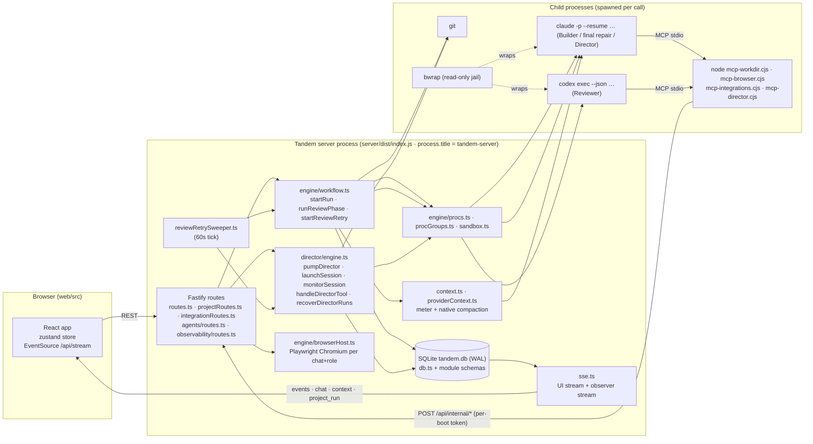

---

## 2. Repository map

The repository is an npm workspace with two packages and one shared type module. There is no test runner package (§36).

```
CLIAGENT/
├── package.json            workspaces: server, web · scripts: dev, build, typecheck
├── dev.sh                  local launcher (prepends ~/.local/node22/bin, runs npm run dev)
├── README.md               product README (stale in places — §50)
├── deploy/
│   ├── deploy.sh           rsync build → host, npm install --omit=dev, playwright chromium, systemctl restart
│   └── tandem.service      systemd unit (User=aiaccounting, Delegate=yes, env, ExecStart node dist/index.js)
├── shared/
│   └── types.ts            every contract shared by server and web (783 lines)
├── server/                 Fastify + better-sqlite3 backend (ESM, bundled by esbuild into dist/index.js)
│   ├── src/                see table below
│   └── test/review-reset/  the reproduction harness (fake CLIs + scenario runner + invariants)
└── web/                    React 19 + Vite 7 + Tailwind 4 single-page app (built to web/dist)
```

### 2.1 `server/src` — backend

| File | Responsibility | Important symbols | Called by / used by |
|---|---|---|---|
| `index.ts` | Entry point; CLI modes (`set-password`, `compact`); startup order; graceful shutdown | `main()`, `shutdown` handler | systemd `ExecStart`, `npm run dev` (`tsx watch`) |
| `config.ts` | Environment → `config` object; creates `DATA_DIR`, `PROJECTS_DIR`, `tmp`, `shots` | `config`, `internalBase()`, `shotsDir` | everything |
| `db.ts` | Opens `DATA_DIR/tandem.db` (WAL); core tables; row mappers; `kv` helpers | `db`, `kvGet/kvSet`, `rowToChat/rowToProject/rowToEvent`, `getChat/getProject/getEvent`, `get/setBuilderSession`, `get/setGitStateRow` | every module that persists |
| `auth.ts` | scrypt passwords, cookie sessions (90 days), login rate limit, `authHook` | `authHook`, `ensureUser`, `setPassword`, `validSession`, `setSessionCookie` | `index.ts`, `routes.ts` |
| `events.ts` | Append/update events, per-chat `seq`, streaming assistant text, chat title/running flags, SSE broadcasts | `addEvent`, `updateEvent`, `maxSeq`, `beginAssistantMessage/appendAssistantText/finishAssistantMessage`, `setChatRunning`, `setChatTitle`, `broadcastChat`, `broadcastContext`, `deriveTitle`, `listChats` | engine, director, routes |
| `sse.ts` | Two SSE audiences (UI clients, observability observers), heartbeat, revocation check | `sseHandler`, `observabilityStreamHandler`, `broadcast`, `notifyObservability` | `routes.ts`, `events.ts`, `observability/*` |
| `settings.ts` | `AppSettings` defaults, deep-merge over `kv:settings`, provider lock, context-defaults migration, Director role resolution | `getSettings`, `putSettings`, `resolveDirectorRole`, `migrateContextDefaults`, `lockProviders` | engine, director, routes, prompts |
| `context.ts` | Context meter: anchor on provider-reported context, estimate pending activity, model window memory, auto-compact rule | `computeUsage`, `shouldAutoCompact`, `recordModelWindow`, `backfillModelWindows`, `recentConversation`, `estimateEventTokens` | events (broadcast), workflow, director, providerContext, routes |
| `prompts.ts` | The single registry of AI-facing instruction text with admin overrides; the three prompt assemblies | `PROMPT_DEFS`, `getPrompt`, `renderPrompt`, `builderSystemText`, `reviewerSystemText`, `directorSystemText`, `buildRolePreview`, import/export | workflow, director, claude, routes |
| `toolText.ts` | Discovers Tandem's own MCP tools over real MCP and overlays admin-edited descriptions (`kv:tool_text`) | `listTools`, `setToolText`, `resetToolText`, `toolTextEnv`, `servedToolRecord` | claude, codex, routes |
| `routes.ts` | Auth, chats, messages, attachments, stop, context/compact, project-run routes, `/api/internal/*` (director, workdir, name-session, git-workflow, project-memory, browser, browser-event), screenshots, settings, prompts, tools, export | `registerRoutes` | `index.ts` |
| `projectRoutes.ts` | Projects, directory browser (`/api/fs/*`), git status | `registerProjectRoutes`, `findOrCreateProject` | `index.ts`, director, run.ts |
| `integrationRoutes.ts` | Credentials, integrations, tool discovery/test, skills, internal gateway routes | `registerIntegrationRoutes`, `skills()` | `index.ts` |
| `projectMemory.ts` | Project-scoped memory table and formats | `createMemory`, `searchMemories`, `listMemories`, `getMemory`, `allMemories`, `toToolShape` | `routes.ts` |
| `exporter.ts` | Chat export bundle → Markdown / HTML | `ExportBundle`, `toMarkdown`, `toHtml` | routes, observability |
| `git.ts` | Read-only git status for the header chip (5 s cache) | `getGitStatus` | `projectRoutes.ts` |
| `reviewRetrySweeper.ts` | The timer: due pending reviews → retries; due wakes → Director; orphaned awaiting sessions → escalation; manual "retry now" | `startReviewRetrySweeper`, `expediteRunReviews`, `sweep` | `index.ts`, `routes.ts` |
| `engine/run.ts` | `RunCtx` registry, stop/kill, boot repair of `running` chats, `RunHandle`, working-dir change | `registerCtx/releaseCtx/activeCtx/isRunning`, `stopRun`, `killChild`, `recoverInterruptedRuns`, `markDanglingStopped`, `RunHandle`, `applyWorkdirChange`, `beginCompaction/endCompaction` | workflow, director, routes, providerContext |
| `engine/workflow.ts` | The run: Builder turn → review gate → capped review loop → final repair; retries; verdict parsing; auto-compact trigger | `startRun`, `runWorkflow`, `runReviewPhase`, `finalRepair`, `review`, `startReviewRetry`, `parseVerdict`, `maybeAutoCompact` | routes, director, sweeper |
| `engine/claude.ts` | One Claude Code CLI invocation: args, MCP config, hooks, env, NDJSON → events, usage extraction | `runClaudeTurn`, `mapToolUse`, `resolveToolResult` | workflow, director |
| `engine/codex.ts` | One Codex CLI review: per-run permission profile with MCP blocks, jail, NDJSON → events | `runCodexReview` | workflow, director (`reviewArtifact`) |
| `engine/procs.ts` | Spawn a CLI, stream stdout lines, timeout, containment entry | `spawnStreaming` | claude, codex |
| `engine/procGroups.ts` | Per-chat process containment (cgroup v2 or pgid), reaping, boot reconciliation | `enterProcGroup`, `terminateProcGroup`, `reconcileProcGroups`, `spawnDetached` | procs, director, routes, index |
| `engine/sandbox.ts` | bubblewrap probe and read-only jail arguments | `bwrapAvailable`, `readOnlyJailArgs` | claude, codex |
| `engine/gitFlow.ts` | Per-chat git policy: adopt repo/branch, preserve dirty work, checkpoint, auto-merge, push | `adoptRepo`, `finishGitRun`, `setGitWorkflow`, `summaryText` | workflow, routes (via workflow re-export) |
| `engine/snapshot.ts` | Worktree identity (porcelain + diff hash), delta between snapshots, revision hash incl. untracked files | `captureWorktree`, `diffWorktrees`, `revisionHash` | workflow |
| `engine/reviewLedger.ts` | Durable per-task review budget and original request; legacy derivation | `openTask`, `recordReview`, `recordRepair`, `getLedger`, `deriveLegacyLedger`, `revisionOf`, `deleteLedger`, `MAX_REVIEW_ROUNDS` | workflow, director/store, routes |
| `engine/reviewWait.ts` | `pending_reviews` store; provider-outage classifier; reset-time parsing; backoff | `upsertPendingReview`, `getPendingReview`, `deletePendingReview`, `duePendingReviews`, `expediteReview`, `classifyProviderOutage`, `parseResetTime`, `transientRetryAt`, `fmtRetryAt` | workflow, director, sweeper, providerContext |
| `engine/providerContext.ts` | Provider-native context reading and compaction (`/context`, `/compact` on the resumed session) | `performNativeCompaction`, `readNativeContext`, `sessionProvider`, `parseClaudeContext` | workflow, director, routes, index (CLI) |
| `engine/browserHost.ts` | Chromium per chat+role, tool handlers, durable checkpoints, idle reaper | `handleBrowserTool`, `releaseBrowsers`, `shutdownBrowsers`, `startBrowserReaper` | routes, director, index |
| `director/engine.ts` | Everything orchestration (1,742 lines): turns, review loops, launch/resume/retry, monitoring, live block, recovery, pause/resume, boot recovery, tool dispatch | see §11 | routes, sweeper, index |
| `director/store.ts` | Orchestration tables, mappers, plan/session CRUD with DAG validation, activity, snapshots, auto-resume streak | `createRun`, `setRunState`, `patchRun`, `patchSession`, `setPlan`, `planSessions`, `depsSatisfied`, `stateSnapshot`, `planDocument`, `bumpAutoResumeStreak` | director/engine, sweeper, routes, observability |
| `director/pendingWake.ts` | `pending_wakes` store (one row per project run) | `upsertPendingWake`, `getPendingWake`, `deletePendingWake`, `duePendingWakes`, `expediteWake`, `providerWaitActive` | director, sweeper |
| `agents/store.ts` | Builder Agent profiles (CRUD, validation, default invariant), immutable per-chat snapshots, import/export, seeding | `resolveAgentForLaunch`, `captureAgentSnapshot`, `getAgentSnapshot`, `seedAgents`, `createAgent`, … | director, agents/exec, routes |
| `agents/exec.ts` | The one place Builder model/effort/prompt overlay is resolved | `builderExecFor` | workflow, providerContext |
| `agents/catalog.ts` | Agent catalog text for the Director's system prompt | `agentCatalogText` | director |
| `agents/seeds.ts` | The four initial profiles (data only) | `SEED_AGENTS` | agents/store |
| `agents/routes.ts` | `/api/agents*` | `registerAgentRoutes` | index |
| `integrations/store.ts` | Credentials (AES-256-GCM at rest), integrations, tools | `encryptSecret/decryptSecret`, `credentialSecret`, `credentialSecretValues`, `upsertTool`, … | integrationRoutes, integrations/exec, mcpClient |
| `integrations/exec.ts` | Server-side execution of integration tools with role enforcement, credential injection, scrubbing | `executeIntegrationTool`, `catalogForRole`, `hasIntegrationTools`, `runSsh` | integrationRoutes, claude, codex |
| `integrations/mcpClient.ts` | Minimal MCP client (stdio + Streamable HTTP) with a pooled connection per integration | `mcpListTools`, `mcpCallTool`, `mcpDisconnect` | integrations/exec, integrationRoutes |
| `integrations/openapi.ts` | OpenAPI 3 / Swagger 2 → tool drafts | `parseOpenApi`, `paramsToSchema` | integrationRoutes |
| `observability/routes.ts` | Bearer-authenticated read-only evidence API v1 + admin key management | `registerObservabilityRoutes` | index |
| `observability/signals.ts` | Lifecycle wake-up signals for observers | `signalSessionState`, `signalRunState` | director/engine, director/store |
| `observability/store.ts` | API keys (SHA-256 hashes) and the stable instance id | `createKey`, `verifyKey`, `revokeKey`, `instanceId` | observability/routes, signals |
| `mock/seed.ts`, `mock/seedChats.ts`, `mock/seedUtil.ts` | First-boot demo projects and chats (`simulated: true` events) | `seedIfEmpty` | index |
| `hook-read-guard.cjs` | Claude Code `PreToolUse` hook refusing oversized images | — | claude.ts passes it via `--settings` |
| `mcp-workdir.cjs` | MCP server `tandem`: working dir, git workflow, project memory, session naming | — | claude.ts (Builder/final repair) |
| `mcp-browser.cjs` | MCP server `tandem_browser`: proxy to `/api/internal/browser` | — | claude.ts, codex.ts |
| `mcp-integrations.cjs` | MCP server `tandem_ext`: gateway to integration tools | — | claude.ts, codex.ts |
| `mcp-director.cjs` | MCP server `tandem_director`: orchestration tools | — | claude.ts (Director) |

### 2.2 `web/src` — frontend

| File | Responsibility |
|---|---|
| `main.tsx` | React root, `BrowserRouter`, `styles.css` |
| `App.tsx` | Auth gate, routes (`/`, `/c/:chatId`, `/settings/*`), `Shell` (sidebar + outlet), `Home` |
| `store.ts` | zustand store: auth, projects, chats, per-chat events/usage, settings + draft, project runs, toasts; the SSE client (`connectStream`, `applyMsg`) |
| `api.ts` | Typed fetch wrapper for every endpoint the UI uses (`ApiError`) |
| `components/ChatView.tsx` | The conversation screen: top bar, context banner, timeline, composer, compaction dialog, project drawer |
| `components/Composer.tsx` | Message input, attachments (upload first, ids sent with the message), per-request Reviewer toggle, Stop |
| `components/timeline/Timeline.tsx`, `rows.tsx`, `ActivityRow.tsx` | Event → row rendering; grouping of consecutive command/read/search/change/browser events |
| `components/ContextMeter.tsx` | Ring + popover of `ContextUsage`; warn/crit banner |
| `components/CompactDialog.tsx` | Manual compaction UI (`POST /api/chats/:id/compact`) |
| `components/ProjectDrawer.tsx` | Structural view of a project run: state, pause/resume, retry reviews, milestones/sessions, activity |
| `components/Sidebar.tsx` | Projects and chats (Director session chats hidden), new chat/project, settings, logout |
| `components/NewProjectDialog.tsx` | Directory browser (`/api/fs/*`), new chat (`addDirectory` + `newChat`) or new project run (`createProjectRun`) |
| `components/GitChip.tsx` | Branch/changes chip; polls `/api/projects/:id/git` every 20 s |
| `components/ProjectMemoryMenu.tsx`, `ExportMenu.tsx`, `Markdown.tsx`, `DiffView.tsx`, `Login.tsx`, `ui.tsx`, `lib/format.ts` | Utilities and small surfaces |
| `components/settings/SettingsLayout.tsx` | Admin shell; `ADMIN_CATEGORIES`; the single save bar |
| `components/settings/useSettingsDraft.ts` | Draft model for `AppSettings`-backed pages; diff-based save |
| `components/settings/pages/RolesPage.tsx`, `AgentsPage.tsx`, `AgentEditorPage.tsx`, `ObservabilityPage.tsx`, `SimplePages.tsx` | Admin pages |
| `components/settings/CredentialsSection.tsx`, `IntegrationsSection.tsx`, `PromptsSection.tsx`, `SkillsSection.tsx`, `ToolsSection.tsx` | Admin sections composed by the pages |

### 2.3 Other

- `shared/types.ts` — the contract file (§28). Imported by the server as `../../shared/types` and by the web via the Vite alias `@shared`.
- `server/test/review-reset/` — the only automated tests (§36).
- `deploy/` — production deployment (§39).

---

## 3. Process architecture

### 3.1 Long-running processes

**1. The Tandem server** — one Node 22 process, `node /srv/tandem/app/server/dist/index.js` in production (`deploy/tandem.service`), `tsx watch src/index.ts` in development. It sets `process.title = 'tandem-server'` first thing in `main()` (`server/src/index.ts`) so that agent shell commands such as `pkill -f dist/index.js` or `pkill -f node` do not match it; the comment is explicit that this is collision avoidance, not a security boundary (§20). Working directory: `/srv/tandem/app/server` (unit `WorkingDirectory`). Owner: `aiaccounting`. It hosts the HTTP API, both SSE streams, the run engine, the Director, the sweeper, the browser host and, through `@fastify/static`, the built web app.

**2. Chromium** — spawned by the server via Playwright (`engine/browserHost.ts` — `launch()`), headless, with `handleSIGINT/SIGTERM/SIGHUP: false` so Tandem controls its lifecycle. One browser per `chatId::builder` or `chatId::reviewer` key; released after 30 idle minutes by `startBrowserReaper()` (5-minute tick) or on chat deletion/session completion; checkpointed (cookies/localStorage/URL/scroll) to `DATA_DIR/browser/<chat>--<bucket>.json`. It never enters a session's containment group.

**3. The frontend** has no process of its own in production (static files served by Fastify). In development Vite runs on :5173 and proxies `/api` to :7810 (`web/vite.config.ts`).

### 3.2 Per-invocation child processes

| Child | Spawned by | Command shape | Env of note | Timeout | Kill path |
|---|---|---|---|---|---|
| Builder / final repair | `engine/claude.ts` — `runClaudeTurn` via `procs.ts` — `spawnStreaming` | `claude -p --output-format stream-json --verbose --include-partial-messages --model M --permission-mode bypassPermissions --exclude-dynamic-system-prompt-sections [--resume SID] --append-system-prompt … [--settings {hooks}] [--mcp-config F --strict-mcp-config]`, prompt on stdin | `ANTHROPIC_API_KEY=''`, `MAX_THINKING_TOKENS`, `CLAUDE_CODE_AUTO_COMPACT_WINDOW`, `TANDEM_*` | 30 min default (`BUILDER_TIMEOUT`), Director-granted up to 90 | `stopRun` → `killChild` (SIGTERM, SIGKILL after 8 s); timeout → same |
| Director turn | same, `role: 'director'`, `readOnly: true`, `withDirectorTools` | as above plus `--disallowedTools Write Edit NotebookEdit [Bash Task]`, wrapped in `bwrap … claude …` when available | `GIT_OPTIONAL_LOCKS=0` | 15 min (`DIRECTOR_TIMEOUT`) | same |
| Reviewer | `engine/codex.ts` — `runCodexReview` | `codex exec --json --skip-git-repo-check -p tandem-reviewer-<run12> --approve-for-me -m M -c model_reasoning_effort="E"` (fallback without profile: `--sandbox read-only`), prompt on stdin, wrapped in `bwrap` when available | `OPENAI_API_KEY=''`, `NO_COLOR=1`, `TANDEM_*` | 15 min (`REVIEW_TIMEOUT`) | same |
| Slash commands | `engine/providerContext.ts` — `claudeSlash` | `claude -p --output-format json --model M --resume SID /context|/compact` (execFile, not streamed) | `ANTHROPIC_API_KEY=''` | 90 s / 10 min | execFile timeout |
| MCP stdio servers | the CLIs themselves, from the `--mcp-config` file (Claude) or the profile's `[mcp_servers.*]` blocks (Codex) | `node dist/mcp-*.cjs` | Claude servers inherit the CLI's env; Codex servers get env declared per server in the profile | — | die with their CLI |
| Tool discovery | `toolText.ts` — `queryServer` | `node dist/mcp-*.cjs` with only `PATH`/`HOME` | — | 6 s | SIGTERM |
| External MCP servers | `integrations/mcpClient.ts` — `StdioConn` | admin-configured command | `PATH`, `HOME`, config env, credential `env_set` | 60 s per call; idle 5 min | SIGTERM on close/idle |
| SSH | `integrations/exec.ts` — `runSsh` | `ssh -o BatchMode=yes -o StrictHostKeyChecking=accept-new -i DATA_DIR/ssh/<id>.key -p P user@host -- cmd` | — | 120 s default, max 600 | SIGKILL on timeout |
| git | `gitFlow.ts`, `snapshot.ts`, `git.ts`, `director/engine.ts`, `mock/seed.ts` | `git -C dir …` | `GIT_TERMINAL_PROMPT=0` (gitFlow) | 8–90 s | execFile timeout |
| pgrep | `procGroups.ts` — `pgidMembers` | `pgrep -g PGID` | — | — | — |
| bwrap probe | `sandbox.ts` — `bwrapAvailable` | `bwrap --dev-bind / / --ro-bind /tmp /tmp -- true` | — | 10 s | — |

Every `spawnStreaming` child is spawned `detached: true` (its own process group) and immediately adopted into its chat's containment group (`enterProcGroup`): a cgroup `s-<chatId>` under the service's own cgroup when the unit delegates one, otherwise a `proc_groups` row keyed by pgid. Descendants (dev servers, watchers) inherit membership (§20).

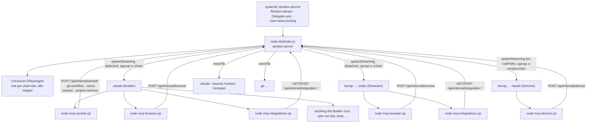

### 3.3 Shutdown and restart behaviour

`SIGTERM`/`SIGINT` → `shutdown()` in `index.ts`: logs `received <signal> — graceful shutdown, exiting 0`, checkpoints and closes every browser (`shutdownBrowsers()`), exits 0; a hard exit after 8 s if that hangs. Nothing else is stopped deliberately: running CLIs are children in their own process groups/cgroups and are *not* killed by the server exiting (they are orphaned and reaped later only if their session becomes terminal — `reconcileProcGroups` at the next boot). The database needs no shutdown step (WAL). systemd restarts the unit after 2 s (`Restart=always`, `RestartSec=2`). What happens to in-flight work at boot is §31.

---

## 4. Application startup and shutdown

Entry point: `server/src/index.ts`. Before `main()` runs, **every imported module has already executed its side effects**, because table creation lives at module top level. The import graph therefore opens the database and creates/migrates all tables before any explicit startup step:

- `config.ts` — reads env, `mkdir -p` `DATA_DIR`, `PROJECTS_DIR`, `DATA_DIR/tmp`, `DATA_DIR/shots`, and generates the per-boot `internalToken` (24 random bytes hex) unless `TANDEM_INTERNAL_TOKEN` is set.
- `db.ts` — `new Database(DATA_DIR/tandem.db)`, `PRAGMA journal_mode = WAL`, core `CREATE TABLE IF NOT EXISTS`, then five `ALTER TABLE chats ADD COLUMN …` wrapped in `try/catch` (idempotent additive migrations).
- `director/store.ts`, `director/pendingWake.ts`, `engine/reviewLedger.ts`, `projectMemory.ts`, `agents/store.ts`, `observability/store.ts`, `integrations/store.ts` — each creates its own tables and indexes the same way.
- `integrations/mcpClient.ts` — starts a 60-second `setInterval` (unref'd) that closes idle MCP connections.

`main()` then runs, in this order:

| Step | Call | Effect | If it fails |
|---|---|---|---|
| 1 | `process.title = 'tandem-server'` | name collision avoidance for agent `pkill` patterns | — |
| 2 | `ensureUser()` (`auth.ts`) | if no `user` row: create it with `TANDEM_INITIAL_PASSWORD` or a generated password **printed once to stdout** | throws → process exits (systemd restarts) |
| 3 | `seedIfEmpty()` (`mock/seed.ts`) | first boot only (`kv:seeded`): writes two demo git repositories under `PROJECTS_DIR` (`customer-portal`, `talkbridge`) and four demo chats with `simulated: true` events | git failures are logged and skipped |
| 4 | `seedAgents()` (`agents/store.ts`) | once per installation (`kv:agent_profiles_seeded`): four Builder Agent profiles | throws → exit |
| 5 | `migrateContextDefaults()` (`settings.ts`) | one-time: if stored settings lack `compactMaxTokens`, set it to 200 000 and force `autoCompact = true`, logging why | — |
| 6 | `recoverInterruptedRuns()` (`engine/run.ts`) | for every chat with `running = 1`: mark its `status:"running"` events `stopped`, append an `error` ("Run interrupted — Tandem restarted…") and `run:stopped`, set `running = 0`; returns the set of chat ids | — |
| 7 | `void reconcileProcGroups()` (`engine/procGroups.ts`) | async: reap process groups whose chat is gone or whose Director session is terminal; prune pre-boot pgid rows | logged |
| 8 | `backfillModelWindows()` (`context.ts`) | if `kv:model_windows` is empty, seed it from historical `ai_call` events | — |
| 9 | `startBrowserReaper()` | 5-min interval | — |
| 10 | `startReviewRetrySweeper()` | 60-s interval (`TANDEM_REVIEW_SWEEP_MS`) | — |
| 11 | signal handlers | `SIGTERM`/`SIGINT` → graceful shutdown | — |
| 12 | `Fastify({ logger, bodyLimit: 2 MB })`, `@fastify/cookie`, `@fastify/multipart` (400 MB, 1 file) | HTTP server | throws → exit |
| 13 | `app.addHook('onRequest', authHook)` | every `/api/*` request except `/api/login`, `/api/health`, `/api/internal/*`, `/api/observability/v1/*` requires the `tandem_sid` cookie | — |
| 14 | `registerRoutes`, `registerIntegrationRoutes`, `registerProjectRoutes`, `registerAgentRoutes`, `registerObservabilityRoutes` | all routes (§26) | — |
| 15 | static SPA from `config.webDist` if it exists, else `API only` warning; SPA fallback for non-`/api` GETs | — | — |
| 16 | `app.listen({ port, host })` + two log lines | — | throws → exit |
| 17 | `recoverDirectorRuns(interruptedChats)` (`director/engine.ts`) | **after listen on purpose**: auto-resumes RUNNING/RESUMING project runs, completes a PAUSING pause, re-wakes a PLANNING run whose Director chat died mid-turn (§31) | its own failures are absorbed by `pumpDirector` |

Two **CLI modes** short-circuit `main()`: `node dist/index.js set-password` (reads a new password from stdin, ≥ 8 chars) and `node dist/index.js compact <chatId>…` (runs the same provider-native compaction the UI button runs, refusing chats flagged running; the Project Chat uses the Director's model).

Shutdown is described in §3.3. There is no explicit database close and no draining of HTTP connections; SSE clients see the socket close and reconnect (`web/src/store.ts` — `openStream` supervises `EventSource`).

---

## 5. Core domain model

### 5.1 Concepts and their representations

| Concept | Runtime type (`shared/types.ts`) | Table / storage | Created by | Updated by | Deleted / archived |
|---|---|---|---|---|---|
| Project | `Project` | `projects` (id, name, root_path, source `directory\|zip\|git`, created_at, last_opened_at) | `findOrCreateProject()` (`projectRoutes.ts`) from the UI, a Director run, a worktree launch, or `applyWorkdirChange` | `last_opened_at` on open/new chat; `root_path`/`name` when a directory is renamed via `/api/fs/rename` | never deleted by code |
| Chat | `Chat` (`kind`, `running`, `gitState`, `projectRunId`, `lastCompactionEventId`) | `chats` (+ additive columns `builder_session_id`, `builder_session_provider`, `git_state`, `kind`, `project_run_id`) | `POST /api/chats`; `createProjectRun()`; `launchSession()` | `setChatRunning`, `setChatTitle`, `setBuilderSession`, `setGitStateRow`, `updated_at` on every event | `DELETE /api/chats/:id` (also stops the run, reaps processes, releases browsers, deletes events/pending review/snapshot/ledger) |
| Event | `ChatEvent<K>` with 16 `EventKind`s | `events` (id, chat_id, seq, ts, run_id, kind, payload JSON) | `addEvent()` | `updateEvent()` rewrites payload in place (streaming text, tool results, statuses) | with the chat |
| Run (invocation) | `RunCtx` (in memory) + `run` events | `active` Map in `engine/run.ts`; `events.run_id` | `startRun`, `startReviewRetry`, `runDirectorTurn`, `reviewArtifact` | `stopRun` sets `stopped`, `killChild` | `releaseCtx` in `finally` |
| Task (review budget) | `ReviewLedger` | `review_ledger` (chat_id PK, task_seq, original_request, reviews_consumed, repairs_consumed, last_verdict, final_repair_done, reviewed_revision, updated_at) | `openTask()` on a new request; `deriveLegacyLedger()` for pre-ledger chats | `recordReview()` (monotonic `MAX`), `recordRepair()` | `deleteLedger()` with the chat |
| Pending review (wait) | `PendingReview` | `pending_reviews` (chat_id PK, round, user_text, subject JSON, reason, detail, retry_at, attempts) | `recordReviewWait()` via `upsertPendingReview()` | attempts/backoff on re-upsert; `expediteReview` | `deletePendingReview` after a verdict, on supersession, terminal session, chat delete |
| Pending wake | `PendingWake` | `pending_wakes` (run_id PK, message, reason, detail, retry_at, attempts) | `upsertPendingWake()` from `pumpDirector`, plan/recovery loops, `monitorSession` (provider outage) | merged message on re-upsert; `expediteWake` | `deletePendingWake` when delivered or the run is terminal |
| Project run | `ProjectRun` (`state: ProjectRunState`, `providerWait`) | `project_runs` (+ `base_branch`, `auto_resume_streak`, `auto_resume_at`; cursors `plan_review_round`, `pending_recovery`, `live_event_id`) | `createProjectRun()` | `patchRun`, `setRunState` | never deleted |
| Milestone | `PdMilestone` (`status: PdMilestoneStatus`) | `pd_milestones` | `setPlan()` | `setPlan` (name/goal/acceptance/order/deps), `patchMilestone({status})` | `setPlan` deletes milestones dropped from the plan only if they have no sessions |
| PD session | `PdSession` (`status: PdSessionStatus`, `stopReason`, `reviewWait`, `agent`) | `pd_sessions` (+ `last_baseline_seq`, `stop_reason`, `review_wait_reason`, `review_retry_at`, `agent_profile_id`) | `planSessions()` (also `integrate_milestone`) | `patchSession` from launch/monitor/recovery/pause/boot | never deleted; `abandoned` is the soft terminal |
| Activity | `PdActivity` (`kind`: plan, decision, session, integration, recovery, state, review, delivery) | `pd_activity` | `addActivity()` | — | never |
| Agent profile | `AgentProfile` | `agent_profiles` (unique slug among non-archived) | `createAgent`, `seedAgents`, `importAgents` | `updateAgent`, `setDefaultAgent` | `archiveAgent` (soft), `restoreAgent` |
| Agent snapshot | `AgentSnapshot` | `chat_agent_snapshots` (chat_id PK) | `captureAgentSnapshot()` once at session launch | never (immutable) | `deleteAgentSnapshot` with the chat |
| Settings | `AppSettings` | `kv` key `settings` | `putSettings` | `putSettings`, `migrateContextDefaults` | — |
| Prompt overrides | `PromptEntry` | `kv` key `prompts` (key → text) | `setPromptOverride`, `importPrompts` | same | `resetPrompt` |
| Tool text overrides | `ToolInfo` | `kv` key `tool_text` | `setToolText` | same | `resetToolText` |
| Skills | `Skill[]` | `kv` key `skills` | `PUT /api/skills` | replaced wholesale | — |
| Model windows | — | `kv` key `model_windows` (`provider:model` → tokens) | `recordModelWindow` from real calls | same | — |
| Credential | `CredentialMeta` (never the secret) | `credentials` (data = AES-256-GCM blob) | `createCredential` | `updateCredential` | `deleteCredential` (refused while referenced) |
| Integration / tool | `Integration`, `IntegrationTool` | `integrations`, `integration_tools` | `createIntegration`, discovery (`upsertTool`) | `updateIntegration`, `updateTool`, `replaceHttpTool`, `markMissingExcept` | `deleteIntegration` (cascades tools in code), `deleteTool` |
| Project memory | `ProjectMemory` | `project_memories` | `createMemory` (Builder tool or nothing else — there is no UI write path) | never (no update path exists) | never (no delete path exists) |
| Observability key | `ObservabilityKey` | `observability_keys` (hash + prefix) | `createKey` | `verifyKey` stamps `last_used_at`; `revokeKey` | revoke only |
| Auth session | — | `sessions` (token PK, created_at, last_seen) | `createSession` on login | `last_seen` at most hourly | `destroySession` on logout / 90-day expiry |
| Containment group | — | cgroup dir `s-<chatId>` or `proc_groups` rows | `enterProcGroup` | — | `terminateProcGroup`, `reconcileProcGroups` |

Concepts the brief asked about that **do not exist here**: Analysis / Analysis Profile (see §24), "Task/work item" beyond the review ledger and PD session above, "Memory" other than Project Memory (§23), "Deployment/restart state" other than `auto_resume_streak/auto_resume_at` and the PD session `stopReason: 'restart'`.

### 5.2 Invariants worth knowing before touching anything

- `events.seq` is dense and monotonic **per chat**; `addEvent` computes `MAX(seq)+1` inside a single-threaded process, which is what makes it safe (§32).
- `events.run_id` is the *invocation* id, never the project run id. Ownership of evidence resolves project run → `pd_sessions.chat_id` → `events.chat_id` (§24 states this explicitly).
- `chats.running` is a durable flag that must never survive a restart set to 1 — `recoverInterruptedRuns()` clears it before anything else runs.
- Exactly one enabled, non-archived Agent profile is the default (transactional in `agents/store.ts`).
- A PD session's execution configuration (model, effort, prompt overlay) is frozen in `chat_agent_snapshots` at launch; editing the profile later never changes a running or resumed session.
- Rows in `pending_wakes` and `pending_reviews` are the only durable "something must happen later" records; the sweeper is the only thing that acts on them.

---

## 6. Database architecture

**Library and connection.** `better-sqlite3` (synchronous), a single connection opened at import in `server/src/db.ts`, `journal_mode = WAL`. No `busy_timeout`, no `foreign_keys` pragma (so every `REFERENCES` clause is documentation, not enforcement), no connection pooling (the process is single-threaded and all queries are synchronous). No ORM; SQL is inline. Transactions are used sparingly and explicitly via `db.transaction(fn)()`: the verdict+ledger commit in `workflow.ts` — `review()`, agent profile creation/update/default promotion, and seeding.

**Migrations.** There is no migrations table and no versioning. Schema lives in `CREATE TABLE IF NOT EXISTS` statements spread across eight modules and is applied at import time; columns added after the fact are `ALTER TABLE … ADD COLUMN` statements wrapped in `try { } catch { /* exists */ }`. Consequences: adding a column is trivial; renaming or dropping one is not supported; a typo in an `ALTER` fails silently. The `kv` table also carries two one-time flags (`seeded`, `agent_profiles_seeded`) and one data migration (`migrateContextDefaults`).

**Test vs production database.** There is no separate test database mode: the harness (§36) starts a full server with `DATA_DIR` pointing at a scratch directory, which creates a fresh `tandem.db`. Production uses `DATA_DIR=/srv/tandem/data`.

### 6.1 Tables

| Table | Module | Purpose | Key columns / notes |
|---|---|---|---|
| `user` | `db.ts` | the single admin user | `id CHECK (id = 1)`, `email`, `pass` (`scrypt:<salt>:<hash>`) |
| `sessions` | `db.ts` | browser login sessions | `token` PK (32 random bytes hex), `created_at`, `last_seen` |
| `kv` | `db.ts` | JSON key-value settings | keys: `settings`, `prompts`, `tool_text`, `skills`, `model_windows`, `seeded`, `agent_profiles_seeded`, `observability_instance_id` |
| `projects` | `db.ts` | directories | `root_path` is the natural key used by `findOrCreateProject` (no UNIQUE constraint) |
| `chats` | `db.ts` | conversations | `project_id`, `title`, `running`, `last_compaction_event_id` (legacy Compactor pointer), `builder_session_id`, `builder_session_provider` (default `claude-code`), `git_state` JSON (`GitFlowState`), `kind` (`chat`/`project`/`pd-session`), `project_run_id` |
| `events` | `db.ts` | the event log | `idx_events_chat (chat_id, seq)`; `payload` JSON typed by `EventPayloadMap` |
| `proc_groups` | `db.ts` | fallback containment | `(chat_id, pgid)` PK, `created_at` (kills gated on `created_at >= host boot`) |
| `pending_reviews` | `db.ts` (store in `engine/reviewWait.ts`) | a refused review to retry | `chat_id` PK, `round`, `user_text`, `subject` JSON (`ReviewSubject`), `reason`, `detail`, `retry_at`, `attempts` |
| `review_ledger` | `engine/reviewLedger.ts` | task budget | `chat_id` PK; `reviews_consumed` only ever grows (`MAX`) |
| `project_runs` | `director/store.ts` | orchestration root | `state`, `goal`, `integration_branch`, `base_branch`, `plan_review_round`, `pending_recovery` JSON, `live_event_id`, `auto_resume_streak`, `auto_resume_at` |
| `pd_milestones` | `director/store.ts` | plan | `key`, `status`, `order_idx`, `depends_on` JSON array of keys; `idx_pd_milestones_run` |
| `pd_sessions` | `director/store.ts` | sessions | `key`, `status`, `prompt`, `chat_id`, `branch`, `cwd`, `depends_on`, `last_baseline_seq`, `stop_reason`, `review_wait_reason`, `review_retry_at`, `agent_profile_id`, `result_summary`, `review_verdict`; `idx_pd_sessions_run` |
| `pd_activity` | `director/store.ts` | activity log | `kind`, `text` (≤ 500 chars), `detail` (≤ 4 000); `idx_pd_activity_run (run_id, ts)` |
| `pending_wakes` | `director/pendingWake.ts` | refused Director turn | `run_id` PK, `message` (≤ 12 000 chars, merged on re-upsert), `reason`, `detail`, `retry_at`, `attempts` |
| `project_memories` | `projectMemory.ts` | project memory | `project_id`, `title`, `content`, `tags` JSON; `idx_project_memories_project` |
| `agent_profiles` | `agents/store.ts` | Builder Agents | `slug` unique among `archived_at IS NULL` (partial unique index), `is_default`, `enabled`, `archived_at` |
| `chat_agent_snapshots` | `agents/store.ts` | frozen execution config | `chat_id` PK |
| `observability_keys` | `observability/store.ts` | API keys | `key_hash` (SHA-256), `key_prefix` (`tnd_obs_` + 4), `revoked_at`, `last_used_at`; `idx_observability_keys_hash` |
| `credentials` | `integrations/store.ts` | secrets | `name` UNIQUE, `type`, `data` = `iv.tag.ciphertext` base64 (AES-256-GCM, key in `DATA_DIR/secret.key`) |
| `integrations` | `integrations/store.ts` | external tool sources | `slug` UNIQUE, `type` (`mcp\|openapi\|http\|ssh`), `config` JSON, `credential_id`, last test fields |
| `integration_tools` | `integrations/store.ts` | served tools | `full_name` UNIQUE (`<slug>_<name>`), `params_schema` JSON, `spec` JSON (`IntegrationToolSpec`), `roles` JSON, `missing` |

### 6.2 JSON column shapes

- `events.payload` — exactly `EventPayloadMap[kind]` (§14, §28). Engine code patches payloads with `updateEvent(id, patch)` (shallow merge), so a payload can carry fields beyond its declared type (e.g. `finalRepairNotReviewed` added to a `findings` payload).
- `chats.git_state` — `GitFlowState { mode, workBranch, targetBranch, push, repoPath }`.
- `pending_reviews.subject` — `{ kind:'changes', files, note } | { kind:'answer', answer }`.
- `project_runs.pending_recovery` — `{ sessionKey, action, reasoning, newPrompt?, extraMinutes?, round, context, awaitingRevision?, approved? }` (written by `handleDirectorTool('recover_session')`, read by `processAfterTurn` and `applyRecovery`).
- `pd_milestones.depends_on`, `pd_sessions.depends_on` — JSON arrays of keys.
- `agent_profiles` / `chat_agent_snapshots` — flat columns, no JSON.
- `integrations.config` — one of `McpIntegrationConfig | OpenApiIntegrationConfig | HttpIntegrationConfig | SshIntegrationConfig`.

### 6.3 Important writers

| Write | Function |
|---|---|
| append an event | `events.ts` — `addEvent` (also bumps `chats.updated_at`, broadcasts event + context) |
| verdict + budget atomically | `workflow.ts` — `review()` (`db.transaction`) |
| chat running flag | `events.ts` — `setChatRunning` (called from `startRun`, `startReviewRetry`, `runDirectorTurn`, `reviewArtifact`, `recoverInterruptedRuns`) |
| project run state | `director/store.ts` — `setRunState` (→ `patchRun` + activity + `signalRunState`) |
| session status | `director/store.ts` — `patchSession` (from `launchSession`, `resumeSession`, `monitorSession`, `applyRecovery`, `recoverDirectorRuns`, `reconcileOrphans`, `pauseProject` via monitors) |
| waits | `reviewWait.ts` — `upsertPendingReview`; `pendingWake.ts` — `upsertPendingWake` |
| settings | `settings.ts` — `putSettings` (clamps thresholds, re-locks providers) |

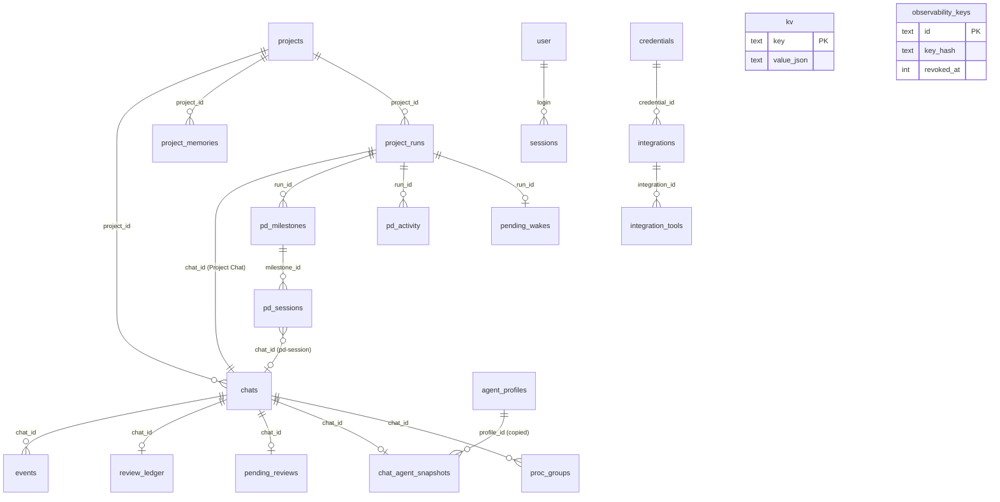

---

## 7. Project lifecycle (Project Director runs)

A **project run** is created by `POST /api/project-runs` (`routes.ts`) → `director/engine.ts` — `createProjectRun(dirPath)`: it finds or creates the `projects` row for the directory, creates the run's own chat (`kind='project'`, the *Project Chat*), and inserts `project_runs` with `state='PLANNING'` (the column default). Nothing else happens until the user posts the goal into the Project Chat; that message goes through `directorUserMessage()` → `pumpDirector()` and starts the Director's first turn.

### 7.1 States

`ProjectRunState` (`shared/types.ts`): `PLANNING | RUNNING | PAUSING | PAUSED | RESUMING | COMPLETED | NEEDS_USER | FAILED`. Every transition goes through `director/store.ts` — `setRunState(id, state, note)`, which patches the row, appends a `state` activity and calls `signalRunState()` for observers. The complete list of writers:

| From | To | Where | Trigger |
|---|---|---|---|
| (new) | `PLANNING` | `createRun()` default | `POST /api/project-runs` |
| `PLANNING` | `RUNNING` | `acceptPlan()` — "Master plan accepted — project is running" | the plan-review loop in `processAfterTurn()` ends with `pass` or the third round is exhausted |
| `NEEDS_USER` | `RUNNING` | `directorUserMessage()` — "User replied — continuing" | the user posts in the Project Chat |
| `RUNNING` (or `PLANNING`, `RESUMING`, `NEEDS_USER`) | `PAUSING` | `pauseProject()` | `POST /api/project-runs/:id/pause`; idempotent for PAUSING/PAUSED/COMPLETED/FAILED |
| `PAUSING` | `PAUSED` | `pauseProject()` (nothing active) or `finishPauseIfDone()` (last monitor reports) | all running sessions and in-flight review retries have stopped |
| `PAUSED`, `NEEDS_USER` | `RESUMING` | `resumeProject()` | `POST /api/project-runs/:id/resume`; also resets the auto-resume streak |
| `RESUMING` | `RUNNING` | `handleDirectorTool('start_sessions' \| 'resume_sessions')` — "Project resumed" | the Director actually launched or resumed at least one session |
| `RUNNING`, `RESUMING` | `RESUMING` | `recoverDirectorRuns()` at boot — "Tandem restarted — … resuming automatically" | server boot with the run mid-flight |
| `PAUSING` | `PAUSED` | `recoverDirectorRuns()` — "pause requested before the restart" | boot |
| `RESUMING` | `RUNNING` | `driveRestartWake()` — "Resumed after the restart — … waiting for the Reviewer" | boot, when the only live work is a session in `awaiting_review` with a pending review (added in commit `046403c`'s fix series) |
| `RESUMING` | `PAUSED` | `driveRestartWake()` — "Automatic resume after the restart could not get the Director going" | the boot wake reached nobody (provider outage) |
| any non-terminal | `COMPLETED` | `handleDirectorTool('complete_project')` | the Director declares completion (only after `deliver`) |
| any non-terminal | `NEEDS_USER` | `handleDirectorTool('need_user')` | the Director asks a question |
| — | `FAILED` | **no writer exists** | `FAILED` is declared in the type and treated as terminal by five guards (`sweepProviderWakes`, `processAfterTurn`, `pauseProject`, `handleDirectorTool`, `observability/signals.ts`), but nothing in the codebase ever sets it |

Terminal states: `COMPLETED` (and the unreachable `FAILED`). `handleDirectorTool` refuses every op but `get_state` on a terminal run; `queueObservation()` drops observations aimed at a run that is `PAUSED`/`PAUSING`/terminal (the "paused-project guard" that `recoverDirectorRuns` and `resumeProject` deliberately sidestep by flipping to `RESUMING` first).

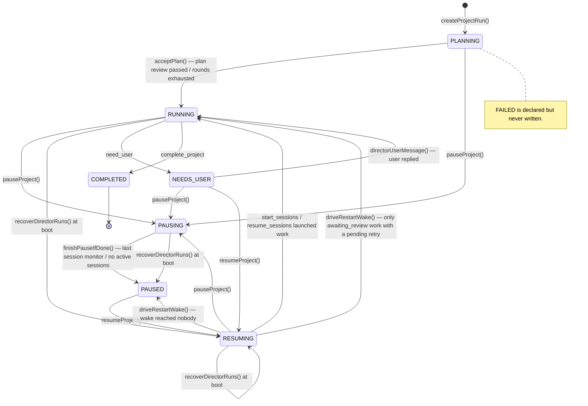

### 7.2 What the Director does in each state

- **PLANNING** — the Director's first turn must call `set_plan` with milestones (each: key, name, goal, acceptance criteria, `depends_on`). `set_plan` stores the plan via `store.ts` — `setPlan()` (validates keys, the DAG and dependency existence) and sets `plan_review_round = 1`. `processAfterTurn()` then runs the **plan review loop**: `reviewArtifact()` sends `planDocument()` to the Codex reviewer with the `director.plan_review_request` prompt; on `findings` the Director gets an observation with the findings (`director.plan_findings_message`, or `director.plan_final_message` for the last round) and must revise (`set_plan` again); on `pass` or after round 3, `acceptPlan()` → `RUNNING`. Plan rounds are stored in `project_runs.plan_review_round` so a restart does not restart the loop. (`processAfterTurn` also drives the analogous **recovery review loop** for a `pending_recovery`, round ≤ 3.)
- **RUNNING** — the Director decomposes milestones into sessions (`plan_sessions`, validated by `planSessions()` — session keys unique, `depends_on` may reference sessions or milestone keys, cycles rejected), launches ready ones (`start_sessions`, refusing sessions whose dependencies are not `completed` per `depsSatisfied()` or whose directory is busy per `dirBusyWithin()`), reacts to monitor observations, integrates (`integrate_milestone` creates an integration session that merges session branches into the integration branch), marks milestones `completed` (`complete_milestone`, which requires every session of the milestone to be completed/abandoned), `deliver`s (merges the integration branch into the base branch; refuses while any session is non-terminal) and finally `complete_project`. The `LAUNCHES_WORK` set (`start_sessions`, `resume_sessions`, `integrate_milestone`) is refused while `providerWaitActive()` reports a provider wait, so a quota-limited project cannot burn the limit further.
- **PAUSING / PAUSED** — `pauseProject()` stops every running session and every in-flight review retry with `stopRun()`; each stopped run's monitor classifies it `paused` with `stopReason 'project_pause'` (the pausing flag is read from the run state in `monitorSession`) and `finishPauseIfDone()` closes the pause when the last one reports. Pending reviews survive the pause and are retried after Resume. Observations are dropped while paused; the Director turn is not running.
- **RESUMING** — the Director is woken with an observation listing paused/interrupted sessions and must decide what to resume (`resume_sessions` for `paused|timeout|needs_attention` sessions with a chat, `start_sessions` for `planned` ones). The first successful launch/resume flips the run to `RUNNING`.
- **NEEDS_USER** — set by `need_user`; the Project Chat shows the question; the next user message flips back to `RUNNING` and is delivered as the Director's turn.
- **COMPLETED** — terminal; `deliver` must have run first (the tool refuses otherwise); `cleanupRunWorkspaces()` removes session worktrees during `deliver`.

### 7.3 Turn serialization and observations

All Director activity funnels through `pumpDirector(runId, message, kind)` with an in-memory `turnState` per run (`busy`, `queued[]`): while a turn runs, further observations are appended to `queued` and coalesced into the next turn. Observations are produced by `queueObservation()` from session monitors, recovery application, the sweeper (`deliverPendingWake` re-delivers a refused message), boot recovery and the user's messages (`directorUserMessage`). A turn is `runDirectorTurn()` → `runClaudeTurn(role:'director', readOnly, withDirectorTools)`; its failure is classified by `classifyProviderOutage(err, now, 'Claude')`, and a refused turn is persisted as a `pending_wakes` row (message merged, backoff applied) instead of being lost (§18). After each turn `processAfterTurn()` runs the review loops and `directorAutoCompact()` compacts the Director's own session when its context passes the ceiling.

---

## 8. Session lifecycle

A **PD session** row (`pd_sessions`) is created `planned` by `planSessions()` (or by `integrate_milestone`). Its status is `PdSessionStatus`: `planned | running | completed | awaiting_review | failed | timeout | needs_attention | paused | abandoned`.

### 8.1 Launch

`launchSession(runId, key, timeoutMin?)`:

1. Refuses if the run is not `RUNNING`/`RESUMING`, the session is not `planned`, dependencies are unsatisfied, or another active session is working in the same directory.
2. Ensures the run's **integration branch** exists (`ensureIntegrationBranch()` — `tandem/<run8>/integration` off the base branch) and gives the session its own **git worktree** (`worktreeDir()` under `PROJECTS_DIR/.tandem-worktrees/…`, branch `tandem/<run8>/<key>`); dependency content is merged in (`mergeDependencyContent()`).
3. Resolves the **Builder Agent** for the session (`resolveAgentForLaunch()` — the session's `agent_profile_id` or the default) and freezes it (`captureAgentSnapshot()`).
4. Creates the session **chat** (`kind='pd-session'`, `project_run_id`, project = the worktree directory, hidden from the sidebar), writes the session prompt as its `user_message`, marks the session `running` (`startedAt`, `stopReason null`) and calls **`startRun(chatId, prompt, [], { review: true, timeoutMs, task: 'new' })`** — exactly the same primitive a human message uses.
5. Attaches `monitorSession()` to the run's completion promise and starts the live-block poller (`ensurePoller()`).

`resumeSession()` / `resumeSessionWithTimeout()` do the same for a `paused|timeout|needs_attention` session with an existing chat, passing `task: 'continue'` so the review ledger is continued, not reopened. `retrySessionReview()` is the sweeper's entry: it re-attaches a monitor to `startReviewRetry(chatId)`'s promise without changing the status (the session stays `awaiting_review` during the retry).

### 8.2 Monitoring and classification

`monitorSession(runId, key, chatId, baselineSeq, running)` awaits the run and then reads what happened from the chat's events since the baseline (`readOutcome()`):

- `phase` — the last `run` event's phase (`finished | stopped | failed`). **The phase is `finished` even when the Builder errored**; the authoritative failure signal is an `error` event whose `message` is one of `FAIL_MESSAGES = {'Builder call failed', 'Builder repair call failed', 'Final repair call failed', 'The run failed unexpectedly'}`.
- `timedOut` — any non-`context` error event matching `/timed out/i` (a compaction's own timeout, `source:'context'`, is excluded on purpose).
- `summary` — the last non-empty `assistant_message`; `reviewVerdict` — the last `findings` verdict.

Classification, in this order (`monitorSession`):

| Condition | Status | `stopReason` |
|---|---|---|
| a `pending_reviews` row exists for the chat and the run ended `finished`/`stopped` without failure/timeout | `awaiting_review` (with `reviewWaitReason`, `reviewRetryAt`) | — |
| `finished`, not failed, not timed out | `completed` | — |
| phase `stopped` | `paused` | `user_stop` (or `project_pause` when the run is PAUSING) |
| run is PAUSING | `paused` | `project_pause` |
| the failure text classifies as a provider outage (`classifyProviderOutage(errorText, now, 'Claude')`) | `paused` | `provider_outage` and a `pending_wakes` row with the backoff |
| timed out | `timeout` | — |
| failed | `failed` | — |

Then: `signalSessionState()` for observers; the Director hears about it once via `queueObservation()` (completed → "Session X COMPLETED…", awaiting_review → "…required review could not run…", user stop → either "project paused — a user-stopped session blocks required downstream work" (`stopBlocksRequiredPath()`) or "nothing pending depends on it"), and `failed`/`timeout` are **immediately promoted to `needs_attention`** with a `failureContext()` (the last events, the error, the git state) and the instruction to decide with `recover_session`. `finishPauseIfDone()` runs at the end of every monitor.

### 8.3 Recovery, pause, restart

- `recover_session` (Director tool) records a `pending_recovery` (`continue | restart | abandon | wait`) on the run; `processAfterTurn()` has the Codex reviewer approve it (recovery review loop, ≤ 3 rounds, `director.recovery_review_request` prompt; findings fed back with `director.recovery_findings_message` / `director.recovery_final_message`) and then `applyRecovery()` performs it: `continue` → `resumeSessionWithTimeout()`; `restart` → `terminateProcGroup(chatId)`, optional new prompt, status `planned`, `launchSession()` (a **new chat**); `abandon` → `abandoned`; `wait` → `paused`. If a provider wait is active, the decision is kept and applied by the wake that ends the wait. There is exactly **one** `pending_recovery` slot per run (§41).
- Pause: `pauseProject()` → `stopRun(chatId)` for running sessions and in-flight retries → monitors mark them `paused`.
- Restart: `recoverDirectorRuns()` marks every `running` session `paused` with `stopReason 'restart'` (the CLI is gone; §31); the Director is woken and decides.
- `reconcileOrphans()` (sweeper): an `awaiting_review` session whose `pending_reviews` row has vanished and whose chat is idle becomes `needs_attention`.

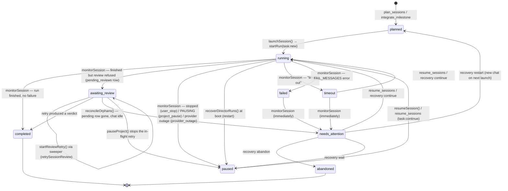

Milestone statuses (`PdMilestoneStatus`): `planned` (from `setPlan`), `running` (first session of the milestone launched, `start_sessions`), `integrating` (`integrate_milestone`), `completed` (`complete_milestone`). **`ready` and `blocked` are declared in `shared/types.ts` and rendered by the UI's status colours but have no writer anywhere in `server/src`.**

---

## 9. Builder architecture

**Definition.** The Builder is the Claude Code CLI acting on the user's request inside the project directory. Tandem's Builder code (`server/src/engine/claude.ts` — `runClaudeTurn`) does not implement any agent logic; it constructs one CLI invocation, streams its output into events, and returns the usage and the answer.

**What it receives.**

- **System prompt** (`--append-system-prompt`): `prompts.ts` — `builderSystemText(settings, exec)`; assembled from the `builder.*` prompt group (`builder.base`, `builder.environment`, `builder.workdir_guidance`, `builder.browser_guidance`, `builder.deploy_guardrail`, `builder.git_workflow`), `sharedInstructions`, the role's `instructions`, the Agent profile's prompt overlay, enabled skills (`kv:skills`) and the integration catalog for the builder role (`catalogForRole('builder')`). Admin edits to any of these take effect on the next turn.
- **User message** (stdin): `workflow.ts` — `builderMessage(h, userText, resumeSessionId)`: when there is **no session to resume** (first turn, or the session was lost/switched) it seeds continuity from Tandem's own record — the legacy compaction summary if the chat has one (`latestCompactionSummary()` → `builder.continuation_compacted`) and the recent conversation from the event log capped at `preserveRecentTokens × 4` chars (`recentConversation()` → `builder.continuation_recent`) — then wraps the request in `builder.new_request`; attachments are listed via `builder.attachments` with their paths under `TANDEM_ATTACHMENTS_DIR`.
- **Session**: `--resume <builder_session_id>` when the chat has one and the provider matches (`getBuilderSession`/`getBuilderSessionProvider`). A new session id arrives in the CLI's `system.init` message and is stored with `setBuilderSession()`.
- **Tools**: Claude Code's built-ins (Read/Write/Edit/Bash/Glob/Grep/WebFetch/…; `bypassPermissions`) plus Tandem's MCP servers via a per-call `--mcp-config tmp/mcp-<uuid>.json` with `--strict-mcp-config`: `tandem` (`mcp-workdir.cjs`: change working directory, git workflow, session naming, project memory), `tandem_browser` (`mcp-browser.cjs`), `tandem_ext` (`mcp-integrations.cjs`, only when integration tools exist for the role). A `--settings` JSON adds the `PreToolUse` hook `hook-read-guard.cjs` that refuses `Read` of images above `TANDEM_MAX_IMAGE_READ_BYTES` (default 150 KB).
- **Model / effort**: from `agents/exec.ts` — `builderExecFor(chatId, settings)` (§16); effort becomes `MAX_THINKING_TOKENS` (`low` unset, `medium` 12 000, `high` 30 000).
- **Environment**: `TANDEM_INTERNAL_URL`, `TANDEM_INTERNAL_TOKEN`, `TANDEM_CHAT_ID`, `TANDEM_ROLE=builder`, `TANDEM_SHOTS_DIR`, `TANDEM_ATTACHMENTS_DIR`, `TANDEM_BROWSER_ROLE=builder`, `TANDEM_TOOL_TEXT`, `TANDEM_NAME_SESSION` (first turn), `CLAUDE_CODE_AUTO_COMPACT_WINDOW` (= `compactMaxTokens` when auto-compact is on), `ANTHROPIC_API_KEY=''` and `ANTHROPIC_AUTH_TOKEN=''` (the CLI must use its own login, never an inherited key), `GIT_OPTIONAL_LOCKS=0`.

**Autonomy.** The Builder decides its own steps. Tandem intervenes only through (a) the prompt, (b) the tool set, (c) the timeout (`BUILDER_TIMEOUT` 30 min; a Director launch may raise it up to 90), (d) `stopRun()` on user Stop, and (e) the review loop, which feeds findings back as a new `--resume`d turn (§13). The Builder is **not** jailed: it runs with `bypassPermissions` and full write access to the host as the service user (§21, §40).

**Modes.** Three uses of the same function differ only in prompt and flags: the **Builder turn** (`role:'builder'`), the **repair turn** (same role, message = `repair.findings_message` — or `repair.answer_findings_message` when the subject was an answer — rendered with the findings), and the **final repair** (message = `repair.final_message` / `repair.answer_final_message` on top of `repair.final_base`, extended by `finalRepairInstructions`). The Director's turn (`role:'director'`, read-only, `withDirectorTools`) also goes through `runClaudeTurn` but is not a Builder.

**Output handling.** `runClaudeTurn` parses the CLI's stream-json NDJSON line by line: `system.init` → session id + model; `stream_event` text deltas → `appendAssistantText` (live text); `assistant` messages → `mapToolUse()` turns each `tool_use` into a typed event (`command` for Bash, `file_read` for Read, `search` for Grep/Glob, `file_change` for Write/Edit/NotebookEdit, `browser` for `tandem_browser__*`, `tool_call` for the rest); `user` messages carry `tool_result`s which `resolveToolResult()` patches back onto the pending event (exit code, output, diff); `result` → `num_turns` and `usage` (input, cache-read, cache-creation and output tokens; `usage.iterations` gives the final iteration, whose input + cache_read + cache_creation + output becomes `contextTokens`) plus `modelUsage[model].contextWindow`, recorded on the `ai_call` event as `response.usage` (§17); the duration is measured by Tandem. Anything unparseable is logged, not fatal.

**Failure.** A non-zero exit, a `result.is_error`, a timeout or a spawn error becomes an `error` event with message `Builder call failed` / `Builder repair call failed` / `Final repair call failed` and `detail` = the CLI's stderr/result text; `startRun` still finishes the run (`run:finished`) — the *Director* reads the error event as the failure (§8.2), while an ordinary chat just shows it.

---

## 10. Reviewer architecture

**Definition.** The Reviewer is the Codex CLI judging the Builder's result against the **original request** — the task's immutable `original_request` from `review_ledger`, not the latest message (§13). `server/src/engine/codex.ts` — `runCodexReview(h, opts)`.

**Independence guarantees.**

- Different vendor and model (`gpt-5.6-sol`, the only entry in `CODEX_MODELS`) from the Builder.
- Fresh session every round (`codex exec` with no resume); the review prompt contains the request, the subject and, for round 2, a continuation section (`reviewer.continuation_section`) that names the previous findings so the Reviewer checks the fixes rather than re-litigating.
- Read-only by construction: `--sandbox read-only` when no profile is written; with the per-run profile `tandem-reviewer-<runId12>` (written to `CODEX_HOME/config.toml` profiles) the read-only sandbox plus `[mcp_servers]` blocks are declared, and the whole process is wrapped in `bwrap` with `readOnlyJailArgs` where bubblewrap exists (§21). The Reviewer gets `tandem_browser` (its **own** browser instance, `TANDEM_BROWSER_ROLE=reviewer`) and `tandem_ext` (only tools whose `roles` include `reviewer`), never `tandem` (workdir/git/memory — the internal route for Project Memory refuses `ctx.phase === 'reviewer'`).
- The Reviewer never sees the Builder's transcript, its browser state or its session; it sees the diff/file list (`subject.kind === 'changes'` with the changed paths and a note about the delta kind) or the answer text (`subject.kind === 'answer'`, capped at `ANSWER_CAP` 24 000 chars).

**Subject selection.** After the Builder turn, `currentDelta(h)` diffs the pre- and post-turn worktree snapshots (`snapshot.ts` — `diffWorktrees`): changed/added/removed files become a `changes` subject with a `note` (`noteFor(kind)`: e.g. "The Builder changed files but also left the tree dirty…"); no file change → `answer` subject from the Builder's final text; nothing at all → no review (the gate explains why in a `status` event).

**Verdict protocol.** The Reviewer must answer `PASS` or a findings list; `workflow.ts` — `parseVerdict(text)` accepts a first-line `PASS`/`VERDICT: PASS`, otherwise parses bullet/numbered items (severity prefixes recognised) into `Finding[]`; an unparseable non-PASS answer counts as findings with the raw text as one item. The verdict is recorded as a `findings` event (`verdict`, `items`, `round`, `raw`) and, atomically, in the ledger (`review()` wraps `recordReview` + `addEvent` in one `db.transaction`).

**Failure vs verdict.** A Reviewer process failure (`reviewerFailed()`) is not a verdict: if `classifyProviderOutage(text, now, 'Codex')` recognises a quota/rate/session limit or a transient outage, `recordReviewWait()` persists a `pending_reviews` row (round, original request, subject, reason, `retry_at`, attempts) and writes a `status` event "Review deferred…"; the run still finishes and the chat stays reviewable later (§18). Any other failure is recorded as an `error` event ("Reviewer call failed") and **the run finishes unreviewed** — there is no reviewer-failure policy beyond that (the `TODO(provider-swap)` comment in `settings.ts` names this).

**Budget.** `MAX_REVIEW_ROUNDS = 2` per task, enforced by `reviewLedger.ts` (§13). Reviews that were refused by the provider consume no round.

---

## 11. Director / orchestration engine

`server/src/director/engine.ts` (1 742 lines) is the orchestration brain; `director/store.ts` owns its tables; `director/pendingWake.ts` its wait store; `mcp-director.cjs` exposes its tools to the Director model.

### 11.1 Responsibilities and their functions

| Concern | Functions |
|---|---|
| Create a run / accept user messages | `createProjectRun`, `directorUserMessage` |
| Serialize turns, coalesce observations | `pumpDirector`, `turnState`, `queueObservation`, `deliverPendingWake` |
| Run one Director turn | `runDirectorTurn` → `runClaudeTurn(role:'director')`; on refusal returns a `ProviderOutage` for `pumpDirector` to persist as a `pending_wakes` row |
| Plan review loop / recovery review loop | `processAfterTurn`, `reviewArtifact` (Codex, `director.plan_review_request` / `director.recovery_review_request` prompts), `acceptPlan`, `applyRecovery` |
| Director self-compaction | `directorAutoCompact` |
| Git plumbing | `git`, `isRepo`, `ensureIntegrationBranch`, `cleanupRunWorkspaces`, `mergeDependencyContent`, `worktreeDir` |
| Sessions | `dirBusyWithin`, `launchSession`, `resumeSession`, `resumeSessionWithTimeout`, `retrySessionReview`, `monitorSession`, `readOutcome`, `failureContext`, `stopBlocksRequiredPath`, `readySessions` |
| Live block in the Project Chat | `ensurePoller` (5 s while sessions run), `deriveLive`, `refreshLiveBlock` (one `sessions` event whose id is `project_runs.live_event_id`, rewritten in place) |
| Pause / resume | `pauseProject`, `finishPauseIfDone`, `resumeProject` |
| Boot recovery | `recoverDirectorRuns`, `wakeAfterRestart`, `driveRestartWake` |
| Tool dispatch | `handleDirectorTool(chatId, op, args)` |

### 11.2 The Director's tools (`tandem_director` MCP server → `POST /api/internal/director`)

The MCP-facing tool names are `project_get_state`, `project_set_plan`, `plan_milestone_sessions`, `start_sessions`, `resume_sessions`, `recover_session`, `integrate_milestone`, `complete_milestone`, `project_deliver`, `complete_project`, `project_need_user`; `mcp-director.cjs` strips the `project_` prefix and maps `plan_milestone_sessions` → `plan_sessions` to produce the `op` below. Each call is also recorded in the Project Chat as a `tool_call` event named `director_<op>`.

| Op | Effect | Refusals |
|---|---|---|
| `get_state` | `stateSnapshot()` text: run state, milestones, sessions (with `reviews N/2 spent · last verdict` from the ledger), pending wait | never |
| `set_plan` | `setPlan(milestones)`; starts/continues the plan review loop | terminal run; invalid DAG |
| `plan_sessions` | `planSessions(sessions)` under a milestone | unknown milestone; duplicate keys; dependency cycles |
| `start_sessions` | `launchSession()` for each key; marks the milestone `running`; RESUMING → RUNNING | `providerWaitActive`; unsatisfied deps; busy dir; not `planned` |
| `resume_sessions` | `resumeSession()` for `paused/timeout/needs_attention` sessions with a chat; RESUMING/PAUSED → RUNNING | `providerWaitActive`; wrong status |
| `recover_session` | records `pending_recovery` (`continue/restart/abandon/wait` + reasoning) for the recovery review loop | a recovery is already pending (single slot) |
| `integrate_milestone` | creates and launches an integration session that merges the milestone's branches; milestone → `integrating` | `providerWaitActive`; sessions not terminal |
| `complete_milestone` | milestone → `completed` | sessions not completed/abandoned |
| `deliver` | merges the integration branch into `base_branch`, cleans worktrees, records a `delivery` activity | non-terminal sessions; merge conflicts |
| `complete_project` | `COMPLETED` | `deliver` not done |
| `need_user` | `NEEDS_USER` with the question | — |

### 11.3 Serialization, wakes, restart

- One turn at a time per run (`turnState.busy`); observations queue. There is no cross-run serialization; two project runs progress independently (each session chat has its own `RunCtx`).
- A refused turn (`classifyProviderOutage` on the CLI error) → `upsertPendingWake({ runId, message, reason, detail, retryAt, transient })` (message merged into the existing row, ≤ 12 000 chars, backoff for transient outages); the sweeper's `sweepProviderWakes()` re-delivers due wakes with `deliverPendingWake()` (in-flight guard `wakeInFlight`), deleting the row first; a wake for a terminal run is dropped. `providerWaitActive(runId)` reads the row so the state snapshot, the live block and the `LAUNCHES_WORK` guard all reflect the wait.
- Boot: §31. Auto-resume is capped by `bumpAutoResumeStreak()` (three quick boots within the 90-second window → the wake is deferred by `SETTLE_DELAY_MS` = 2 min instead of pausing).

```mermaid
sequenceDiagram
  participant U as User (Project Chat)
  participant R as routes.ts
  participant D as director/engine.ts
  participant C as claude (Director, read-only jail)
  participant X as codex (Reviewer)
  participant S as startRun (workflow.ts)
  U->>R: POST /api/chats/:projectChat/messages "goal"
  R->>D: directorUserMessage() → pumpDirector(user)
  D->>C: runDirectorTurn — system prompt + state + message
  C->>D: tandem_director.set_plan(milestones)
  D->>D: setPlan(); plan_review_round=1
  D->>X: reviewArtifact(planDocument, round 1)
  X-->>D: findings | PASS
  alt findings and round < 3
    D->>C: observation "plan review findings…" (next turn) → set_plan again
  else pass or round 3
    D->>D: acceptPlan() → RUNNING
  end
  C->>D: plan_sessions(...) / start_sessions([s1])
  D->>S: launchSession → worktree, chat(pd-session), startRun(task:new)
  S-->>D: run promise → monitorSession → status + queueObservation
  D->>C: next turn with coalesced observations
  C->>D: integrate_milestone / complete_milestone / deliver / complete_project
```

---

## 12. Run execution pipeline

This is `startRun()` end to end (`server/src/engine/workflow.ts`), the primitive shared by human chats, Director sessions and retries.

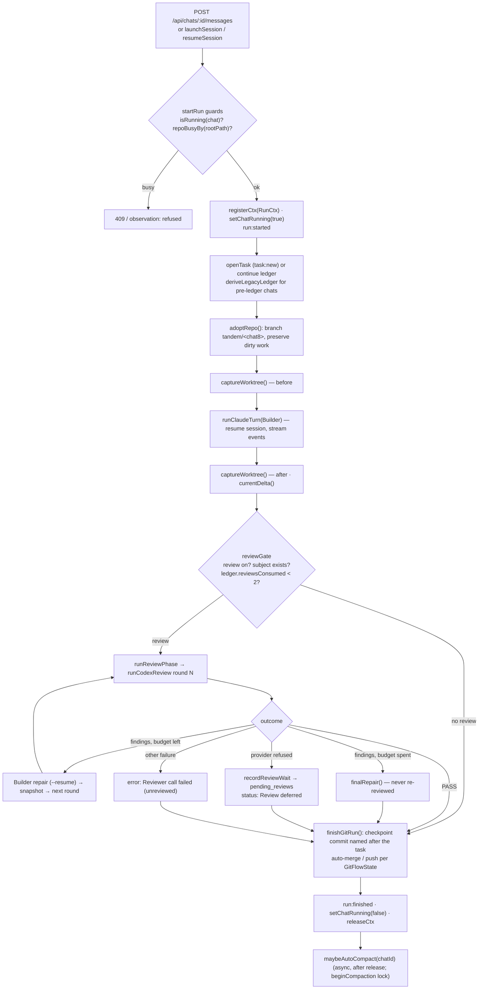

**Step by step.**

1. **Entry.** `startRun(chatId, userText, attachments, opts)` where `opts = { review, timeoutMs?, task?: 'new' | 'continue' }`. Human messages pass `review` from the composer toggle; Director launches pass `review: true`, `task: 'new'`; resumes pass `task: 'continue'`; `startReviewRetry(chatId)` is a separate entry that only runs the review phase.
2. **Guards.** `isRunning(chatId)` (a `RunCtx` exists or a compaction holds the chat) → refused; `repoBusyBy(rootPath, chatId)` (another chat's `RunCtx` on the same directory) → refused with the other chat's id. Both surface as HTTP 409 for the UI and as a thrown error for the Director.
3. **Registration.** `registerCtx({ chatId, runId, stopped:false, child:null })`, `setChatRunning(chatId, true)` (broadcast), `addEvent(run, { phase:'started' })`. A `RunHandle` (`run.ts`) bundles chat, project, ctx and helpers (`h.status(text)`, `h.error(...)`, `h.settings`).
4. **Task ledger.** `task:'new'` → `openTask(chatId, userText)` (new `task_seq`, `reviews_consumed = 0`, `original_request = userText`); `task:'continue'` (or a legacy chat without a row) → `getLedger()` or `deriveLegacyLedger(chatId)` (reconstructs consumed rounds from the latest `findings` events of the last task). The **original request** used for every review prompt is `ledger.originalRequest`, never the current message.
5. **Git adoption.** `adoptRepo(h)` (`gitFlow.ts`): if the directory is not a repo or the chat's saved state is `mode:'none'`, git is skipped; otherwise on first use it records `{ mode:'working-branch', workBranch:'tandem/<chat8>', targetBranch:<current branch>, push:'never' }`, creates/switches to the work branch, and if the tree was dirty commits the pre-existing changes as `tandem: preserve uncommitted changes present before adopting the working branch` (a `checkpoint` event with `action:'preserve'`) so nothing of the user's is lost or mixed into the Builder's checkpoint.
6. **Snapshot before.** `captureWorktree(dir)` → `{ hash, files }` (md5 of `git status --porcelain` + md5 of the diff).
7. **Builder turn.** `runClaudeTurn(h, message, { role:'builder', resume, timeoutMs, exec })` (§9). The `ai_call` event created before the spawn is updated with the response, usage and duration when the CLI ends.
8. **Snapshot after / delta.** `currentDelta(h)` → `ReviewDelta { kind, files }` with kinds such as `clean-change`, `dirty-tree`, `no-change` (`DeltaNoteKind`), and `subjectFor(delta, answer)`.
9. **Review gate.** `reviewGate(h, opts, subject, ledger)` writes a `status` event explaining a skipped review: review switched off for this message, the Reviewer role disabled in settings, nothing to review, or the task's two rounds already spent ("Review budget for this task is spent (2/2) — the result stands as delivered").
10. **Review phase.** `runReviewPhase()` (§13).
11. **Git finish.** `finishGitRun(h, originalRequest)`: stages everything, commits `tandem: <original request, whitespace-collapsed, first 72 chars>` (or `tandem: checkpoint`; only if there is something to commit; `checkpoint` event `action:'commit'`), then per state: `auto-merge` → `git merge --no-ff <workBranch> -m "tandem: merge <workBranch>"` into `targetBranch` and switch back (`action:'merge'`; a conflict aborts the merge and is reported as an error); `direct` → commits on the target; `push` per `GitFlowState.push` (`action:'push'`; failures are `retryable` git errors). Failures are `error` events with `source:'git'`; the run still finishes.
12. **Finish.** `addEvent(run, { phase: stopped ? 'stopped' : 'finished' })`, `setChatRunning(false)`, `releaseCtx`. Unexpected throws produce `error` "The run failed unexpectedly" and `run:failed`.
13. **After.** `maybeAutoCompact(chatId)` (fire-and-forget): if `settings.context.autoCompact` and `shouldAutoCompact(usage)` and no failed attempt within `COMPACT_RETRY_COOLDOWN` (15 min) → `performNativeCompaction(chat, 'auto')` under the compaction lock, so the next message waits instead of resuming the session concurrently.

**Concurrency within a run.** Everything is sequential except the streaming of CLI output (event appends happen as lines arrive) and the browser host, which serves MCP calls from the CLI concurrently with the stream.

**Idempotency.** Runs are not idempotent (a retried message is a new run). The review *retry* is idempotent with respect to budget: `startReviewRetry()` re-reads the ledger and either resumes an interrupted final repair, runs the pending round, or, if the budget is already spent, deletes the pending row and finishes the git run.

---

## 13. Builder ↔ Reviewer repair loop

**Purpose.** Give every result exactly one independent check with one chance to fix it and one re-check, then stop. The cap is a product decision (cost, latency, and preventing two models from arguing indefinitely), and it must survive crashes, retries, resumes and restarts.

**The durable ledger (`engine/reviewLedger.ts`).** One row per chat: `task_seq`, `original_request`, `reviews_consumed`, `repairs_consumed`, `last_verdict`, `final_repair_done`, `reviewed_revision`. `recordReview(chatId, round, verdict, revision)` sets `reviews_consumed = MAX(reviews_consumed, round)` (monotonic, so a re-run of a round cannot lower the count), `recordRepair` likewise. `MAX_REVIEW_ROUNDS = 2`. `revisionOf(treeHash, subject)` and `snapshot.ts` — `revisionHash(dir, state)` (state hash + untracked files `path|size:mtime`) identify *what* was reviewed so an identical revision is not reviewed twice after a retry. The ledger was introduced in commit `9c98ac9` after the forensic case in which continuation runs got a fresh budget and the checkpoint was named after a recovery note instead of the request (§41).

**The loop (`runReviewPhase`).**

```mermaid
sequenceDiagram
  participant W as workflow.ts
  participant L as review_ledger
  participant B as Builder (claude --resume)
  participant R as Reviewer (codex exec)
  W->>L: openTask / continue (reviewsConsumed = n)
  Note over W: subject = changes | answer (after Builder turn)
  alt n = 0
    W->>R: round 1 (original request, subject)
    R-->>W: PASS → done | findings
    W->>L: recordReview(1) + findings event (one transaction)
    W->>B: repair turn (repair.message with findings)
    B-->>W: snapshot → new subject
  end
  alt n ≤ 1 and findings on the previous round
    W->>R: round 2 (+ continuation_section naming round-1 findings)
    R-->>W: PASS → done | findings
    W->>L: recordReview(2)
    W->>B: finalRepair() — repair.final_message (+ finalRepairInstructions)
    W->>L: recordRepair(final_repair_done = 1)
    Note over W: findings event patched: finalRepairNotReviewed = true
  end
  Note over W,L: n = 2 ⇒ no review at all; status "Review budget spent (2/2)"
```

- **Round 1** is reviewed against `original_request`. `PASS` ends the loop. Findings → `Builder repair` turn: `--resume` the same session with `repair.findings_message` (findings rendered by `findingsAsText`; `repair.answer_findings_message` for an answer subject), `BUILDER_TIMEOUT`.
- **Round 2** includes the previous findings (`lastFindings(chatId, 1)`) via `reviewer.continuation_section`. `PASS` ends. Findings → **final repair** (`finalRepair(h, round2, subjectKind, builderTimeout)`): the Builder gets `repair.final_message` (or `repair.answer_final_message`) and the `findings` event is patched with `finalRepairNotReviewed: true`; the UI labels it "fixed after the final review — not re-reviewed". `recordRepair()` marks `final_repair_done`.
- **Refusals do not consume rounds.** A provider-refused review leaves `reviews_consumed` untouched and writes `pending_reviews`; the sweeper's `startReviewRetry()` runs the *same* round with the *same* subject and original request. If the crash happened during a final repair (`final_repair_done = 0` but `reviews_consumed = 2`), the retry path finishes the final repair rather than reviewing a third time.
- **Task continuity.** A Director `resumeSession` passes `task:'continue'`; a `restart` recovery launches a new chat, which legitimately opens a new task. A human's next message in the same chat opens a new task (`task:'new'` default) — a new request deserves a new budget.

**Repairs are turns, not runs.** The repair and final-repair invocations happen inside the same `RunCtx`/run id, so the timeline shows one run with several `ai_call` events. Stop during a repair sets `ctx.stopped`, kills the child and ends the run `stopped`.

---

## 14. Event system

**Event kinds** (`EventKind`, `shared/types.ts`, 16): `user_message`, `assistant_message`, `status`, `command`, `file_read`, `search`, `file_change`, `ai_call`, `findings`, `compaction`, `run`, `error`, `browser`, `checkpoint`, `tool_call`, `sessions`. Payloads are `EventPayloadMap[kind]` (§28 lists each shape).

**Production.** Only `events.ts` — `addEvent(chatId, kind, payload, runId?)` inserts (id = random UUID, `seq = MAX(seq)+1` for the chat, `ts = now`), bumps `chats.updated_at`, and broadcasts `{ type:'event', chatId, event }` to UI clients plus a `context` message with the recomputed `ContextUsage`. `updateEvent(id, patch)` merges into the stored payload and broadcasts the whole event again (or a `delta` message for streaming text via `appendAssistantText`, throttled). Events are appended by: routes (`user_message`, `status`), `workflow.ts` (`run`, `status`, `findings`, `checkpoint`, `error`), `claude.ts`/`codex.ts` (`ai_call`, `assistant_message`, `command`, `file_read`, `search`, `file_change`, `browser`, `tool_call`, `error`), `gitFlow.ts` (`checkpoint`, `error`), `providerContext.ts` (`compaction`, `error`), `director/engine.ts` (`status`, `sessions`, `error` in the Project Chat), `browserHost.ts` (`browser`), `run.ts` (`error`, `run:stopped` at boot).

**Ordering.** `seq` is dense per chat and assigned synchronously; there is no global order across chats (use `ts`). `run_id` groups an invocation. Within an `ai_call`, tool events are appended as the CLI reports them and later patched with results; a consumer that needs "settled" data should treat an event as final only after the `run` event of its run id.

**Consumers.** The UI (`store.ts` — `applyMsg` upserts by event id, sorted by seq; `Timeline.tsx` renders and groups), the Director (`readOutcome()` reads `run`/`assistant_message`/`findings`/`error` since a baseline seq; `deriveLive()` reads the last events for the live block), the context meter (`computeUsage` anchors on the last `ai_call`/`compaction`), the Observability API (`/events`, `/evidence` — §24), the exporter (`toMarkdown`/`toHtml`), and the harness invariants (§36).

**Streaming.** `beginAssistantMessage()` creates an empty `assistant_message`, `appendAssistantText()` accumulates and broadcasts `delta` chunks, `finishAssistantMessage()` writes the final text. Tool events are created when the `assistant` message carrying the `tool_use` block arrives (status `running`) and patched with the `tool_result`; tool inputs are not streamed character by character.

**Error events.** `ErrorPayload { message, detail?, source?: 'builder'|'reviewer'|'git'|'context'|'director'|'system', retryable? }`. The messages the Director treats as failures are exactly the four `FAIL_MESSAGES` (§8.2); changing their text changes session classification (§42).

**Retention.** Nothing is ever pruned. Chat deletion removes the chat's events. `simulated: true` marks the seeded demo events (§49).

---

## 15. AI provider architecture

Two providers exist as adapters: `claude-code` (`engine/claude.ts`, plus `providerContext.ts` for `/context`/`/compact`) and `codex` (`engine/codex.ts`). Both are **CLI adapters**: Tandem never calls a model HTTP API directly, holds no API keys for models, and deliberately blanks `ANTHROPIC_API_KEY`, `ANTHROPIC_AUTH_TOKEN` and `OPENAI_API_KEY` in child environments so the CLIs use their own logins (the operator's subscriptions).

**Role → provider binding is fixed** by `settings.ts` — `lockProviders()`: Builder = `claude-code`, Reviewer = `codex`, Director = `claude-code` (`resolveDirectorRole` always runs the Director on the Claude adapter; if no Director model is saved it follows the Builder's model, or the stock Claude model if the Builder were ever non-Claude). The Admin UI's provider selects are disabled (`RolesPage.tsx`). The `TODO(provider-swap)` comment lists what would be needed to unlock them: provider-aware dispatch in `runWorkflow`, session resume/compaction for both providers, MCP wiring for both roles, and a reviewer-failure policy.

**No OpenRouter, no direct API mode, no third provider.** The `Provider` union is exactly `'claude-code' | 'codex'`.

**Where provider specifics live.**

| Aspect | Claude Code | Codex |
|---|---|---|
| Invocation | `claude -p … --output-format stream-json` (`claude.ts`) | `codex exec --json …` (`codex.ts`) |
| Session | `--resume <id>`; id from `system.init` | none (fresh per review) |
| Tools | built-ins + `--mcp-config` + `--settings` hooks | `-p <profile>` with `[mcp_servers]`, `--approve-for-me`; fallback `--sandbox read-only` |
| Effort | `MAX_THINKING_TOKENS` env | `-c model_reasoning_effort="<effort>"` |
| Output parsing | stream-json NDJSON (`system`, `stream_event`, `assistant`, `user`, `result`) | `--json` JSONL (`item.started/completed`, `turn.completed` with usage) |
| Usage | `result.modelUsage[model]` → input/output/cache tokens, `contextWindow` | `turn.completed.usage` (input/output tokens; no context report) |
| Context inspection | `/context` via `claudeSlash` | not available ("Codex 0.147 has no on-demand context report") |
| Compaction | `/compact` via `claudeSlash` (result verified to shrink) | not available; Codex compacts internally |
| Outage detection | `classifyProviderOutage(text, now, 'Claude')` | `classifyProviderOutage(text, now, 'Codex')` |
| Binary | `TANDEM_CLAUDE_BIN` (default `claude`) | `TANDEM_CODEX_BIN` (default `codex`) |

**Adding a provider** would mean: a new adapter with the same contract as `runClaudeTurn`/`runCodexReview` (events + usage + session id), a `Provider` union member and model list in `shared/types.ts`, dispatch in `runWorkflow`/`review`, `sessionProvider()`/`performNativeCompaction` support, MCP server wiring for its tool protocol, `classifyProviderOutage` vocabulary for its error texts, and unlocking `lockProviders`. There is no plugin mechanism.

---

## 16. Model / reasoning / profile resolution

Three roles, three resolution paths:

**Builder** — `agents/exec.ts` — `builderExecFor(chatId, settings)` returns `{ model, effort, promptOverlay, agentName }`:
1. If the chat has a `chat_agent_snapshots` row (a Director session), use the **snapshot** (model, effort, prompt overlay, name) — immutable for the life of the chat, even if the profile is edited, archived or the role settings change.
2. Otherwise use `settings.roles.builder` (`model`, `effort`, `instructions`) — an ordinary human chat follows the Admin → Roles settings live.

`resolveAgentForLaunch(profileId?)` (`agents/store.ts`) picks the profile for a *new* session: the requested id if it exists, is enabled and not archived; else the default profile. `captureAgentSnapshot(chatId, profile)` copies its fields. Seeds (`agents/seeds.ts`): `general` (default, `claude-sonnet-5`, high), `ui` (sonnet-5, high), `backend` (`claude-opus-5`, high), `qa` (sonnet-5, medium). Validation (`validateModel`, `validateEffort`, `validateSlug` in `agents/store.ts`): model must be in `CLAUDE_MODELS`, effort in `EFFORTS`, slug pattern and uniqueness, prompt length ≤ `MAX_AGENT_PROMPT_CHARS`.

**Reviewer** — `settings.roles.reviewer.model` (`gpt-5.6-sol`) and `.effort`; `enabled:false` disables review globally (the gate reports it). No per-chat override.

**Director** — `settings.ts` — `resolveDirectorRole(settings)`: `roles.director.model` if set, else the Builder's model when the Builder is Claude, else the stock default (`claude-opus-5`); effort = `roles.director.effort ?? roles.builder.effort`. The Project Chat's compaction uses this resolution (`routes.ts` compact route passes the override; `index.ts compact` CLI too).

**Effort mapping.** Claude: `MAX_THINKING_TOKENS` `low` → unset, `medium` → 12 000, `high` → 30 000 (`claude.ts`). Codex: `model_reasoning_effort` set verbatim (`low|medium|high`).

**Model lists.** `shared/types.ts` — `CLAUDE_MODELS` (the selectable Claude models; the default is `claude-opus-5`) and `CODEX_MODELS = ['gpt-5.6-sol']`. `putSettings` does not validate model names against the lists (the UI limits choices; the API accepts any string).

**Precedence summary.** Session snapshot > Agent profile at launch (frozen) > role settings; the Reviewer has only role settings; the Director has its own role or inherits the Builder's. There is no per-request model override and no "Analysis Profile" concept in this codebase.

---

## 17. Context and token management

**Two mechanisms, one ceiling.** Tandem never summarizes a conversation itself. It (a) *measures* the provider session's context and (b) asks the provider that owns the session to compact it, and since commit `aca04b0` it also (c) tells the Claude Code CLI the same ceiling so the CLI compacts *inside* a long run.

**The meter — `server/src/context.ts` — `computeUsage(chat): ContextUsage`.** The anchor is the most recent of: the last `ai_call` event's `response.usage.contextTokens` (recorded by `claude.ts` from the CLI's `result`: the last entry of `usage.iterations` — input + cache_read + cache_creation + output of the final model call, i.e. the size the *next* request will carry; the window comes from `modelUsage[model].contextWindow`) or the last `compaction` event's `afterTokens`. Events after the anchor (user text, tool outputs, assistant text) are estimated with `estimateEventTokens()` (≈ chars/4) into `pendingTokens`. The window comes from `kv:model_windows` (`recordModelWindow(provider, model, contextWindow)` is written whenever the CLI reports one; `backfillModelWindows()` seeds it at boot from history). `pct = (used + pending) / window`, `total = used + pending`, `source` is `'provider' | 'estimated' | 'none'`. There is no level field: the UI derives the tone (`ContextMeter.tsx` — `pctTone()`: warn at `warnPct`, crit at `critPct`). `broadcastContext()` pushes a fresh `ContextUsage` to the UI after every event, and `GET /api/chats/:id/context` returns it on demand. For a chat with no `ai_call` yet, `usedTokens` is `null` and the meter shows only the estimate.

**When compaction triggers — `shouldAutoCompact(usage, settings)`.** True when `usedTokens + pendingTokens ≥ compactMaxTokens` (default 200 000, clamped 50 000–2 000 000 in `putSettings`) **or** `pct ≥ compactPct` (default 75). Whichever trips first wins; the percentage alone was found inert once windows grew to 1M (`migrateContextDefaults()` explains and repairs that).

**Between runs — `workflow.ts` — `maybeAutoCompact(chatId)`.** Runs after `releaseCtx` at the end of every run. Skips if auto-compact is off, the chat is running, the usage is under the rule, or a compaction failed within `COMPACT_RETRY_COOLDOWN` (15 min, in-memory `compactFailedAt`). Otherwise `performNativeCompaction(chat, 'auto')`. The Director does the same for its own session (`directorAutoCompact`).

**Provider-native compaction — `engine/providerContext.ts` — `performNativeCompaction(chat, reason, override?)`.**

1. `beginCompaction(chatId)` marks the chat busy (so `isRunning()` is true and `startRun`, retries, the sweeper and the manual button all wait — otherwise the next message would `--resume` the same session concurrently). Released in `finally`.
2. Refuses if the chat has no session yet or the session's owner provider differs from the current provider.
3. `readNativeContext()` → `claude -p --output-format json --model M --resume SID /context` (90 s), parsed by `parseClaudeContext()` from the `**Tokens:** 23.2k / 1m` line; falls back to the meter's estimate for `beforeTokens`.
4. `runNativeCompact()` → the same command with `/compact` (10 min). The CLI's envelope says success even when its internal summarization call was refused, so the *result text* is checked with `classifyProviderOutage()` and `/\bAPI Error\b|error (?:while )?compacting|compaction failed/i`.
5. Reads `/context` again; if `after ≥ before × 0.95` the compaction is a **failure** ("the context did not shrink") — commit `acff4ad` — because recording it would anchor the meter at the old size and hide that nothing happened.
6. Success writes one `compaction` event `{ provider, model, beforeTokens, afterTokens, windowTokens, source: 'provider'|'estimated', reason, sessionId, durationMs }`; failure writes one `error` event with `source:'context'`, `retryable:true`.

Codex has neither `/context` nor `/compact` in `codex exec` (the code documents the verification: a `/compact` sent through exec reaches the model as text). Since the Builder is locked to Claude, no chat session is Codex-owned; the Codex branches in `providerContext.ts` return honest errors.

**Inside a run — `engine/claude.ts`.** When `autoCompact` is on and `compactMaxTokens > 0`, every Builder/Director invocation gets `CLAUDE_CODE_AUTO_COMPACT_WINDOW=<compactMaxTokens>`; the CLI then compacts on its own as the session nears the window (it keeps a buffer of roughly 16 %, so a 200 000 setting compacts at about 167 000). The CLI reports each such compaction as a `system` message with subtype `compact_boundary`; `claude.ts` records it as a `compaction` event with `reason: 'provider-auto'` (or `'manual'`), `source: 'provider'` and `beforeTokens` from `compact_metadata.pre_tokens` — no `afterTokens`, so the meter re-anchors on the next `ai_call`'s `contextTokens` instead. Before `aca04b0`, a single long Director session could reach 388k tokens mid-run while the between-run rule never had a chance to fire.

**Manual compaction.** `POST /api/chats/:id/compact` (UI: `CompactDialog.tsx`) and `node dist/index.js compact <chatId…>`; the Project Chat passes the Director's model as the override.

**Legacy.** `CompactionPayload.summary` / `.preserved` and `chats.last_compaction_event_id` belong to the removed Compactor role (commit `d66e4b3`); `latestCompactionSummary()` still injects an old summary into the first message of a chat that has one (§49).

**Where limits live.** `settings.context` (`warnPct`, `compactPct`, `critPct`, `compactMaxTokens`, `autoCompact`, `preserveRecentTokens`). `preserveRecentTokens` is not a compaction knob any more: it caps how much recent conversation `builderMessage()` seeds into a **fresh** CLI session (no `--resume` available), at `preserveRecentTokens × 4` characters (§9).

---

## 18. Rate limits, session limits and provider outages

**Classifier — `engine/reviewWait.ts` — `classifyProviderOutage(errorText, now, provider): ProviderOutage | null`.** Two families:

| Family | Detection (case-insensitive) | `reason` | `retryAt` | `transient` |
|---|---|---|---|---|
| Quota | `usage limit`, `rate limit`, `session limit`, `quota`, `too many requests`, standalone `429`, `usage_limit_reached`, `rate_limit_exceeded` | `<Provider> session limit` / `rate limit` / `usage limit` | `parseResetTime(text)` + 60 s grace, else now + 15 min (`DEFAULT_RETRY_MS`) | no |
| Transient (`classifyTransient`) | overload: `overloaded` or `API Error/status/HTTP … 529`; server error: `internal server error`, `bad gateway`, `service unavailable`, `gateway timeout`, `server had an error while processing`, `temporarily unavailable`, `API Error … 50x`; connection: `ECONNRESET`, `ETIMEDOUT`, `EAI_AGAIN`, `socket hang up`, `stream disconnected`, `TypeError: fetch failed` | `<Provider> overload` / `server error` / `connection error` | now + 5 min (`TRANSIENT_RETRY_MS`) | yes |

`parseResetTime()` understands epoch fields (`"resets_at": 1700000000`), relative phrases (`in 2 hours 5 min`), and clock times (`3:30 pm (UTC)`), with heuristics for a time that has just passed (`JUST_MISSED_MS` 20 min → tomorrow) or is within `NEAR_RETRY_MS`. `transientRetryAt(attempts, now)` gives the backoff 5, 10, 20, 40, 60, 60… minutes (`TRANSIENT_RETRY_MAX_MS`), applied on **upsert** (`upsertPendingReview` / `upsertPendingWake` take the max of the caller's `retryAt` and the backoff when `transient`), so attempts, not the classifier, drive escalation. `fmtRetryAt()` renders "HH:MM UTC (in N min)".

**Where refusals are caught.**

| Refused call | Caught in | Persisted as | Visible as |
|---|---|---|---|
| Reviewer round (Codex) | `workflow.ts` — `reviewerFailed()` → `recordReviewWait()` | `pending_reviews` (per chat; round, subject, original request) | `status` event "Review deferred — <reason>; retry at …"; PD session `awaiting_review` with `reviewWaitReason`/`reviewRetryAt`; ProjectDrawer badge |
| Director turn (Claude) | `director/engine.ts` — `pumpDirector()` after `runDirectorTurn()` | `pending_wakes` (per run; message merged) | `ProjectRun.providerWait` from `providerWaitActive()`; live block line; activity "held — <reason> until …" |
| Builder call inside a Director session (Claude) | `monitorSession()` — `classifyProviderOutage(outcome.errorText)` | session `paused` with `stopReason 'provider_outage'` + `pending_wakes` | activity "…paused — provider …"; the wake resumes it |
| `/compact` summarization | `providerContext.ts` — `runNativeCompact()` result text | nothing (cooldown 15 min in memory) | `error` event `source:'context'` |
| Builder call in an ordinary chat | not classified | — | `error` "Builder call failed" with the provider text; the user retries by sending another message |

**Retry — `reviewRetrySweeper.ts`.** Every `TICK_MS` (60 s, `TANDEM_REVIEW_SWEEP_MS`): `sweep()` iterates `duePendingReviews()`; for a chat that belongs to a PD session it requires the session to still be `awaiting_review` (otherwise the row is deleted as superseded), skips running chats, and calls `startReviewRetry(chatId)`; for Director sessions `retrySessionReview()` re-attaches the monitor. `sweepProviderWakes()` delivers due `pending_wakes` via `deliverPendingWake()` (drops wakes of terminal runs). `reconcileOrphans()` escalates `awaiting_review` sessions with no pending row to `needs_attention`. `expediteRunReviews(runId)` (`POST /api/project-runs/:id/retry-reviews`, the drawer's "Retry now") moves every `retry_at` to now and returns `{ requeued, runState }`; the next tick does the work.

**What the retry does — `startReviewRetry(chatId)`.** Registers a `RunCtx` (so it is a live run: Stop and Pause apply), re-reads the ledger, and: if `reviews_consumed ≥ 2` and the final repair is unfinished → `finalRepair()`; if `≥ 2` and done → delete the pending row and `finishGitRun()`; else run the pending round with the persisted subject and original request, then continue the loop exactly as `runReviewPhase` would. A refusal during the retry re-upserts the row with `attempts + 1` (backoff grows).

**Guards while waiting.** `providerWaitActive(runId)` blocks `start_sessions`, `resume_sessions`, `integrate_milestone` and defers `applyRecovery`, so a limited project does not spend the limit further. `driveRestartWake()` recognises a run whose only live work is an `awaiting_review` session with a pending review and returns it to `RUNNING` instead of pausing it (the retry runs when due).

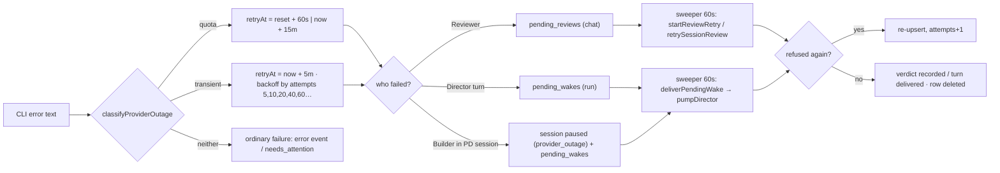

---

## 19. CLI execution

**Spawn primitive — `engine/procs.ts` — `spawnStreaming(opts): Promise<StreamResult>`.** `opts = { bin, args, cwd, env, stdin?, timeoutMs, ctx, onLine }`. It spawns with `detached: spawnDetached()` (own process group), registers the child on `ctx.child` (so `stopRun` can kill it), adopts it into the chat's containment group (`enterProcGroup(ctx.chatId, child.pid)`), writes `stdin` and closes it, splits stdout into lines and calls `onLine(line)` for each (one bad line never kills the run), keeps the last 8 000 chars of stderr, arms a timer that calls `killChild(ctx)` at `timeoutMs`, and resolves `{ exitCode, timedOut, spawnError, stderrTail }` on close. Spawn errors resolve, never throw.

**Claude Code — `engine/claude.ts` — `runClaudeTurn(h, message, opts)`.** Builds args (§3.2), writes a per-call MCP config to `DATA_DIR/tmp/mcp-<uuid>.json` (deleted after the call), a `--settings` JSON string with the read-guard hook, sets the env (§9), and wraps the command in `bwrap readOnlyJailArgs(...) -- claude …` when `opts.readOnly` and `bwrapAvailable()`. The prompt goes on stdin. Working directory: the project root (or the session worktree). Parsing (§9): `system.init` (session id, model, tools), `stream_event` (text deltas, the streamed tool-input deltas for tool inputs), `assistant` (tool_use blocks → typed events), `user` (tool_result → patch the pending event), `result` (usage, cost, `is_error`). Tool-name → event mapping is `mapToolUse()`; results are resolved by `resolveToolResult()`, which also extracts exit codes from Bash results and diffs from Edit results. `ANTHROPIC_API_KEY`/`ANTHROPIC_AUTH_TOKEN` are blanked; the CLI must be logged in as the service user (production: `HOME=/srv/tandem` in the unit).

**Codex — `engine/codex.ts` — `runCodexReview(h, opts)`.** Writes a profile `tandem-reviewer-<runId12>` into `$CODEX_HOME/config.toml` (or the default Codex home) declaring `sandbox_mode = "read-only"`, the MCP servers `tandem_browser` and, when tools exist for the reviewer role, `tandem_ext` with their env, then runs `codex exec --json --skip-git-repo-check -p <profile> --approve-for-me -m <model> -c model_reasoning_effort="<effort>"`; if the profile cannot be written it falls back to `--sandbox read-only` without MCP. `bwrap` wraps the command when available. Parsing: JSONL events — `item.started`/`item.completed` of type `command_execution` become `command` events (output capped at 60 000 chars, status from `exit_code`), `item.completed` of type `agent_message` becomes the answer text; reasoning, todo-list and MCP items are deliberately **not** recorded (the Reviewer's browser actions are evented server-side by the browser host instead); `turn.completed.usage` → `ai_call` usage (input, output + reasoning tokens); `turn.failed`/`error` → failure text. The profile is removed afterwards.

**Slash commands** use `execFile` (`providerContext.ts` — `claudeSlash`), not `spawnStreaming`, so they are not contained in a session group and are not killed by Stop; the compaction lock makes them exclusive with runs instead.

**Environment handling.** Children start from `process.env` with additions and blanks; nothing else is scrubbed (the service user's environment is what the CLIs see). `TANDEM_INTERNAL_TOKEN` is passed so the MCP servers can call back; this token is per-boot random and never written to the database or the timeline.

**Output limits.** Assistant text and tool outputs are stored whole in event payloads except where the adapters cap them (command output tails, `ANSWER_CAP` for review subjects, 2 000-char `detail` in waits). The `ai_call` event stores the full prompt and system prompt (`request.system`, `request.messages`) — the exporter and the Observability API expose them, so **prompts must never contain secrets** (§22).

**Timeouts.** `BUILDER_TIMEOUT` 30 min (Director may raise per session, capped at 90 in `launchSession`), `REVIEW_TIMEOUT` 15 min, `DIRECTOR_TIMEOUT` 15 min (`director/engine.ts`), `/context` 90 s, `/compact` 10 min, toolText discovery 6 s, integration HTTP 60 s, SSH 120 s default (≤ 600).

**Stop.** `POST /api/chats/:id/stop` → `stopRun(chatId)` → `ctx.stopped = true`, `killChild(ctx)` (SIGTERM, SIGKILL after 8 s). The workflow checks `ctx.stopped` between phases and ends the run `stopped`; MCP servers die with their CLI; background processes the Builder started **survive** until a terminal transition reaps the group (§20).

---

## 20. Process safety and kill protection

**Threat.** An agent running shell commands can kill the very server that supervises it (`pkill node`), leave dev servers running forever, or have its background processes killed by a later unrelated cleanup. Tandem's answer has three layers.

**1. Name collision avoidance.** `process.title = 'tandem-server'` so `pkill -f dist/index.js` / `pkill -f node …` patterns written by an agent do not match the server. The code comment says what this is: collision avoidance, *not* a security boundary — the Builder runs as the same Unix user with `bypassPermissions` and can `kill` any pid it can see (§40).

**2. Per-chat containment — `engine/procGroups.ts`.**

- *Backend 1, cgroup v2 (production).* `cgroupRoot()` reads the server's own cgroup from `/proc/self/cgroup`, probes that a sub-directory can be created (the unit has `Delegate=yes`), and `enterProcGroup(chatId, pid)` creates `s-<chatId>` there and writes the pid to its `cgroup.procs`. Descendants inherit membership in the kernel; enumeration is recursive over nested sub-cgroups (`readPids`). The cgroup filesystem is the restart-surviving source of truth. (The server process itself stays in the unit's cgroup; only CLI pids are moved into leaf sub-cgroups, which is what makes writing `cgroup.procs` legal under the v2 "no internal processes" rule for the *children*.)
- *Backend 2, process groups (macOS/dev, or when cgroup adoption fails).* Children are spawned `detached` (own pgid) and `INSERT OR IGNORE INTO proc_groups (chat_id, pgid, created_at)`. Kills use `kill(-pgid)`. Weakness: a daemon that calls `setsid` escapes; pids recycle. Therefore kills are **gated on the host boot time** (`bootTimeMs()` from `/proc/uptime` or `os.uptime()`): rows older than the current boot are dropped, never signalled.
- *Reaping — `terminateProcGroup(chatId): Promise<number>`.* SIGTERM to every member → `GRACE_MS` 5 s → cgroup: write `1` to `cgroup.kill` (kernel-recursive) / pgid: `kill(-pgid, SIGKILL)` → verify empty → remove directories / rows; returns how many were still alive at the start so callers that delete worktrees can await it.
- *When groups are reaped.* Only on **terminal transitions**: chat deletion (`DELETE /api/chats/:id`), `applyRecovery('restart')` before relaunching, `deliver`'s `cleanupRunWorkspaces()`, session completion cleanup in the Director, and `reconcileProcGroups()` at boot (groups whose chat is gone or whose PD session is `completed`/`abandoned`; pgid rows from before this boot or with no live members are pruned). **An invocation ending does not reap** — the Reviewer or a repair may still need the Builder's dev server.

**3. Server self-protection.** systemd `Restart=always`/`RestartSec=2`; `NoNewPrivileges=true`; the server is not inside any session cgroup, so `cgroup.kill` never reaches it; graceful shutdown on SIGTERM checkpoints browsers and exits 0 (§3.3). There is no watchdog and no health-based restart beyond systemd's process supervision.

**Timeout protection.** Every CLI call has a hard timeout (§19) enforced by `spawnStreaming`; a timed-out Builder is recorded as an `error` containing "timed out", which the Director classifies as `timeout` → `needs_attention` (§8.2).

**Known gaps** (also §41): the Builder can kill the server by pid; the pgid backend cannot contain `setsid` daemons; Chromium is outside containment by design and relies on the reaper (30 idle minutes) and `releaseBrowsers`; a CLI orphaned by a server restart keeps running until its session's terminal transition.

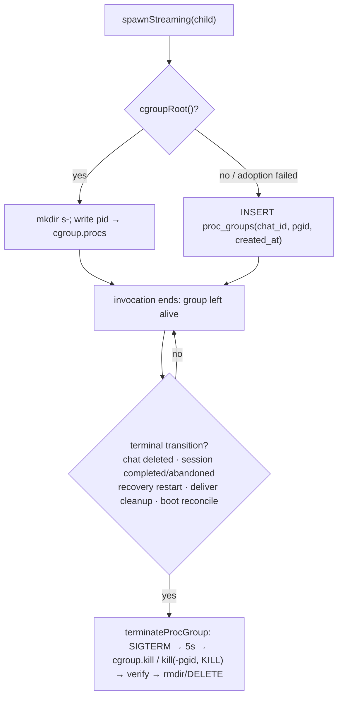

---

## 21. Sandbox / isolation architecture

**What is jailed.** Only process trees that must not modify the repository: the **Reviewer** (`codex`) and the **Project Director** (`claude` with `readOnly: true`). The **Builder is not jailed** — it needs to write — and runs with `--permission-mode bypassPermissions`.

**The jail — `engine/sandbox.ts` — `readOnlyJailArgs(projectPath, cwd)`.** bubblewrap arguments, read exactly:

```
--dev-bind / /                           # start from the real filesystem, read-write
--ro-bind <projectPath> <projectPath>    # the work under review
--ro-bind <PROJECTS_DIR>                 # every project, not just the active one
--ro-bind <dir of dist/index.js>         # Tandem's own code
--ro-bind <DATA_DIR>                     # chats, events, credentials, worktrees
--ro-bind ~/.local/share/claude          # the Claude CLI install
--ro-bind ~/.local/bin
--ro-bind ~/.claude/settings.json        # created as "{}" if absent, then bound read-only
--ro-bind ~/.claude/CLAUDE.md            # created empty if absent, then bound read-only
--bind <DATA_DIR>/shots                  # screenshots stay writable
--bind <DATA_DIR>/tmp
--die-with-parent --chdir <cwd> --
```

So the jail is **not** a whole-filesystem read-only view: the root is bound read-write and specific trees are overlaid read-only. What it guarantees is that the reviewed project, all projects, the app, the data directory and the surfaces that could change *future* turns (the CLI install, user-level hooks and instructions) cannot be written — the kernel returns `EROFS`. `~/.claude/projects` (the session store) stays writable because `--resume` needs it, and that is why the two placeholder files are created before binding: otherwise a jailed model could create a hook file in a writable parent. Anything else under `$HOME` or `/tmp` remains writable.

**Availability probe.** `bwrapAvailable()` runs `bwrap --dev-bind / / --ro-bind /tmp /tmp -- true` once; on macOS (development) it is false and the callers run **degraded**: Codex keeps its own `--sandbox read-only`, the Director keeps `--disallowedTools Write Edit NotebookEdit` (plus `Bash Task` when unjailed). Those are CLI-level, model-cooperative restrictions, not kernel ones. The reviewer prompt tells the model it is read-only either way.

**Working directory rules.** The Builder's cwd is the project root or the session worktree; a Builder may move its working directory with `tandem_set_working_dir` (`applyWorkdirChange()` — `POST /api/internal/workdir`), which re-points the chat's project (`findOrCreateProject`) and is refused for paths under `FORBIDDEN_PREFIXES` (`projectRoutes.ts` — system directories, `DATA_DIR`, and the app directory). The directory browser (`/api/fs/*`) applies the same `guardMutablePath` for mkdir/rename/delete.

**Network.** No network isolation exists. The Reviewer prompt (`reviewer.network_guidance`) explains what it may do; the browser host gives each role its own Chromium.

**Browser isolation.** One Chromium per `chatId::role` (`browserHost.ts`), so the Reviewer never sees the Builder's tabs, cookies or storage; checkpoints are per key; `browser_reset` gives a fresh context; `browser_kill` releases the instance.

**Filesystem outside the jail.** Attachments are stored under `DATA_DIR/attachments/<chatId>/`; screenshots under `DATA_DIR/shots/<chatId>/`; both are served only through authenticated routes (`/api/chats/:id/shots/:file`) with path normalisation.

---

## 22. Secrets and credentials

**What is stored, and how.**

| Secret | Storage | Protection |
|---|---|---|
| Admin password | `user.pass` as `scrypt:<salt>:<hash>` (`auth.ts`) | scrypt, constant-time compare |
| Login sessions | `sessions.token` (32 random bytes hex) | cookie `tandem_sid`, `httpOnly`, `sameSite=lax`, `secure` in production, 90-day expiry, `last_seen` refreshed hourly |
| Integration credentials | `credentials.data` = `iv.tag.ciphertext` (AES-256-GCM) | key file `DATA_DIR/secret.key` (32 random bytes, created `0600` on first use); types `bearer_token`, `api_key_header`, `basic_auth`, `header_set`, `env_set`, `ssh_private_key` |
| SSH private keys | decrypted to `DATA_DIR/ssh/<credentialId>.key` (`0600`) only for the duration of a call | deleted after `runSsh` |
| Observability API keys | `observability_keys.key_hash` = SHA-256 of the key; the plaintext is shown **once** on creation | prefix `tnd_obs_` + 4 chars kept for display |
| Internal token | `config.internalToken` in memory (or `TANDEM_INTERNAL_TOKEN`) | per-boot random; passed to MCP children via env; checked by every `/api/internal/*` route |
| Provider logins | **not Tandem's**: the CLIs' own credential stores under the service user's `$HOME` | `ANTHROPIC_API_KEY`/`OPENAI_API_KEY` are blanked for children |

**Where secrets must never appear.** Prompts (they are stored in `ai_call.request` and exported), timeline events, `pd_activity`, error messages, logs, the Observability API, exports. The integration layer enforces this: `integrations/exec.ts` — `executeIntegrationTool()` injects credentials server-side (headers, env, basic auth) and **scrubs** every credential value from the tool result before it is returned to the CLI (`credentialSecretValues()` → replace with `«redacted»`); the catalog served to the model (`catalogForRole`) contains tool names, descriptions and schemas, never credential material; `CredentialMeta` (what the API and UI see) carries only id, name, type, and field *names*.

**Role enforcement.** Each integration tool has `roles` (`builder`, `reviewer`); `executeIntegrationTool` refuses a call from a role not listed (`TANDEM_ROLE` is set by the adapter and forwarded by `mcp-integrations.cjs`; the internal route trusts the token, not the role claim from the model — the role comes from the env the *server* set for that child).

**Secret handling paths to know.** `integrations/store.ts` — `encryptSecret/decryptSecret`, `credentialSecret(id)` (the only decrypt path), `deleteCredential` refused while an integration references it; `integrationRoutes.ts` never returns `data`. `PUT /api/settings` and prompts have no secret fields. `exporter.ts` exports whatever is in the events — it does not scrub, which is why the invariant is "never let a secret into an event".

**Rotation.** Password: `POST /api/account/password` or `node dist/index.js set-password`. Observability keys: revoke + create. Credentials: `PATCH /api/credentials/:id` re-encrypts. `secret.key` rotation is not supported (would orphan every credential).

---

## 23. Project Memory

**Definition.** Project-scoped notes the Builder writes for future sessions: architecture facts, decisions, gotchas. Stored in `project_memories` (`server/src/projectMemory.ts`), keyed by `project_id`, with `title`, `content`, `tags`.

**Write path.** Only the Builder's MCP tool `project_memory_create` (`mcp-workdir.cjs` → `POST /api/internal/project-memory` op `create` → `createMemory()`). There is no UI or REST write path, no update and no delete. Validation: title ≤ 200 chars, content ≤ 20 000, ≤ 12 tags.

**Read paths.** Builder tools `project_memory_search` (FTS-free `LIKE` search over title/content/tags via `searchMemories()`), `project_memory_list`, `project_memory_get`; UI `GET /api/projects/:id/memories` (`ProjectMemoryMenu.tsx`) and `GET /api/projects/:id/memories/export` (Markdown). The Builder system prompt (`builder.*` group) instructs the model to search memory at the start of work and to record durable facts.

**Isolation.** The internal route derives the project from the chat (`TANDEM_CHAT_ID`), so a Builder can only read/write its own project's memory. The **Reviewer is refused**: the route checks the caller's phase/role and returns an error for reviewer-role callers (the reviewer's MCP config does not even include the `tandem` server, so this is a second line). Director sessions in worktrees are separate `projects` rows (the worktree path), so a session's memory is scoped to the worktree project, **not** the parent project — a limitation to know (§41).

**Not present:** embeddings, retrieval ranking, automatic memory extraction, a memory for the Director, cross-project memory.

---

## 24. Observability API (and what "Observatory" is)

**Scope statement.** This repository contains the **Observability API**: a read-only, bearer-key-authenticated evidence surface over Tandem's own data (`server/src/observability/*`). It does **not** contain *Tandem Observatory* — the analysis product with "Analysis Profiles", coverage manifests, provenance/tripwire checks, HIL tests or OpenRouter models. Those live in a separate repository built (by Tandem's Project Director) as a consumer of this API. Any handbook section asking about them is answered here: they are not in this codebase; the contract they consume is below.

**Authentication.** `Authorization: Bearer tnd_obs_…`. `verifyKey()` hashes the presented key (SHA-256) and looks it up in `observability_keys`, refusing revoked keys and stamping `last_used_at`. Keys are managed by the admin UI (`ObservabilityPage.tsx`) through `GET/POST /api/observability/keys`, `POST /api/observability/keys/:id/revoke` (cookie-authenticated). The bearer routes are exempt from the cookie hook; a revoked key also ends its live stream (`sse.ts` re-checks the key on each heartbeat).

**Endpoints (`/api/observability/v1`).**

| Route | Returns |
|---|---|
| `GET /info` | `{ instanceId, app, version, now }` — `instanceId` is stable per installation (`kv:observability_instance_id`) |
| `GET /projects` | projects that have project runs, with run counts |
| `GET /projects/:projectId/runs` | project runs (state, goal, branches, timestamps, provider wait) |
| `GET /runs/:runId` | one run with milestones and sessions |
| `GET /runs/:runId/sessions` | sessions with status, agent, review verdict, chat id |
| `GET /runs/:runId/evidence` | the run's Project Chat events plus every session's evidence summary |
| `GET /sessions/:sessionId/evidence` | a session's chat as an `ExportBundle`-like structure: events, findings, ai_calls (prompts included), checkpoints |
| `GET /sessions/:sessionId/events?after=<seq>&limit=` | raw events, paginated by seq |
| `GET /sessions/:sessionId/artifacts/:file` | a screenshot file from the session chat's shots dir |
| `GET /stream` | SSE: `signal` messages `session.completed`, `session.attention`, `run.terminal` (from `observability/signals.ts`), heartbeat every 25 s |

**Evidence ownership.** The API resolves evidence from project run → `pd_sessions.chat_id` → `events.chat_id`; `events.run_id` (the invocation id) is *not* the project run id. Observers must not join on it.

**Signals.** `signalSessionState(runId, sessionId, chatId, status)` emits `session.completed` for `completed` and `session.attention` for `needs_attention`/`failed`/`timeout`/`awaiting_review`; `signalRunState(runId, state)` emits `run.terminal` for `COMPLETED`/`FAILED`. Delivered via `notifyObservability()` to observer SSE connections only (never to UI clients).

**What observers do not get.** Settings, prompts (except as embedded in `ai_call` requests), credentials, ordinary human chats that are not part of a project run, write access of any kind.

---

## 25. Admin / settings

Admin lives at `/settings/*` (`SettingsLayout.tsx`, `ADMIN_CATEGORIES`). Settings are stored as one JSON document in `kv:settings` and read through `getSettings()` (defaults deep-merged, obsolete keys stripped, providers locked) — so **every** reader sees a consistent, current view without a restart.

| Page (route) | Backing store | API | Takes effect |
|---|---|---|---|
| Roles (`/settings/roles`) | `settings.roles.{builder,reviewer,director}` (provider locked, model, effort, instructions, reviewer `enabled`), `finalRepairInstructions`, `sharedInstructions` | `GET/PUT /api/settings` (the UI sends a diff patch via `useSettingsDraft`) | next CLI invocation |
| Builder Agents (`/settings/agents`, `/settings/agents/:agentId`) | `agent_profiles` | `/api/agents*` (`agents/routes.ts`) | next **launch**; running/resumed sessions keep their snapshot |
| Instructions / AI Prompts (`/settings/instructions`) | `kv:prompts` overrides over `PROMPT_DEFS` | `GET /api/prompts`, `PUT /api/prompts/:key`, `DELETE /api/prompts/:key` (reset), export/import; `GET /api/settings/effective-prompt?role=` preview | next invocation |
| Tools (`/settings/tools`) | `kv:tool_text` overrides of Tandem MCP tool descriptions | `GET /api/tools`, `PUT/DELETE /api/tools/:server/:tool` | next invocation (`TANDEM_TOOL_TEXT` env) |
| Integrations (`/settings/integrations`) | `credentials`, `integrations`, `integration_tools`, `kv:skills` | `/api/credentials*`, `/api/integrations*`, `/api/skills` | next invocation (catalog rebuilt per call) |
| Context (`/settings/context`) | `settings.context` | `PUT /api/settings` (clamped) | immediately for the meter; next run for auto-compact; next invocation for the CLI window |
| Observability (`/settings/observability`) | `observability_keys` | `/api/observability/keys*` | immediately |
| Account (`/settings/account`) | `user.pass` | `POST /api/account/password` | immediately |

**Validation.** `putSettings` clamps percentages to 10–99, `preserveRecentTokens` 0–200 000, `compactMaxTokens` 50 000–2 000 000, and re-applies `lockProviders`; it does not validate model names. Agents are validated in `agents/store.ts` (`validateModel`, `validateEffort`, `validateSlug`). Prompt overrides are free text (length-capped in the route). Integration configs are validated by type in `integrationRoutes.ts`; a `test` endpoint performs a live discovery/ping.

**Multi-user.** There is exactly one user (`user.id CHECK (id = 1)`); every logged-in session is the admin. There are no roles, no audit log of admin changes (settings changes are not evented), and no per-project settings.

---

## 26. Backend API architecture

**Framework.** Fastify 5 with `@fastify/cookie`, `@fastify/multipart` (attachments, 400 MB), `@fastify/static` (the SPA). JSON bodies up to 2 MB. No schema validation layer (handlers read `req.body as any` and validate by hand); errors are returned as `{ ok:false, error }` or `{ error }` with 4xx codes, or as Fastify's default 500 for uncaught throws.

**Authentication tiers** (`auth.ts` — `authHook`): cookie-authenticated (`tandem_sid`) for everything under `/api/*` except: `POST /api/login`, `GET /api/health` (public), `/api/internal/*` (per-boot token in the JSON body, MCP children only), `/api/observability/v1/*` (bearer key). Login is rate-limited to 8 attempts per 15 minutes per IP, in memory.

**Complete route table.**

| Area | Method + path | Handler / effect |
|---|---|---|
| Health/auth | `GET /api/health` | `{ ok, app:'tandem', version }` |
| | `POST /api/login`, `POST /api/logout`, `GET /api/me`, `POST /api/account/password` | sessions |
| Stream | `GET /api/stream` | UI SSE (`sseHandler`): `event`, `delta`, `chat`, `chat_deleted`, `context`, `project`, `project_run` messages |
| Chats | `GET /api/chats`, `POST /api/chats` `{ projectId }`, `PATCH /api/chats/:id` (title), `DELETE /api/chats/:id` | `DELETE` also `stopRun`, `terminateProcGroup`, `releaseBrowsers`, deletes events/pending review/snapshot/ledger |
| | `GET /api/chats/:id/events` | full event list |
| | `POST /api/chats/:id/messages` `{ text, attachmentIds?, review? }` | `user_message` + `startRun` (409 when busy); Project Chats → `directorUserMessage`; `pd-session` chats refuse human posts |
| | `POST /api/chats/:id/attachments` (multipart), `DELETE /api/attachments/:id` | files under `DATA_DIR/attachments` |
| | `POST /api/chats/:id/stop` | `stopRun` |
| | `GET /api/chats/:id/context`, `POST /api/chats/:id/compact` | meter; `performNativeCompaction` (409 while running) |
| | `GET /api/chats/:id/shots/:file`, `GET /api/chats/:id/export?format=md\|html` | screenshots; `exporter.ts` |
| Project runs | `POST /api/project-runs` `{ path }` | `createProjectRun` |
| | `GET /api/project-runs/:id` | `ProjectRun` + milestones + sessions + activity + `providerWait` |
| | `POST /api/project-runs/:id/pause`, `/resume`, `/retry-reviews` | `pauseProject`, `resumeProject`, `expediteRunReviews` |
| Projects & fs | `GET /api/projects`, `POST /api/projects/open` `{ id }`, `POST /api/projects/directory` `{ path }` | list; touch `last_opened_at`; `findOrCreateProject` |
| | `GET /api/fs/list?path=`, `POST /api/fs/mkdir`, `/rename`, `/delete` | directory browser with `guardMutablePath` |
| | `GET /api/projects/:id/git` | `getGitStatus` (5 s cache) |
| | `GET /api/projects/:id/memories`, `/memories/export` | Project Memory |
| Settings | `GET/PUT /api/settings`, `GET /api/settings/effective-prompt?role=` | `getSettings`/`putSettings`; `buildRolePreview` |
| Prompts | `GET /api/prompts`, `PUT/DELETE /api/prompts/:key`, `GET /api/prompts/export`, `POST /api/prompts/import` | registry overrides |
| Tools | `GET /api/tools`, `PUT/DELETE /api/tools/:server/:tool` | MCP tool text |
| Agents | `GET/POST /api/agents`, `GET/PATCH /api/agents/:id`, `POST /api/agents/:id/default\|archive\|restore`, `GET /api/agents/export`, `POST /api/agents/import` | `agents/store.ts` |
| Integrations | `GET/POST /api/credentials`, `GET /api/credentials/fields/:type`, `PATCH/DELETE /api/credentials/:id` | encrypted credentials |
| | `GET/POST /api/integrations`, `PATCH/DELETE /api/integrations/:id`, `POST /api/integrations/:id/test`, `/refresh-tools`, `POST/PUT/PATCH/DELETE …/tools[/:toolId]`, `GET /api/integrations/export`, `POST /api/integrations/import` | integrations and served tools |
| | `GET/PUT /api/skills` | `kv:skills` |
| Observability admin | `GET/POST /api/observability/keys`, `POST /api/observability/keys/:id/revoke` | keys |
| Observability v1 (bearer) | see §24 | read-only |
| Internal (token) | `POST /api/internal/director` `{ chatId, token, op, args }` | `handleDirectorTool` + a `tool_call` event `director_<op>` in the Project Chat |
| | `POST /api/internal/workdir`, `/name-session`, `/git-workflow`, `/project-memory` | `applyWorkdirChange`, `setChatTitle`, `setGitWorkflow`, Project Memory ops |
| | `POST /api/internal/browser` `{ chatId, token, role, tool, args }`, `POST /api/internal/browser-event` | `handleBrowserTool`; a `browser` event per action |
| | `GET /api/internal/integration-catalog?role=`, `POST /api/internal/integration-call` | `catalogForRole`, `executeIntegrationTool` |

**Request lifecycle for a message.** `authHook` → route parses body → `addEvent(user_message)` → `startRun()` **not awaited** (the promise is detached; failures inside are recorded as events) → `202`-style JSON `{ ok:true }` → all progress arrives over SSE.

**Long-running work is never held on an HTTP request**; the only long-lived HTTP connections are the two SSE streams. Uploads are the exception (synchronous write to disk).

**Versioning.** The UI API is unversioned; the observability API is `/v1`. `config.version` is `0.2.0`.

---

## 27. Frontend architecture

**Stack.** React 19, react-router 7 (`BrowserRouter`), zustand 5 (one store), Tailwind 4 (CSS variables `--color-*` defined in `styles.css`; dark UI), `react-markdown` + `remark-gfm` + `highlight.js`, `lucide-react` icons, Inter and JetBrains Mono via `@fontsource-variable`. Built by Vite 7 into `web/dist`, served by the server in production; in development Vite (`:5173`) proxies `/api` to `:7810`.

**Routing (`App.tsx`).** `/` (Home — pick a project/chat), `/c/:chatId` (`ChatView`), `/settings/roles|agents|agents/:agentId|instructions|tools|integrations|context|observability|account`. An auth gate calls `GET /api/me`; failure shows `Login.tsx`. `Shell` renders `Sidebar` + the routed outlet.

**State (`store.ts`).** One zustand store holding: `authChecked`/`email`, `projects`, `chats`, `events` (`Record<chatId, ChatEvent[]>` sorted by seq), `usage` (`Record<chatId, ContextUsage>`), `loaded`/`loadError` per chat, `settings` + `settingsDraft`/`settingsDirty`/`savingSettings`, `agentDrafts`, `projectRuns` (by id), `toasts`, `newProjectOpen`, `sidebarOpen`; actions `init`, `login`, `logout`, `refreshAll`, `loadChat`, `send`, `stop`, `loadSettings`, `loadProjectRun`. Commands go through `api.ts` (REST); state changes come back through the **SSE stream** (`connectStream()`): `EventSource('/api/stream')`, on open → `refreshAll()` (chats, projects, settings, current chat events) to heal any gap; on error → reconnect after 2.5 s. `applyMsg()` handles the `ServerMsg` union: `event` (upsert by id, keep seq order), `delta` (append streamed text to an `assistant_message`), `chat` (upsert chat row — title, running, gitState), `chat_deleted`, `context` (usage), `project` (project upsert), `project_run` (run + milestones + sessions + activity + providerWait). There is no optimistic UI: a sent message appears when its `user_message` event arrives.

**Screens.**

- `ChatView.tsx` — top bar (title, `GitChip` polling `GET /api/projects/:id/git` every 20 s, `ContextMeter`, `ExportMenu`, `ProjectMemoryMenu`), the context warn/crit banner, `Timeline`, `Composer`, `CompactDialog`, and `ProjectDrawer` for chats that belong to a project run.
- `Composer.tsx` — text (`dir="auto"` for RTL), attachments (uploaded first via `POST /api/chats/:id/attachments`, then their ids are sent with the message), the per-message **Reviewer toggle** (`review`), Stop (`POST /api/chats/:id/stop`) while running; disabled for `pd-session` chats.
- `timeline/Timeline.tsx` — converts events into rows; consecutive `command`, `file_read`, `search`, `file_change`, `browser` events of the same run collapse into one group row (`GROUPABLE`); `rows.tsx` renders every kind (AI calls with expandable prompt/response and usage, findings with severities and the "not re-reviewed" badge, compactions, checkpoints, errors, the Director `sessions` live block, run separators).
- `ProjectDrawer.tsx` — the structural view of a project run: state pill, Pause/Resume, "Retry reviews now" (`/retry-reviews`), provider wait banner, milestones with sessions (status, agent, verdict, link to the session chat), activity log.
- `Sidebar.tsx` — projects and their chats; `pd-session` chats are hidden (they are reachable from the drawer); new chat / new project (`NewProjectDialog.tsx` → `/api/fs/*` browser → `POST /api/projects/directory` + `POST /api/chats`, or `POST /api/project-runs`); settings; logout.
- Settings — `SettingsLayout.tsx` (categories, one save bar), `useSettingsDraft.ts` (draft of `AppSettings`; save sends only the changed subtree as a patch to `PUT /api/settings`), pages in `settings/pages/*` composed of sections (`CredentialsSection`, `IntegrationsSection`, `PromptsSection`, `SkillsSection`, `ToolsSection`). `RolesPage.tsx` provider selects are rendered `disabled` (§15).

**Accessibility / i18n.** RTL text works through `dir="auto"` on message content. There is **no** `prefers-reduced-motion` handling (the `fade-up` animation always runs). No translations; UI strings are English.

**Error handling.** `api.ts` throws `ApiError { status, message }`; screens show toasts (`store.toast`). A 409 from the messages route ("chat is running" / "another chat is working in this directory") is surfaced verbatim.

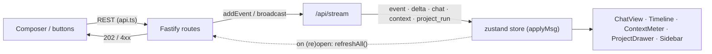

---

## 28. Shared contracts / types / schemas

`shared/types.ts` is the single contract between server and web; there is no runtime schema validation (no zod/JSON schema) — the types are compile-time only, enforced by `npm run typecheck` in both packages. Server code imports it relatively (`../../shared/types`), the web through the Vite alias `@shared` (and TypeScript `paths`).

**Groups of contracts.**

| Group | Types | Notes |
|---|---|---|
| Providers & models | `Provider`, `RoleName` (`builder\|reviewer`), `Effort`, `CLAUDE_MODELS`, `CODEX_MODELS`, `EFFORTS`, `MAX_AGENT_PROMPT_CHARS` | model lists drive the UI selects |
| Settings | `RoleConfig`, `DirectorRoleConfig`, `ContextConfig`, `AppSettings` | stored as `kv:settings` |
| Agents | `AgentProfile`, `AgentSnapshot` | |
| Projects & chats | `ProjectSource`, `Project`, `GitFlowMode` (`none\|working-branch\|auto-merge\|direct`), `GitFlowState`, `Chat` | `Chat.kind`, `Chat.projectRunId`, `Chat.gitState` |
| Events | `EventKind`, `StepStatus`, `AttachmentMeta`, the 16 payload interfaces, `EventPayloadMap`, `ChatEvent<K>` | see below |
| Context | `ContextUsage`, `CompactOutcome` | |
| Git & fs | `GitFileStat`, `GitStatus`, `DirEntry`, `DirListing` | |
| Prompts & tools | `PromptGroup`, `PromptEntry`, `ToolParamInfo`, `ToolInfo` | |
| Integrations | `IntegrationType`, `CredentialType`, `CredentialMeta`, `HttpToolParam`, `IntegrationToolSpec`, `IntegrationTool`, `McpIntegrationConfig`, `OpenApiIntegrationConfig`, `HttpIntegrationConfig`, `SshIntegrationConfig`, `Integration` | |
| Orchestration | `ProjectRunState`, `PdMilestoneStatus`, `PdSessionStatus`, `PdSession`, `PdMilestone`, `PdActivity`, `ProjectRun`, `SessionsPayload` | |
| Misc | `ObservabilityKey`, `ObservabilitySignal`, `ProjectMemory`, `Skill`, `ServerMsg` | `ServerMsg` is the SSE union |

**Event payloads (`EventPayloadMap`).**

| Kind | Payload | Written by |
|---|---|---|
| `user_message` | `{ text, attachments? }` | routes, `launchSession` |
| `assistant_message` | `{ text, streaming? }` | claude/codex adapters |
| `status` | `{ text }` | workflow, director, routes |
| `command` | `{ command, cwd, stdout, stderr, exitCode, durationMs, status }` | adapters (Bash / command_execution) |
| `file_read` | `{ path, lines?, error? }` | claude adapter |
| `search` | `{ query, tool, matches[] }` | claude adapter (Grep/Glob) |
| `file_change` | `{ files: ChangedFile[] }` (path, additions, deletions, diff) | claude adapter (Write/Edit) |
| `ai_call` | `{ role, provider, model, effort, status, request{prompt,system?}, response?{text,usage?}, cli?, startedAt, durationMs?, completedSeq?, simulated?, error?, tools? }` | adapters; `role` may be `builder`, `reviewer`, `final_repair`, `director`, or the legacy `compactor` |
| `findings` | `{ verdict, round, items: Finding[], finalRepairNotReviewed? }` | `workflow.ts` — `review()` |
| `compaction` | `{ provider, model, beforeTokens?, afterTokens?, windowTokens?, source?, reason?: 'manual'\|'auto'\|'provider-auto', sessionId?, durationMs?, summary?, preserved?, simulated? }` | `providerContext.ts`, `claude.ts` (`compact_boundary`); `summary`/`preserved` legacy |
| `run` | `{ phase: started\|finished\|stopped\|failed, label?, review? }` | workflow, `recoverInterruptedRuns` |
| `error` | `{ message, detail?, source?, retryable? }` | everywhere |
| `browser` | `BrowserActionPayload { action, detail, url?, title?, viewport?, ref?, value?, screenshotFile?, console?, error?, durationMs?, status, role? }` | `browserHost.ts` via the internal route |
| `checkpoint` | `{ action: commit\|preserve\|merge\|push, branch, target?, commit?, message?, files? }` | `gitFlow.ts` |
| `tool_call` | `{ tool, integration, integrationType?, role, args, status, resultPreview?, resultBytes?, error?, startedAt, durationMs? }` | integrations gateway, director route (`director_<op>`), claude adapter (generic tools) |
| `sessions` | `SessionsPayload { runId, milestoneKey, milestoneName, sessions[], done }` | `refreshLiveBlock()` (rewritten in place) |

**Evolution rules that the code relies on.** Payload changes must be additive (old events stay readable; the UI tolerates missing fields). `updateEvent` merges shallowly, so adding a field to a live event is safe; renaming one is not (old rows keep the old name). Enum extensions (`EventKind`, statuses) must be reflected in the UI switch statements (`rows.tsx`, status colour maps) or they render as unknown. The server does not validate payloads at write time.

**Changing a contract safely.** Edit `shared/types.ts` → `npm run typecheck` (both packages fail on any mismatch) → adjust writers (server) and renderers (web) → for stored data consider a backfill (there is no migration framework; `backfillModelWindows()` is the pattern: a one-time pass guarded by a `kv` flag or emptiness check).

---

## 29. Prompt architecture

**One registry.** Every piece of AI-facing instruction text that Tandem itself authors lives in `server/src/prompts.ts` — `PROMPT_DEFS` (key, group, title, description, default text). Admin overrides are stored in `kv:prompts` (key → text); `getPrompt(key)` returns the override or the default; `renderPrompt(key, vars)` substitutes `{{name}}` placeholders (unknown placeholders are left verbatim). Export/import (`exportPrompts`/`importPrompts`) move the overrides as JSON. The Admin preview (`GET /api/settings/effective-prompt?role=`) calls the same assembly functions the engine uses, so the preview cannot drift from production.

**Keys by group** (42):

| Group | Keys | Used by |
|---|---|---|
| `builder` | `base`, `environment`, `workdir_guidance`, `browser_guidance`, `deploy_guardrail`, `git_workflow`, `continuation_compacted`, `continuation_recent`, `new_request`, `attachments` | `builderSystemText()`; `workflow.ts` — `builderMessage()` |
| `repair` | `findings_message`, `final_base`, `answer_findings_message`, `answer_final_message`, `final_message` | `runReviewPhase`, `finalRepair`, `builderSystemText(role:'final_repair')` |
| `reviewer` | `base`, `browser_guidance`, `network_guidance`, `request_section`, `continuation_section`, `changed_section`, `changed_empty`, `note_git`, `note_git_state`, `note_git_clean`, `note_nongit`, `note_nongit_inspect`, `note_switched`, `answer_section`, `round_section`, `output_format` | `reviewerSystemText()`; `workflow.ts` — `review()` (prompt body); `director/engine.ts` — `reviewArtifact()` |
| `director` | `base`, `state`, `observation`, `plan_review_request`, `plan_findings_message`, `plan_final_message`, `recovery_review_request`, `recovery_findings_message`, `recovery_final_message`, `session_continuation`, `integration_wrapper` | `directorSystemText()`; `runDirectorTurn`, `processAfterTurn`, `resumeSession`, `integrate_milestone` |

**Assemblies (exact order).**

- `builderSystemText(settings, role, agentPrompt?, gitWorkflow?)` → `builder.base` · (`repair.final_base` when `role === 'final_repair'`) · `# Your specialist profile` + the Agent profile prompt · `sharedInstructions` · role instructions (`roles.builder.instructions`, or `finalRepairInstructions` for the final repair) · enabled skills for the builder role (`# Skill: <name>` + instructions) · `builder.environment` + `workdir_guidance` + `browser_guidance` + `deploy_guardrail` · `builder.git_workflow` rendered with the chat's git summary. Delivered as `--append-system-prompt`.
- `reviewerSystemText(settings)` → `reviewer.base` · `sharedInstructions` · `roles.reviewer.instructions` · skills for the reviewer role · `reviewer.browser_guidance` + `network_guidance`. The **review prompt body** (stdin) is built in `workflow.ts` — `review()` from `reviewer.request_section` (original request), `changed_section`/`changed_empty`/`answer_section` (subject), one `note_*` describing the git situation, `round_section` (+ `continuation_section` with the previous findings on round 2) and `output_format` (the `PASS`/findings protocol that `parseVerdict` expects — **changing `output_format` without changing `parseVerdict` breaks verdict parsing**).
- `directorSystemText(settings)` → `director.base` · `sharedInstructions` (the agent catalog from `agents/catalog.ts` and the state snapshot are injected into the *message*, via `director.state`/`director.observation`).

**Text that is not in the registry** (engine-owned, edit in code): the session-naming appendix appended in `claude.ts` when `TANDEM_NAME_SESSION` is set (asks the model to call `tandem_name_session` once); the observation sentences in `director/engine.ts` (`monitorSession`, `resumeProject`, `recoverDirectorRuns`, `applyRecovery`); `status` event texts; the Codex profile header; MCP tool descriptions (editable separately in Admin → Tools via `kv:tool_text`, delivered through `TANDEM_TOOL_TEXT`).

**Placeholders per key** (exact, from the default texts): `builder.git_workflow` — `{{git_workflow}}`; `builder.continuation_compacted` — `{{compacted_context}}`; `builder.continuation_recent` — `{{recent_conversation}}`; `builder.new_request` — `{{user_message}}`; `builder.attachments` — `{{attachment_list}}`; all `repair.*_message` keys — `{{findings}}`; `reviewer.request_section` — `{{original_request}}`; `reviewer.continuation_section` — `{{continuation}}`; `reviewer.changed_section` — `{{changed_files}}`, `{{changed_files_note}}`; `reviewer.note_switched` — `{{new_dir}}`; `reviewer.answer_section` — `{{builder_answer}}`; `reviewer.round_section` — `{{review_round}}`, `{{max_review_rounds}}`; `director.state` — `{{project_state}}`; `director.observation` — `{{observations}}`; `director.plan_review_request` — `{{plan}}`, `{{project_goal}}`; `director.plan_*`/`recovery_*_message` — `{{findings}}`; `director.recovery_review_request` — `{{decision}}`, `{{session_context}}`; `director.session_continuation` — `{{note}}`; `director.integration_wrapper` — `{{name}}`, `{{instructions}}`, `{{integration_branch}}`, `{{session_branches}}`, `{{git_workflow}}`, `{{project_state}}`. An override that drops a placeholder silently loses that information; an unknown placeholder is left as literal text.

**Adding a prompt key.** Add a `PromptDef` to `PROMPT_DEFS` (group, title, description, default); call `getPrompt`/`renderPrompt` at the use site; it appears in Admin → Instructions automatically. Never build instruction text inline.

---

## 30. Git architecture

Two independent git layers exist.

### 30.1 Per-chat git flow (`engine/gitFlow.ts`)

Applies to every run (human chats and Director sessions alike). State lives in `chats.git_state` (`GitFlowState { mode, workBranch, targetBranch, push, repoPath }`), summarised for the Builder prompt by `summaryText()`.

- **Adoption — `adoptRepo(h)`** at run start. Not a repo, or saved `mode:'none'` → no git actions for the chat. First contact with a repo: `workBranch = tandem/<first 8 chars of chatId>`, `targetBranch` = the branch checked out at that moment, `mode: 'working-branch'`, `push: 'never'`. If the tree is dirty, everything is committed on the work branch as `tandem: preserve uncommitted changes present before adopting the working branch` (`checkpoint` `action:'preserve'`, files listed). Then the desired branch (`workBranch`, or `targetBranch` for `direct`) is checked out/created. Detached HEAD or a failing `git` marks the chat `mode:'none'`.
- **Checkpoint — `finishGitRun(h, originalRequest)`** at run end: `git add -A` + commit `tandem: <request, whitespace-collapsed, ≤ 72 chars>` (or `tandem: checkpoint`) with a fixed committer identity (`IDENT` — `-c user.name=Tandem -c user.email=…`), recorded as `checkpoint` `action:'commit'`. The message uses the **task's original request**, never a continuation note (the forensic bug fixed in `9c98ac9`).
- **Modes.** `working-branch` (default): stay on `tandem/<chat8>`; the user merges. `auto-merge`: after the commit, `git checkout targetBranch && git merge --no-ff workBranch -m "tandem: merge <workBranch>"` then back; conflicts abort the merge (`error` "Merge conflict — auto-merge into … aborted"). `direct`: commit on `targetBranch` itself. `none`: off.
- **Push.** `push: 'never' | 'on-merge' | 'always'` → `git push origin <branch>` after the relevant step; failures are `retryable` git errors; `GIT_TERMINAL_PROMPT=0` prevents hanging on credentials.
- **Changing the policy.** The Builder tool `tandem_set_git_workflow` (→ `POST /api/internal/git-workflow` → `setGitWorkflow(chatId, { mode, target_branch, push })`) is the only way; there is no UI for it. It refuses on `mode:'none'` chats.

### 30.2 Project-run git (`director/engine.ts`)

- **Integration branch** — `ensureIntegrationBranch(runId, rootPath)`: `tandem/<run8>/integration` created from `base_branch` (the branch checked out when the run was created, stored on the run).
- **Session worktrees** — `worktreeDir(runId, key)` under `PROJECTS_DIR/.tandem-worktrees/<run8>/<key>`; `git worktree add -b tandem/<run8>/<key> <dir> <integration>`; `mergeDependencyContent()` merges the branches of completed dependencies into the new worktree before the session starts. Each worktree is registered as its own `projects` row so the session chat has a directory.
- **Per-session flow inside the worktree** is the ordinary §30.1 flow (the session chat adopts its worktree branch).
- **Integration** — `integrate_milestone` launches an *integration session* whose prompt (`director.integration_wrapper`) tells the Builder to merge the milestone's session branches into the integration branch and resolve conflicts; the milestone is `integrating` meanwhile.
- **Delivery** — `deliver`: merges the integration branch into `base_branch` in the root checkout (refused if any session is non-terminal or the merge conflicts), then `cleanupRunWorkspaces()` removes worktrees (`git worktree remove`) after `terminateProcGroup()` confirms no process still uses them, and prunes branches.
- **Cleanup failure modes.** A worktree whose directory is busy is left in place with an activity note; `git worktree prune` is attempted; orphaned `.tandem-worktrees` directories are otherwise never garbage-collected.

**Status chip.** `git.ts` — `getGitStatus(dir)` (branch, ahead/behind, changed files; 5 s cache) feeds `GET /api/projects/:id/git`; `--no-optional-locks` is used for read-only status so it never contends with a running Builder's git operations.

---

## 31. Restart / crash recovery

Design principle: **the database is the truth and the process is disposable.** Nothing in memory is required to resume; anything the code cannot resume is turned into an explicit, visible state.

**Boot sequence relevant to recovery** (§4): `recoverInterruptedRuns()` → `reconcileProcGroups()` → sweeper start → listen → `recoverDirectorRuns(interruptedChats)`.

**Case A — restart during an active Builder session (ordinary chat).** The CLI is orphaned (it keeps running; its process group survives). `recoverInterruptedRuns()` sets `chats.running = 0`, marks `status` events `stopped`, appends `error` "Run interrupted — Tandem restarted…" and `run:stopped`. The user sends a new message; `--resume` continues the same Claude session (the CLI's own session store is intact). The orphaned CLI's process group is reaped only when the chat is deleted (`reconcileProcGroups` reaps groups of *missing* chats and *terminal* PD sessions, not of live ordinary chats). Git: the work branch keeps whatever the Builder had written; the next run's `adoptRepo` preserves it.

**Case B — restart during a Reviewer round.** Same as A for the chat. The review is *not* retried automatically: no `pending_reviews` row exists (a wait is only recorded for a classified refusal), and `recoverInterruptedRuns` does not know a review was in flight. The result stands unreviewed for a human chat; for a Director session the run reads as `stopped` → `paused (restart)` → the Director decides (`resume_sessions` → `task:'continue'` re-enters the review loop with the persisted ledger, so budget is preserved).

**Case C — restart during a Director planning/turn.** The Director chat shows as interrupted (Case A). `recoverDirectorRuns`: `PLANNING` run whose chat was interrupted → `wakeAfterRestart()` with "your turn was cut off — re-read the state and continue planning"; the plan-review cursor `plan_review_round` survives so the loop resumes at the right round; a `pending_recovery` survives likewise.

**Case D — restart while sessions are running.** Every `running` session → `paused`, `stopReason:'restart'`, `endedAt`. `RUNNING`/`RESUMING` run → `RESUMING` + `wakeAfterRestart()` ("resumed AUTOMATICALLY — the user did not pause it"). The Director inspects and calls `resume_sessions` (→ `task:'continue'`), which flips the run to `RUNNING`. `driveRestartWake()` awaits the turn: if it fails (provider outage) and no `pending_wakes` row covers it, the run falls to `PAUSED` with an explicit note so a Resume button exists.

**Case E — restart during a provider wait.** `pending_reviews`/`pending_wakes` rows are durable; the sweeper picks them up when due. `driveRestartWake()` special-cases a run whose only live work is `awaiting_review` + pending → straight to `RUNNING` ("waiting for the Reviewer; the retry runs when due") instead of pausing (fix from commit `046403c`'s series). The `LAUNCHES_WORK` guard keeps the Director from launching during the wait.

**Case F — restart loop.** `bumpAutoResumeStreak()` counts boots within a 90-second window; on the third the wake is *delayed* by `SETTLE_DELAY_MS` (2 min) rather than the project being paused (pausing would be indistinguishable from a user pause and never reconsidered). `resumeProject()` resets the streak.

**Case G — restart during compaction.** The `/compact` `execFile` dies with the server (not detached); the in-memory compaction lock is gone; no event is written; the meter keeps the old anchor; `maybeAutoCompact` will try again after the next run (15-min cooldown does not apply — the map is empty).

**Case H — restart during git operations.** `git` calls are short `execFile`s; an interrupted merge leaves `MERGE_HEAD` in the repo. `adoptRepo` on the next run will fail to switch branches and mark the chat `mode:'none'` with an error event — the repository needs a human `git merge --abort`. Worktree creation interrupted midway leaves a registered worktree; `launchSession` re-uses an existing directory if the branch exists.

**Idempotency of recovery.** All recovery steps are re-runnable: `patchSession` writes are absolute, `setRunState` notes are informational, `pending_*` upserts merge, `reconcileProcGroups` prunes without side effects for live groups.

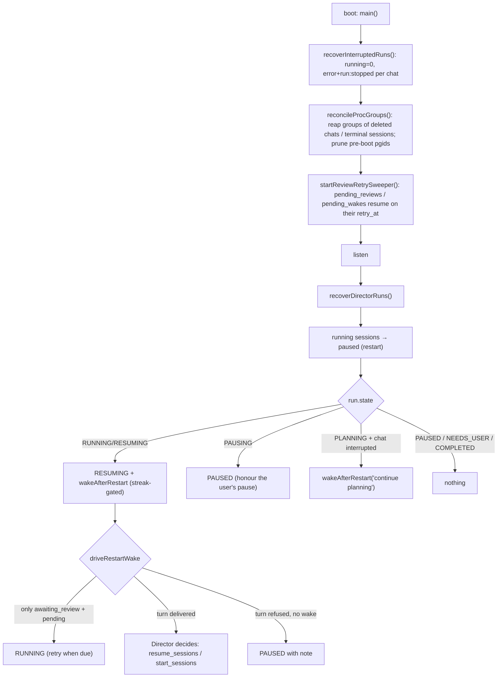

---

## 32. Concurrency model

- **Single-threaded server.** Node's event loop; better-sqlite3 is synchronous, so every SQL statement is atomic with respect to other JavaScript and `MAX(seq)+1` needs no lock. Explicit transactions guard the few multi-statement invariants (`review()`, agent default swap, seeding).
- **Per-chat exclusivity.** `RunCtx` in `engine/run.ts` — `active: Map<chatId, RunCtx>`; `isRunning(chatId)` = a ctx exists **or** `compacting.has(chatId)`. `startRun`, `startReviewRetry`, the sweeper, the manual compact route and the Director all check it; a violation is a 409 / thrown error, never a queue. There is no wait queue for a busy chat: the caller retries (the UI shows the error; the sweeper tries next tick; the Director gets an observation).
- **Per-directory exclusivity.** `repoBusyBy(rootPath, exceptChatId)` refuses a run when another chat's `RunCtx` is on the same `projects.root_path`; the Director's `dirBusyWithin()` enforces the same among sessions of a run before launching. Two *different* directories can run concurrently without limit — there is **no global concurrency cap**; the operator's provider limits are the effective cap.
- **Per-run Director serialization.** `turnState(runId)` (`busy`, `queued`) coalesces observations; `wakeInFlight` in the sweeper prevents double delivery; `pending_recovery` is a single slot.
- **Monitors and pollers.** Each launched session has one `monitorSession` promise chain; the live-block poller (`ensurePoller`, 5 s) exists once per run while sessions run.
- **Sweeper.** One `setInterval`; `sweep()` is synchronous except for the promises it fires and does not await, so ticks never overlap.
- **Browser host.** Concurrent MCP calls from the same CLI are serialized per instance by Playwright's page API; instances are keyed by chat+role, so Builder and Reviewer never share a page.
- **SSE fan-out.** Synchronous writes to every client on each event; slow clients are not back-pressured (Node buffers).
- **Races that were found and closed.** Compaction vs next run (fixed by the compaction lock); retry vs pause (in-flight retry counted as active work in `pauseProject`); double final repair after a restart (ledger `final_repair_done`); observation dropped when queued before the state flip (`setRunState` before `queueObservation` in recovery paths).
- **Known unguarded windows** (§41): `startRun`'s guard and `registerCtx` are not one atomic step across an `await`, but no `await` occurs between them; the login rate limiter and cooldown maps are per-process.

---

## 33. Background jobs, timers and sweepers

| Job | Where | Interval / trigger | Does | Failure mode |
|---|---|---|---|---|
| Review-retry & wake sweeper | `reviewRetrySweeper.ts` — `startReviewRetrySweeper` | `TICK_MS` = `TANDEM_REVIEW_SWEEP_MS` or 60 s | due pending reviews → `startReviewRetry`/`retrySessionReview`; due wakes → `deliverPendingWake`; `reconcileOrphans` | exceptions per item are caught and logged; a failing item is retried next tick |
| Browser reaper | `browserHost.ts` — `startBrowserReaper` | 5 min | closes instances idle > 30 min after checkpointing | logged |
| Browser checkpoint / watchdog | `browserHost.ts` | checkpoint every 60 s while active; watchdog 100 s on hung actions | persists state to `DATA_DIR/browser/*.json`; kills a hung Chromium | instance recreated lazily |
| Director live-block poller | `director/engine.ts` — `ensurePoller` | 5 s while any session runs | `refreshLiveBlock` rewrites the `sessions` event | stops itself when no session runs |
| SSE heartbeat | `sse.ts` | `TANDEM_SSE_HEARTBEAT_MS` or 25 s | `: ping` comment; observer key re-check | dead sockets are dropped |
| MCP pool sweep | `integrations/mcpClient.ts` | 60 s (unref'd) | closes external MCP connections idle > 5 min | logged |
| Git status cache | `git.ts` | 5 s TTL | avoids repeated `git status` for the chip | — |
| Auto-compact | `workflow.ts` — `maybeAutoCompact` | after every run; 15-min cooldown after a failure | `performNativeCompaction('auto')` | `error` event `source:'context'` |
| Wake settle timer | `director/engine.ts` — `wakeAfterRestart` | one-shot 2 min when a restart loop is suspected | delivers the deferred boot wake | — |
| Per-call timeouts | `procs.ts`, `providerContext.ts`, `mcpClient.ts`, `integrations/exec.ts` | per call (§19) | kill/abort | recorded as errors |
| Login rate limit | `auth.ts` | 15-min window, in memory | 8 attempts per IP | resets on restart |
| First-boot seed | `mock/seed.ts` — `seedIfEmpty` | once (`kv:seeded`) | demo repos + chats | git errors skipped |

No job queue, no cron, no worker processes. Everything is `setInterval`/`setTimeout` in the one server process and dies with it; durable intent lives only in `pending_reviews`, `pending_wakes`, `project_runs.auto_resume_*` and session statuses.

---

## 34. Error handling model

**Categories and how each is represented.**

| Category | Example | Representation | Recovery |
|---|---|---|---|
| Provider refusal (quota/limit) | Codex "usage limit reached… resets 3:00 pm" | `pending_reviews`/`pending_wakes` + `status` event "deferred"; session `awaiting_review`/`paused (provider_outage)` | sweeper retry at `retry_at`; manual "Retry now" |
| Provider transient outage | Claude 529 overloaded, ECONNRESET | same as above with `transient:true`, backoff | same |
| Builder/Reviewer failure (non-outage) | non-zero exit, `is_error`, unparseable output | `error` event `Builder call failed` / `Reviewer call failed` with `detail`; run finishes | human: send again; Director: `needs_attention` → `recover_session` |
| Timeout | Builder > 30 min | `error` "… timed out after N min" | Director: `timeout` → `needs_attention` |
| User stop | Stop button / Pause | run `stopped`; session `paused (user_stop|project_pause)` | resume |
| Git failure | conflict, push rejected | `error` `source:'git'` (`retryable` for push); run still finishes | human git action / next run |
| Compaction failure | no shrink, API error in `/compact` | `error` `source:'context'`, `retryable` | next run (cooldown 15 min) / manual |
| Validation (API) | bad body, unknown id | HTTP 400/404 `{ error }` | client |
| Busy | chat running / dir busy | HTTP 409 | retry |
| Auth | missing cookie / bad token / bad key | 401 / 403 | login / fix key |
| Unexpected throw in a run | bug | `error` "The run failed unexpectedly" + `run:failed` (`startRun`'s catch) | investigate |
| Unexpected throw in a route | bug | Fastify 500 with the logger's stack | investigate |
| Unexpected throw in a monitor/pump | bug | caught in `pumpDirector`/`monitorSession` wrappers → `error` event in the Project Chat and an observation "…failed: <message>. Decide again." | Director |

**Rules the code follows.** Runs never throw to the HTTP layer (detached promise with its own catch). Errors are *events*, so they are visible in the timeline, exported and observable. Provider text is preserved in `detail` (capped) because the classifier and humans need it. No stack traces in events (only messages). No retries inside a CLI call — retry is always a *new* invocation driven by durable state or a human.

**Retryable vs terminal.** `ErrorPayload.retryable` is informational for the UI; the only automatic retries are the sweeper's (waits) and auto-compact's cooldown. A `FAIL_MESSAGES` error is terminal for the run; a wait is not.

---

## 35. Logging, observability and forensics

**Server log.** `console.log/warn/error` with the `[tandem]` prefix (about ten call sites: boot lines, cgroup fallback, reaping, migration notes, compaction notes) plus Fastify's request logger (`logger: true`). In production stdout/stderr go to `/srv/tandem/data/tandem.log` (unit `StandardOutput/StandardError=append:`). Nothing in the log carries secrets by design; provider error texts may appear.

**The timeline is the primary log.** Every action is an event with `run_id`, and every AI call stores its exact prompt, system text, response, usage, CLI command and exit code. The Project Chat additionally records every Director tool call (`tool_call` `director_<op>`), the live block and status lines; `pd_activity` is the human-readable orchestration journal.

**Forensics playbook** (read-only, safe on a live production database — open it `readonly` and use `git --no-optional-locks`):

- *Why did this run fail?* `SELECT seq, kind, payload FROM events WHERE chat_id=? AND run_id=? ORDER BY seq` → look for `error` (message/detail) and the `run` phase; `ai_call.cli.exitCode` and `response.text`.
- *Why did a session stall?* `pd_sessions` (status, `stop_reason`, `review_wait_reason`, `review_retry_at`), `pending_reviews`/`pending_wakes` (`retry_at`, `attempts`, `detail`), `pd_activity` for the run ordered by `ts`, and the server log for `[tandem]` lines around the time.
- *Why did the Reviewer run three times / why was the budget wrong?* `review_ledger` (`task_seq`, `reviews_consumed`, `final_repair_done`, `reviewed_revision`) against the chat's `findings` events (`round`); `ai_call` prompts for `reviewer` show the original request used.
- *Why did the Director do X?* Its `ai_call` events (the whole state snapshot is in the prompt) and the `tool_call` events that followed.
- *Why was the project paused?* `pd_activity` `kind='state'` notes carry the exact reason string from `setRunState` (e.g. "pause requested before the restart", "could not get the Director going").
- *Was the server restarted?* Look for `Run interrupted — Tandem restarted` errors and `run:stopped` written by `recoverInterruptedRuns`; `project_runs.auto_resume_streak/auto_resume_at`.
- *What did a process tree do?* cgroup dirs `s-<chatId>` under the service cgroup; `proc_groups` rows (fallback).
- *What does the browser see?* screenshots under `DATA_DIR/shots/<chatId>/`, `browser` events, checkpoints under `DATA_DIR/browser/`.
- *Context size history?* `ai_call.response.usage.contextTokens` over time and `compaction` events (`beforeTokens`/`afterTokens`, `reason`).

**Tracing an invocation.** `run_id` on events ↔ `RunCtx.runId` ↔ the Codex profile name `tandem-reviewer-<runId12>` ↔ the MCP config file name (`tmp/mcp-<uuid>.json` is a different uuid). Project run ↔ sessions via `pd_sessions.run_id` ↔ chats via `pd_sessions.chat_id`.

**External observers** get the same evidence through the Observability API (§24) and its signals stream.

**Metrics.** None (no Prometheus, no counters). Health = `GET /api/health`.

---

## 36. Testing architecture

**What exists.** Exactly one automated test surface: the **review-reset reproduction harness** under `server/test/review-reset/` (added in `046403c`, extended since). There is no unit-test framework (no vitest/jest/mocha in any `package.json`), no frontend tests, no CI configuration in the repository, and no `npm test` script. Type checking (`npm run typecheck`) is the only static gate.

**Harness design.** It runs the **real bundled server** (`server/dist/index.js`) against a scratch `DATA_DIR`, with the two CLIs replaced by scripted fakes via `TANDEM_CLAUDE_BIN`/`TANDEM_CODEX_BIN`:

| File | Role |
|---|---|
| `run.sh` | Scenario runner: builds a temp repo, starts the server on `PORT`, creates a project run, feeds a scripted Director (`dscript.json`), crashes and restarts the server at the scenario's point, expedites retries through `POST /api/project-runs/:id/retry-reviews`, waits for settle, then runs `assert.cjs`. Env knobs: `DIST`, `PORT`, `LABEL`, `FAKE_FINDINGS_FOR`, `SETTLE`, `RESUME_AFTER_RESTART`. Work dirs under `./.work` (git-ignored). |
| `fake-claude.cjs` | Emits Claude Code stream-json for Builder/repair/Director turns; counts calls per session; can refuse a given call with a chosen error text (`FAKE_CLAUDE_FAIL_ON_CALL`, `FAKE_DIRECTOR_FAIL_ON_TURN`, `FAKE_CLAUDE_FAIL_TEXT`), simulate a no-op compaction (`FAKE_COMPACT_NOOP`, `FAKE_COMPACT_RESULT`) or an inflated context (`FAKE_BIG_CONTEXT` → cache_read 800 000), and logs its argv with `CLAUDE_CODE_AUTO_COMPACT_WINDOW`. |
| `fake-codex.cjs` | Emits Codex JSONL; returns findings for the rounds named in `FAKE_FINDINGS_FOR`, otherwise `PASS`; can refuse with a quota text. |
| `dscript.json` | The scripted Director's tool calls per turn (set_plan → plan_sessions → start_sessions → …). |
| `assert.cjs` | Opens the scratch DB and checks the invariants below. |
| `README.md` | Usage. |

**Scenarios** (`run.sh` first argument): `NONE` (control), `AFTER_R1`, `DURING_R2`, `DURING_FINAL`, `DOUBLE_FINAL` (crash points inside the review loop), `QUOTA_R2`, `QUOTA_CRASH_FINAL`, `QUOTA_WAIT_RESTART` (provider refusal + crash/restart), `OVERLOAD_BUILDER`, `OVERLOAD_DIRECTOR` (529 handling).

**Invariants checked (`assert.cjs`).** I1 review rounds strictly increase within a task; I2 at most two reviews per task and `reviews_consumed ≤ 2`; I3 every reviewer prompt's original request is the canonical task, never the recovery message; I4 continuation reviews carry the previous findings as steering; I5 the session ends `completed` with no pending review left; I6 continuation Builder calls `--resume` the session; I7 quota scenarios record exactly one round-2 review; I8 the checkpoint commit names the task, not the recovery text; I9 the ledger has `reviewed_revision` after a review; I10 an overload is recorded as a *wait* (activity line), never as a session failure, and no wake is left behind; I11 every Claude CLI call ran with `CLAUDE_CODE_AUTO_COMPACT_WINDOW=200000`.

**Running it.**

```bash
npm run build
cd server/test/review-reset && ./run.sh NONE
```

Each scenario takes roughly one to two minutes; run scenarios sequentially or with distinct `PORT`/`LABEL`. Requires `node`, `git`, `bash`, `curl`; does not require the real CLIs or network.

**What is not covered.** The real CLI parsers against real output, the browser host, integrations, the web UI, auth, the sandbox, cgroup containment (the harness runs unjailed on the developer machine), export, Observability API. Manual verification against production has been the practice (see the commit messages, which describe the forensic evidence for each fix).

---

## 37. Build / check / development commands

| Command | Where | What it does |
|---|---|---|
| `npm install` | root | installs both workspaces (`server`, `web`) |
| `npm run dev` | root | `concurrently`: `tsx watch src/index.ts` (server, :7810) + `vite` (web, :5173, proxying `/api`) — `./dev.sh` does the same after prepending a local Node 22 to `PATH` |
| `npm run build` | root | `vite build` → `web/dist`, then `esbuild src/index.ts --bundle --platform=node --format=esm --packages=external --outfile=dist/index.js` and copies the five `.cjs` files (`hook-read-guard`, `mcp-workdir`, `mcp-browser`, `mcp-integrations`, `mcp-director`) into `server/dist/` |
| `npm run typecheck` | root | `tsc --noEmit` in server then web — the only static check; **run it before every commit**, and check the exit code rather than the tail of the output |
| `node server/dist/index.js` | server | production entry (runtime dependencies must be installed next to it: `npm install --omit=dev` in `server/`) |
| `node server/dist/index.js set-password` | server | set the admin password from stdin |
| `node server/dist/index.js compact <chatId>…` | server | run provider-native compaction for chats |
| `./deploy/deploy.sh` | root, after `npm run build` | deploy to production (§39) |
| `cd server/test/review-reset && ./run.sh <SCENARIO>` | harness | reproduction suite (§36) |

**Bundling notes.** `--packages=external` keeps `better-sqlite3`, `fastify`, `playwright`, `yaml` etc. as runtime dependencies (installed on the host); the bundle is ESM (`server/package.json` has `"type": "module"`), which is why the MCP servers and the hook are `.cjs` — they are spawned by the CLIs as plain Node scripts and must not be parsed as ESM. `path.dirname(process.argv[1])` (the `dist/` directory) is what `sandbox.ts` binds read-only and what the adapters use to locate the `.cjs` files, so **do not move them out of `dist/`**.

**Local data.** Development uses `server/data/` (`DATA_DIR` default `<cwd>/data`, git-ignored via the root `.gitignore` `data/` rule), including the seeded demo projects under `server/data/projects/`. The harness writes under `server/test/review-reset/.work/` (git-ignored).

**Lint / format.** None configured.

---

## 38. Configuration and environment variables

Real values are deliberately not reproduced here; the production values live in `deploy/tandem.service`.

### 38.1 Server process

| Variable | Read in | Default | Purpose / effect |
|---|---|---|---|
| `PORT` | `config.ts` | `7810` | listen port; also used for `internalBase()` |
| `HOST` | `config.ts` | `127.0.0.1` | bind address; `0.0.0.0`/`::` map to `127.0.0.1` for the internal URL |
| `DATA_DIR` | `config.ts` | `<cwd>/data` | database, `tmp/`, `shots/`, `browser/`, `attachments/`, `secret.key`, `ssh/` |
| `PROJECTS_DIR` | `config.ts` | `<DATA_DIR>/projects` | where new/demo projects and `.tandem-worktrees` live; bound read-only in the jail |
| `WEB_DIST` | `config.ts` | `<cwd>/../web/dist` | static SPA; if missing the server logs "API only" |
| `NODE_ENV` | `config.ts` | — | `production` → secure cookies |
| `TANDEM_EMAIL` | `config.ts` | the operator address hard-coded in `config.ts` | the single admin user's email (created on first boot) |
| `TANDEM_INITIAL_PASSWORD` | `auth.ts` — `ensureUser` | — | first-boot password; otherwise a random one is printed once to stdout |
| `TANDEM_CLAUDE_BIN`, `TANDEM_CODEX_BIN` | `config.ts` | `claude`, `codex` | CLI binaries (the harness points them at fakes) |
| `TANDEM_INTERNAL_TOKEN` | `config.ts` | random per boot | shared secret for `/api/internal/*`; set only if MCP children must survive a restart (not recommended) |
| `TANDEM_REVIEW_SWEEP_MS` | `reviewRetrySweeper.ts` | `60000` | sweeper tick |
| `TANDEM_SSE_HEARTBEAT_MS` | `sse.ts` | `25000` | heartbeat interval |
| `HOME`, `PATH` | CLIs, Playwright, `sandbox.ts` (`os.homedir()`) | inherited | the service user's home holds the CLI logins (`~/.claude`, `~/.codex`) and the Chromium cache; `PATH` must contain `claude`, `codex`, `bwrap`, `git` |
| `CODEX_HOME` | `codex.ts` | Codex default (`~/.codex`) | where the per-run reviewer profile is written |

### 38.2 Set by Tandem for child processes

| Variable | Set in | Read by | Meaning |
|---|---|---|---|
| `TANDEM_INTERNAL_URL` | `claude.ts`, `codex.ts` | `mcp-*.cjs` | `http://<host>:<port>/api/internal/workdir` (servers strip the suffix) |
| `TANDEM_INTERNAL_TOKEN` | same | `mcp-*.cjs` | the per-boot token |
| `TANDEM_CHAT_ID` | same | `mcp-*.cjs` | the chat the tools act for |
| `TANDEM_ROLE` | same | `mcp-integrations.cjs` | `builder` / `reviewer` for the integration catalog and role enforcement |
| `TANDEM_BROWSER_ROLE` | same | `mcp-browser.cjs` | `builder` / `reviewer` → separate Chromium instance |
| `TANDEM_SHOTS_DIR`, `TANDEM_ATTACHMENTS_DIR` | `claude.ts` | CLI/MCP | where screenshots and attachments are |
| `TANDEM_TOOL_TEXT` | `toolText.ts` — `toolTextEnv()` | `mcp-*.cjs` | JSON of admin-overridden tool descriptions |
| `TANDEM_NAME_SESSION` | `claude.ts` | prompt appendix | ask the model to name the chat once |
| `TANDEM_MAX_IMAGE_READ_BYTES` | (inherited) | `hook-read-guard.cjs` | image `Read` size cap, default 150 KB |
| `MAX_THINKING_TOKENS` | `claude.ts` | Claude Code | effort → 12 000 / 30 000 (unset for `low`) |
| `CLAUDE_CODE_AUTO_COMPACT_WINDOW` | `claude.ts` | Claude Code | = `compactMaxTokens` when auto-compact is on (§17) |
| `ANTHROPIC_API_KEY=''`, `ANTHROPIC_AUTH_TOKEN=''`, `OPENAI_API_KEY=''` | `claude.ts`, `providerContext.ts`, `codex.ts` | CLIs | force the CLIs' own logins; never inherit an operator key |
| `GIT_OPTIONAL_LOCKS=0`, `GIT_TERMINAL_PROMPT=0` | `claude.ts` (Director), `gitFlow.ts` | git | no index lock contention / no credential prompts |
| `NO_COLOR=1` | `codex.ts` | Codex | clean JSONL |

### 38.3 Harness knobs

`DIST`, `PORT`, `LABEL`, `FAKE_FINDINGS_FOR`, `SETTLE`, `RESUME_AFTER_RESTART` (runner); `FAKE_CLAUDE_FAIL_ON_CALL`, `FAKE_DIRECTOR_FAIL_ON_TURN`, `FAKE_CLAUDE_FAIL_TEXT`, `FAKE_COMPACT_NOOP`, `FAKE_COMPACT_RESULT`, `FAKE_BIG_CONTEXT` (fakes). See `server/test/review-reset/README.md`.

### 38.4 Settings that are *not* environment

Everything in Admin (`kv:settings`, prompts, tool text, skills, agents, integrations, credentials, observability keys) is database state and moves with `DATA_DIR`, not with the unit file.

---

## 39. Deployment architecture

**Target.** One Linux host, systemd unit `tandem.service`, service user `aiaccounting`, paths `/srv/tandem/app/{server,web}`, `/srv/tandem/data`, `/srv/tandem/projects`, Node 22 under `/opt/node22`. The unit binds `HOST` to a Docker-bridge address (`172.17.0.1`) so a reverse proxy in a container can reach it; TLS/termination is **outside this repository**.

**Procedure — `deploy/deploy.sh`** (run from the repo root after `npm run build`; requires SSH as root with key auth, `BatchMode=yes`):

1. Prepare directories and install Node 22 if `/opt/node22/bin/node` is missing.
2. `rsync --delete` `server/dist/` and `web/dist/`, plus `server/package.json` and `deploy/tandem.service` (`--delete` on `dist/` means anything not in the local build disappears).
3. `chown -R aiaccounting`, `npm install --omit=dev` as the service user, `npx playwright install chromium` (idempotent) and `install-deps` (best effort).
4. `systemctl daemon-reload && systemctl enable --now tandem && systemctl restart tandem`, then `curl` the health endpoint.

**What a deploy does to running work.** `systemctl restart` sends SIGTERM → graceful shutdown (browsers checkpointed) → the process exits → `Restart=always` is irrelevant because systemd is restarting anyway → boot recovery (§31): running sessions become `paused (restart)`, the Director is re-woken automatically, ordinary chats show "Run interrupted". Orphaned CLI processes keep running in their cgroups until their session's terminal transition. **Rule from operations: never deploy while a project run is mid-flight unless the interruption is acceptable**; check `project_runs.state` and `chats.running` first (read-only query), or wait for the Director to reach `NEEDS_USER`/`PAUSED`/`COMPLETED`.

**Unit essentials.** `User/Group=aiaccounting`, `WorkingDirectory=/srv/tandem/app/server` (so `<cwd>/data` defaults are irrelevant — every path is set explicitly), `Environment=` for `NODE_ENV`, `PORT`, `HOST`, `DATA_DIR`, `PROJECTS_DIR`, `WEB_DIST`, `TANDEM_EMAIL`, `HOME`, `PATH` (includes the CLIs' install dir and a Node 18 needed by Codex's shebang), `Restart=always`, `RestartSec=2`, `NoNewPrivileges=true`, `Delegate=yes` (cgroup containment), stdout/stderr appended to `/srv/tandem/data/tandem.log`.

**Prerequisites on the host that the script does not install.** `claude` and `codex` logged in as the service user; `bwrap` (bubblewrap) for the jail; `git`; the reverse proxy; log rotation for `tandem.log` (none is configured).

**Rollback.** Re-run `deploy.sh` from a checkout of the previous commit (the database schema is additive, so older code runs against a newer database unless a new column is required by the old code's queries — read the migration notes in the relevant commit before rolling back across schema changes).

**Database maintenance.** WAL mode; `tandem.db-wal`/`-shm` live next to the database; back up by copying all three while the service is stopped, or use `sqlite3 .backup`. Forensic reads should open the file `readonly`.

---

## 40. Security model

**Trust boundaries.**

| Boundary | Mechanism | Strength |
|---|---|---|
| Internet → API | cookie session for the single admin; login rate limit; `secure` cookies in production; bearer keys (hashed) for the read-only Observability API | standard; no CSRF token (relies on `sameSite=lax`); no 2FA |
| Browser → SSE | same cookie | — |
| MCP children → `/api/internal/*` | per-boot random token in the JSON body; `chatId` in the body | any process on the host that reads a child's environment (same user) can call internal routes as that chat |
| Reviewer / Director → filesystem | bubblewrap read-only binds (kernel) + Codex read-only sandbox + Claude disallowed tools | strong on hosts with `bwrap`; advisory without |
| Builder → host | **none beyond Unix permissions** (`bypassPermissions`, same user as the server) | the Builder can read the database, `secret.key`, the CLIs' credentials, and can kill the server; this is the accepted trade-off of an autonomous coding agent on a single-tenant box |
| Secrets in prompts/timeline | server-side credential injection + scrubbing; blanking of API-key env vars | depends on discipline (§22) |
| Multi-tenancy | none: one user, one host, all projects mutually visible (the jail binds *every* project read-only for the Reviewer) | single-tenant only |

**Attack surface notes.** Path handling for `/api/fs/*` uses `FORBIDDEN_PREFIXES`/`guardMutablePath` (system dirs, data dir, app dir); attachments and screenshots are served by chat id with basename normalisation; the SPA fallback serves `index.html` for unknown non-API paths. Uploads up to 400 MB are written to disk without type checks (they are for the Builder to read). Exports and the Observability API return everything in events — prompt injection into a repository file can therefore flow into prompts and be exported, but not into credentials.

**Prompt-injection posture.** The Reviewer is independent and read-only, which limits what a malicious repository can make the *Reviewer* do; the Builder has no such limit beyond the deploy guardrail prompt (`builder.deploy_guardrail`) and Claude Code's own protections.

**What to do before exposing Tandem to untrusted users:** it is not designed for that — there is no per-user isolation at any layer.

---

## 41. Known risks, technical debt and historical footguns

Ordered roughly by consequence. Each item states the evidence in the code.

1. **The Builder runs unjailed as the service user with `bypassPermissions`.** It can read `DATA_DIR` (database, `secret.key`, SSH keys during a call), the CLIs' credential stores, and kill the server. `process.title` only prevents accidental matches (§20, §40).
2. **Reviewer failure that is not a provider outage silently leaves the result unreviewed.** `reviewerFailed()` writes an error and the run finishes; a Director session then reads as `completed` (the error message is not in `FAIL_MESSAGES`). The `TODO(provider-swap)` in `settings.ts` names the missing "reviewer-failure policy".
3. **A restart during a Reviewer round is not retried** (no `pending_reviews` row exists for a crash; §31 Case B).
4. **`FAILED` project-run state has no writer**; `ready`/`blocked` milestone states have no writer; the UI renders colours for states that cannot occur (§49).
5. **Single `pending_recovery` slot per run**: two sessions needing decisions at once force the Director to sequence them; `recover_session` refuses while one is pending.
6. **pgid containment backend cannot contain `setsid` daemons** and relies on boot-time gating against pid reuse (development/macOS; production has cgroups).
7. **Orphaned CLI processes after a server restart keep running** until a terminal transition of their session; for ordinary chats that is chat deletion (§31 Case A).
8. **The jail is not a read-only filesystem**: `--dev-bind / /` first; only listed trees are read-only. Anything else writable by the user (e.g. `~/.codex`, `/tmp`) is writable to the Reviewer (§21).
9. **Parser fragility.** `parseVerdict` (free-text `PASS`/findings), `parseClaudeContext` (`**Tokens:** …` line), `parseResetTime` (English phrases), `classifyProviderOutage` (English vocabulary, `429`/`529` heuristics). A CLI wording change silently degrades behaviour (reviews always "findings"; compaction "could not parse"; outages classified as failures).
10. **No migrations framework**: `ALTER TABLE` in `try/catch`; typos fail silently; no down-migrations; rollback across schema changes is manual (§6, §39).
11. **No foreign keys enforced**, so deletes are manual (chat delete cascades in code; project deletion does not exist; worktree `projects` rows accumulate).
12. **Login rate limit and compaction cooldown are in memory**; a restart resets them.
13. **Demo seed runs in production** on first boot (`seedIfEmpty` creates two demo repos and chats in `PROJECTS_DIR`); harmless but surprising.
14. **`repoBusyBy` compares `root_path` strings**: two projects rows pointing at the same directory through different paths (symlink, trailing slash) are not detected.
15. **SSE has no backpressure**; a stalled client grows Node buffers.
16. **The internal token is body-borne and shared by all children**; any same-user process can act as any chat.
17. **Uploads have no type/size sanity beyond 400 MB**, and screenshots/attachments are never garbage-collected.
18. **Log file is unbounded** (`append:` in the unit, no rotation).
19. **`deploy.sh` restarts unconditionally**; there is no "is anything running" gate in the script (operational rule only).
20. **Project Memory for Director sessions is scoped to the worktree project row**, not the parent project, so sessions do not share memory with the main project (§23).
21. **Model lists are hard-coded in `shared/types.ts`**; `putSettings` does not validate them; a typo in a model name reaches the CLI unchanged.
22. **Worktree cleanup is best effort**; `.tandem-worktrees` may accumulate if `deliver` never runs.
23. **Historical footguns (fixed, but the shape recurs):** review budget reset on continuation (fixed by the ledger, `9c98ac9`); checkpoint named after the recovery note (same); retry path using a stale subject (fixed); restart during a review wait pausing the project (`driveRestartWake` exception); 529/5xx treated as failures (`4a5eda3`); no-op compaction recorded as success (`acff4ad`); percentage-only compaction trigger inert at 1M windows (`migrateContextDefaults`); harness fakes named `.js` under an ESM package (renamed `.cjs`); editing a running shell script (never do it — bash reads incrementally).

---

## 42. Maintainer cookbook — how do I change X?

Each recipe: where to change, what else to touch, how to verify, and **Potential collateral effects**.

1. **Change the Builder's default model or effort.** Admin → Roles, or `DEFAULT_SETTINGS` in `settings.ts` for new installs; add new model ids to `CLAUDE_MODELS` in `shared/types.ts` (UI select). Verify: send a message, check the `ai_call` event's `model`. *Collateral:* Director sessions keep their snapshot; the Director inherits the Builder model only if no Director model is saved; `putSettings` does not validate the name.

2. **Change the Reviewer's model.** Same path; `CODEX_MODELS`. *Collateral:* the Codex profile passes `-m` verbatim; an unknown model fails every review (recorded as reviewer failure → unreviewed results, risk 2).

3. **Add a new Claude model to the list.** `shared/types.ts` `CLAUDE_MODELS`; agent validation (`validateModel` in `agents/store.ts`) uses the same list; typecheck both packages. *Collateral:* model window unknown until the first real call records it (`recordModelWindow`).

4. **Change the review cap from 2 to N.** `MAX_REVIEW_ROUNDS` in `reviewLedger.ts`; `runReviewPhase` and `startReviewRetry` are written for two rounds (round 1 → repair → round 2 → final repair) — generalise the loop; `stateSnapshot()`'s `reviews N/2` text; harness invariant I2. *Collateral:* cost/latency per task; `deriveLegacyLedger` reconstruction assumptions; UI copy "final repair".

5. **Change what the Reviewer is told / the verdict format.** `reviewer.*` prompt keys (Admin or defaults) — but `reviewer.output_format` must stay consistent with `parseVerdict()`. *Collateral:* an unparseable format makes every review "findings" with the raw text; the Director's plan/recovery reviews use the same parser.

6. **Change the Builder's system prompt.** Prefer Admin → Instructions (overrides) or `PROMPT_DEFS` defaults; never inline text in `claude.ts`. *Collateral:* affects the Director's *sessions* too (all Builders); check `buildRolePreview` output.

7. **Change the Director's behaviour.** `director.*` prompts for guidance; `handleDirectorTool` for rules (refusals, DAG, budget); `mcp-director.cjs` for tool schemas (names map via the `project_` prefix rule). *Collateral:* the harness `dscript.json` scripts the Director's tool calls — update scenarios.

8. **Add a Director tool.** `mcp-director.cjs` TOOLS entry → `handleDirectorTool` case → `director.base` prompt mention → `stateSnapshot` if it needs state. *Collateral:* every tool call is evented as `director_<op>`; `LAUNCHES_WORK` guard if it starts work; terminal-run refusal is automatic.

9. **Add a Builder MCP tool (Tandem-owned).** `mcp-workdir.cjs` tool + internal route in `routes.ts` (token check, chat lookup, role check) + `toolText.ts` discovery is automatic (Admin → Tools shows it). *Collateral:* the Reviewer does not get the `tandem` server; if the tool must be reviewer-visible, wire it into `mcp-browser.cjs`-style separate server and the Codex profile.

10. **Add a browser action.** `browserHost.ts` — `handleBrowserTool` action + `mcp-browser.cjs` tool schema; the route writes the `browser` event from the returned `report`. *Collateral:* both roles get it; screenshots go to `shotsDir`; checkpoint fields if state is added.

11. **Change timeouts.** `BUILDER_TIMEOUT`/`REVIEW_TIMEOUT` in `workflow.ts`, `DIRECTOR_TIMEOUT` in `director/engine.ts`, slash timeouts in `providerContext.ts`; per-session `timeoutMin` cap in `launchSession`. *Collateral:* "timed out" errors drive `timeout` → `needs_attention`; long Builder runs cross the CLI auto-compact window more often.

12. **Change the auto-compact ceiling.** Admin → Context (`compactMaxTokens`, `compactPct`, `autoCompact`); clamps in `putSettings`. *Collateral:* also changes `CLAUDE_CODE_AUTO_COMPACT_WINDOW` for every Claude invocation (mid-run compaction); the Director compacts at the same ceiling.

13. **Change how outages are recognised.** `classifyProviderOutage` / `classifyTransient` / `parseResetTime` in `reviewWait.ts`; add fixture texts to the harness fakes (`FAKE_CLAUDE_FAIL_TEXT`) and run `OVERLOAD_*`/`QUOTA_*`. *Collateral:* a too-broad regex turns real failures into infinite waits; a too-narrow one turns outages into `needs_attention`.

14. **Change the retry backoff.** `TRANSIENT_RETRY_MS`, `TRANSIENT_RETRY_MAX_MS`, `transientRetryAt` (used by both stores); `DEFAULT_RETRY_MS`, `RESET_GRACE_MS`. *Collateral:* `expediteReview`/`expediteWake` override to "now"; UI text via `fmtRetryAt`.

15. **Change the sweeper cadence.** `TANDEM_REVIEW_SWEEP_MS` env (no code change). *Collateral:* shorter ticks poll SQLite more; `reconcileOrphans` escalation latency changes.

16. **Add an event kind.** `EventKind` + payload interface + `EventPayloadMap` in `shared/types.ts`; writer; `rows.tsx` renderer (+ `GROUPABLE` if it should group); `exporter.ts` and the observability evidence builder if it should export; `readOutcome` only if it affects session classification. *Collateral:* unknown kinds render as generic rows in old UIs; observers may not understand them.

17. **Add a field to a payload.** Add optional field; writers; readers. *Collateral:* none for stored rows (additive); `updateEvent` merges.

18. **Add a table or column.** New `CREATE TABLE IF NOT EXISTS` in the owning module (or a `try { ALTER … } catch {}`), mapper, typed shape in `shared/types.ts` if it reaches the UI; cascade in chat/project deletion if related. *Collateral:* no rollback path; production schema changes are applied at boot by the new code.

19. **Change the project-run state machine.** `ProjectRunState` in `shared/types.ts`, transitions in `director/engine.ts` (`setRunState` sites), terminal sets (`signals.ts` `TERMINAL`, guards in `pauseProject`/`handleDirectorTool`/`processAfterTurn`/`sweepProviderWakes`), `ProjectDrawer` colours, `recoverDirectorRuns` branches. *Collateral:* observers key on `run.terminal`; `queueObservation`'s paused guard.

20. **Change session classification.** `monitorSession` ordering and `readOutcome` (`FAIL_MESSAGES`, `/timed out/`). *Collateral:* changing an error message string in `workflow.ts`/`claude.ts` silently changes classification — keep `FAIL_MESSAGES` in sync; `signalSessionState` categories; harness I5/I10.

21. **Change the git checkpoint policy.** `gitFlow.ts` (`adoptRepo` defaults, `finishGitRun` message, modes); the Builder tool `tandem_set_git_workflow` for per-chat changes; `IDENT` for author identity. *Collateral:* harness I8 checks the commit message pattern `tandem: …`; Director worktree branches rely on `tandem/<run8>/<key>` naming in `director/engine.ts`.

22. **Change the containment strategy.** `procGroups.ts` (`GRACE_MS`, backends); unit `Delegate=yes`. *Collateral:* worktree removal waits for `terminateProcGroup`; the browser is intentionally outside.

23. **Change the jail.** `sandbox.ts` — `readOnlyJailArgs`; every extra `ro()` must exist or it is skipped. *Collateral:* `--resume` needs `~/.claude/projects` writable; Codex needs its home writable for the profile; screenshots need `shotsDir` rw.

24. **Add an integration type.** `IntegrationType` + config interface in `shared/types.ts`; `integrations/exec.ts` executor; discovery/test in `integrationRoutes.ts`; `IntegrationsSection.tsx`. *Collateral:* scrubbing must cover any new credential path; role enforcement is generic.

25. **Add a credential type.** `CredentialType`, `credentialFields`, `credentialSecretValues` (scrubbing), injection in `exec.ts`, UI section. *Collateral:* secrets appear in tool results if scrubbing misses a field.

26. **Change auth (session length, rate limit).** `auth.ts` constants. *Collateral:* observers use bearer keys, unaffected; internal routes unaffected.

27. **Add an Observability endpoint.** `observability/routes.ts` under `v1`; use the evidence builders; never expose settings/credentials; add a signal in `signals.ts` if observers must wake. *Collateral:* external product compatibility — additive only.

28. **Add an Admin setting.** `AppSettings` + `DEFAULT_SETTINGS` (+ clamp in `putSettings`), read it where needed, `SimplePages.tsx`/`RolesPage.tsx` field via `useSettingsDraft`. *Collateral:* `stripObsolete` deletes unknown `context.*` keys — add defaults first or the value is dropped.

29. **Change the first-boot seed or disable it.** `mock/seed.ts` — `seedIfEmpty` (guard `kv:seeded`). *Collateral:* production first boot creates demo repos in `PROJECTS_DIR`; existing installs are unaffected (flag set).

30. **Add a scenario to the harness.** `run.sh` case (crash point via `crash_at`, env for the fakes), `dscript.json` if the Director script changes, `assert.cjs` invariant. *Collateral:* scenarios share `PORT`/`LABEL` defaults — run sequentially; never edit `run.sh` while a scenario runs.

---

## 43. Complete end-to-end trace examples

Each trace names the functions in order and the events/rows they produce.

### A. A user creates a project and sends the first message (ordinary chat)

1. `NewProjectDialog` → `GET /api/fs/list` … → `POST /api/projects/directory { path }` → `projectRoutes.ts` — `findOrCreateProject()` (`projects` row) → `POST /api/chats { projectId }` (`chats` row, `kind='chat'`).
2. Composer → `POST /api/chats/:id/messages { text, review:true }` → `routes.ts`: `addEvent(user_message)`, `setChatTitle(deriveTitle(text))` on first message, `startRun(...)` detached.
3. `startRun`: guards → `registerCtx` → `setChatRunning(true)` (SSE `chat`) → `run:started` → `openTask(chatId, text)` (`review_ledger` task 1) → `adoptRepo` (`checkpoint preserve` if dirty; branch `tandem/<chat8>`).
4. `captureWorktree` → `runClaudeTurn` (no `--resume`; `TANDEM_NAME_SESSION` set): `ai_call` (status running) → `system.init` → `setBuilderSession(id, 'claude-code')` → tool events stream (`command`, `file_read`, `search`, `file_change`, `browser` via MCP, `tool_call` for `tandem_name_session` → `PATCH` title) → `assistant_message` deltas → `result` → `ai_call` patched with usage (`contextTokens`, `contextWindow` → `recordModelWindow`).
5. `captureWorktree` → `currentDelta` → `subjectFor` (`changes`) → `reviewGate` passes → `runReviewPhase`: `runCodexReview` round 1 (`ai_call role reviewer`, `command` events from Codex) → `parseVerdict` → `review()` transaction: `findings` event + `recordReview(1)`. Say `findings` → repair turn (`--resume`) → snapshot → round 2 → `PASS` → `recordReview(2)`.
6. `finishGitRun`: `checkpoint commit` "tandem: <request…>". `run:finished`, `setChatRunning(false)`, `releaseCtx`, `maybeAutoCompact` (below threshold → nothing).
7. UI: every step arrived as SSE `event`/`delta`/`chat`/`context`; `Timeline` groups the tool rows.

### B. Builder → Reviewer → repair → second review → final repair

Same as A through round 1 `findings`. Round 2 also returns `findings` → `recordReview(2)` → `finalRepair()`: `runClaudeTurn` with `repair.final_message` (+ `finalRepairInstructions`) → `recordRepair()` (`final_repair_done=1`) → the round-2 `findings` event is `updateEvent`ed with `finalRepairNotReviewed:true` → `finishGitRun` → `run:finished`. Any later message opens task 2 with a fresh budget.

### C. Reviewer refused by a session limit, then retried

Round 2 `runCodexReview` fails with "usage limit reached … resets 3:00 pm" → `reviewerFailed()` → `classifyProviderOutage(text, now, 'Codex')` → `{ reason:'Codex usage limit', retryAt: parsed+60s }` → `recordReviewWait()` → `upsertPendingReview({ chatId, round:2, userText: originalRequest, subject, reason, detail, retryAt })` + `status` "Review deferred — Codex usage limit; retry at 15:01 UTC (in 47 min)" → `finishGitRun` → `run:finished` (budget unchanged: `reviews_consumed=1`). If it is a Director session: `monitorSession` → `awaiting_review` (+ `reviewWaitReason`, `reviewRetryAt`), observation to the Director, `signalSessionState`. At 15:01 the sweeper: `duePendingReviews()` → session still `awaiting_review` → `startReviewRetry(chatId)` → `registerCtx` → ledger says round 2 pending → `review(round 2, persisted subject)` → verdict → `deletePendingReview` → `finishGitRun` → monitor (re-attached by `retrySessionReview`) → `completed`.

### D. Server restart while a Director session is running

`systemctl restart` → SIGTERM → `shutdown()` (browsers checkpointed) → exit. Boot: `recoverInterruptedRuns()` marks the session chat's run `stopped` with the "Run interrupted" error; `reconcileProcGroups()` leaves the session's cgroup alone (session not terminal); `recoverDirectorRuns()`: the `running` session → `paused (restart)`; run `RUNNING` → `RESUMING` ("Tandem restarted — 1 interrupted session preserved; resuming automatically"); `wakeAfterRestart()` → streak ok → `driveRestartWake()` → `runDirectorTurn` with the restart observation → the Director calls `resume_sessions([S2.1])` → `resumeSession()` → `startRun(chat, prompt, { task:'continue' })` (`--resume`, same ledger) → `RUNNING` ("Project resumed") → `monitorSession` continues as normal. The orphaned pre-restart CLI, if still alive, is not part of the new run; it is reaped when the session becomes terminal.

### E. Context threshold crossed → compaction

After a run: `maybeAutoCompact(chatId)` → `computeUsage(chat)` → `usedTokens+pending ≥ 200 000` → `performNativeCompaction(chat, 'auto')` → `beginCompaction` → `/context` (before = 214k) → `/compact` (result text clean) → `/context` (after = 38k) → `compaction` event `{ before 214000, after 38000, source:'provider', reason:'auto' }` → `endCompaction`. The meter re-anchors on `afterTokens`; the next message `--resume`s the same session id. Mid-run variant: the CLI hits its own `CLAUDE_CODE_AUTO_COMPACT_WINDOW` → emits `compact_boundary` → `claude.ts` writes `compaction { reason:'provider-auto', beforeTokens }` inside the run; the next `ai_call`'s `contextTokens` shows the shrink.

### F. Process crash during Reviewer execution

The Codex child dies (OOM, killed): `spawnStreaming` resolves with a non-zero `exitCode`/`stderrTail` → `runCodexReview` returns `ok:false` → `reviewerFailed()` → not an outage → `error` "Reviewer call failed" (`source:'reviewer'`) → the run finishes **unreviewed** (`finishGitRun` still commits). Director session: `readOutcome` sees phase `finished`, no `FAIL_MESSAGES` error → `completed` with `reviewVerdict null` (risk 2). Server crash instead of child crash: Case B of §31.

### G. Provider quota hit in the middle of a Director planning turn

`runDirectorTurn` → CLI error "usage limit reached" → `classifyProviderOutage(…, 'Claude')` → `pumpDirector` → `upsertPendingWake({ runId, message: <the turn's message>, reason:'Claude usage limit', retryAt })` + activity "held — Claude usage limit until …" + `refreshLiveBlock` → `providerWaitActive(runId)` is true (drawer banner; `LAUNCHES_WORK` refused). Sweeper at `retry_at`: `sweepProviderWakes()` → `deletePendingWake()` → `deliverPendingWake()` → `pumpDirector(observation)` → the Director continues planning; `plan_review_round` was untouched.

### H. A run stopped manually by the user

Stop button → `POST /api/chats/:id/stop` → `stopRun(chatId)` → `ctx.stopped = true`, `killChild` (SIGTERM → SIGKILL 8 s). `runClaudeTurn` ends with the child gone; the workflow sees `ctx.stopped`, skips the review phase, `finishGitRun` commits whatever exists, writes `run:stopped`. Director session: `monitorSession` → phase `stopped` → `paused (user_stop)`; `stopBlocksRequiredPath()` decides between "project paused — a user-stopped session blocks required downstream work" (`status` in the Project Chat) and "nothing pending depends on it; the project continues" (observation). The Builder's background processes stay alive (group not reaped).

---

## 44. State machine reference

| Machine | States | Writers | Terminal |
|---|---|---|---|
| Project run (`project_runs.state`) | `PLANNING`, `RUNNING`, `PAUSING`, `PAUSED`, `RESUMING`, `COMPLETED`, `NEEDS_USER`, `FAILED` | `setRunState` from `acceptPlan`, `directorUserMessage`, `pauseProject`, `finishPauseIfDone`, `resumeProject`, `driveRestartWake`, `recoverDirectorRuns`, `handleDirectorTool` (`start_sessions`, `resume_sessions`, `complete_project`, `need_user`) | `COMPLETED` (`FAILED` declared, never written) |
| PD session (`pd_sessions.status`) | `planned`, `running`, `completed`, `awaiting_review`, `failed`, `timeout`, `needs_attention`, `paused`, `abandoned` | `planSessions` (planned), `launchSession`/`resumeSession`/`resumeSessionWithTimeout` (running), `monitorSession` (completed/awaiting_review/paused/timeout/failed → needs_attention), `applyRecovery` (planned/abandoned/paused), `recoverDirectorRuns` (paused), `reconcileOrphans` (needs_attention) | `completed`, `abandoned` |
| Session `stopReason` | `null`, `user_stop`, `project_pause`, `provider_outage`, `restart` | `monitorSession`, `recoverDirectorRuns`; cleared on (re)launch | — |
| Milestone (`pd_milestones.status`) | `planned`, `ready`*, `running`, `integrating`, `completed`, `blocked`* | `setPlan` (planned), `start_sessions` (running), `integrate_milestone` (integrating), `complete_milestone` (completed); *no writer | `completed` |
| Run phase (`run` events) | `started` → `finished` \| `stopped` \| `failed` | `startRun`/`startReviewRetry` (`started`, end), `recoverInterruptedRuns` (`stopped`) | all three ends |
| Chat running flag (`chats.running`) | 0/1 | `setChatRunning` (`startRun`, `startReviewRetry`, `runDirectorTurn`, `reviewArtifact`, `recoverInterruptedRuns`) | — |
| In-memory chat busy | idle / running (`RunCtx`) / compacting | `registerCtx`/`releaseCtx`, `beginCompaction`/`endCompaction` | — |
| Review ledger | `reviews_consumed` 0→1→2 (monotonic), `final_repair_done` 0→1, `task_seq` increments on `openTask` | `openTask`, `recordReview`, `recordRepair`, `deriveLegacyLedger` | — |
| Pending review | absent → present (attempts n) → absent | `upsertPendingReview`, `expediteReview`, `deletePendingReview` (verdict, supersession, terminal session, chat delete) | — |
| Pending wake | absent → present → absent | `upsertPendingWake`, `expediteWake`, `deletePendingWake` (delivered, terminal run) | — |
| Recovery slot (`project_runs.pending_recovery`) | null → recorded (round r) → approved → applied (null) | `recover_session`, `processAfterTurn`, `applyRecovery` | — |
| Step status (`StepStatus` on command/ai_call/tool_call) | `running` → `done` \| `failed` \| `stopped` | adapters (`updateEvent`), `recoverInterruptedRuns` (`stopped`) | — |
| Browser instance | absent → live (checkpointed every 60 s) → released (idle 30 min / reset / kill / chat delete / shutdown) | `browserHost.ts` | — |
| Containment group | absent → populated → reaped | `enterProcGroup`, `terminateProcGroup`, `reconcileProcGroups` | — |
| Git flow (`chats.git_state.mode`) | `none`, `working-branch`, `auto-merge`, `direct` | `adoptRepo` (initial), `setGitWorkflow` (tool) | — |
| Agent profile | active (enabled/disabled, default or not) ↔ archived | `createAgent`, `updateAgent`, `setDefaultAgent`, `archiveAgent`, `restoreAgent` | — |

Diagrams: project run §7, session §8, run pipeline §12, repair loop §13, outage handling §18, containment §20, restart §31.

---

## 45. Dependency map

Server modules and what they import (from the actual `import` statements; `shared/types` omitted).

```mermaid
flowchart TD
  index --> auth & config & routes & projectRoutes & integrationRoutes & agentsRoutes[agents/routes] & obsRoutes[observability/routes] & agentsStore[agents/store] & settings & db & providerContext & run & context & directorEngine[director/engine] & browserHost & sweeper[reviewRetrySweeper] & procGroups & seed[mock/seed]
  routes --> auth & context & config & db & events & exporter & providerContext & directorEngine & directorStore[director/store] & projectMemory & run & browserHost & reviewWait & reviewLedger & procGroups & agentsStore & workflow & sweeper & sse & settings & prompts & toolText
  sweeper --> db & reviewWait & workflow & directorEngine & pendingWake[director/pendingWake] & directorStore
  directorEngine --> config & db & events & prompts & settings & projectRoutes & claude & codex & run & context & providerContext & browserHost & workflow & reviewWait & pendingWake & procGroups & agentsCatalog[agents/catalog] & signals[observability/signals] & agentsStore & directorStore
  directorStore --> db & sse & agentsStore & signals & pendingWake & reviewLedger
  workflow --> context & db & events & settings & prompts & claude & codex & providerContext & run & gitFlow & snapshot & reviewWait & agentsExec[agents/exec] & reviewLedger
  claude --> config & events & procs & context & integrationsExec[integrations/exec] & sandbox & toolText & run
  codex --> config & events & integrationsExec & procs & sandbox & toolText & run
  procs --> run & procGroups
  providerContext --> reviewWait & config & context & db & agentsExec & events & settings & run
  run --> db & events & settings & projectRoutes
  gitFlow --> db & events & run
  events --> db & sse & context
  context --> db & settings
  settings --> db
  prompts --> db
  toolText --> db
  auth --> config & db
  db --> config
  projectRoutes --> config & db & sse & git
  integrationRoutes --> config & db & integrationsExec & mcpClient[integrations/mcpClient] & openapi[integrations/openapi] & integrationsStore[integrations/store]
  integrationsExec --> config & events & mcpClient & integrationsStore
  obsRoutes --> exporter & config & context & db & events & directorStore & agentsStore & sse & obsStore[observability/store]
  signals --> db & sse & obsStore
  agentsStore --> db & seeds[agents/seeds]
  agentsExec --> agentsStore
  pendingWake --> db & reviewWait
  reviewLedger --> db
  reviewWait --> db
  seed --> config & db & seedChats[mock/seedChats]
  seedChats --> db & config & seedUtil[mock/seedUtil]
  seedUtil --> db & events & prompts
  procGroups --> db
  sandbox --> config
  browserHost --> config
```

**Layering, as it actually is.** `config` → `db` → (`settings`, `prompts`, `toolText`, `sse`, `context`) → `events` → engine primitives (`run`, `procGroups`, `procs`, `sandbox`, `snapshot`, `reviewWait`, `reviewLedger`, `gitFlow`) → adapters (`claude`, `codex`, `providerContext`) → `workflow` → `director/*` → `reviewRetrySweeper` → routes → `index`. Cycles: `run` ↔ `procs`/`claude`/`codex` (via `killChild`/`RunHandle`) and `run` → `projectRoutes` (for `findOrCreateProject`) are the notable back-edges; `events` → `context` → `settings` means every event append recomputes usage.

**Runtime dependencies** (`server/package.json`): `fastify`, `@fastify/cookie`, `@fastify/multipart`, `@fastify/static`, `better-sqlite3`, `playwright`, `yaml` (integration OpenAPI parsing). Dev: `esbuild`, `tsx`, `typescript`, `@types/*`. Web: `react`, `react-dom`, `react-router-dom`, `zustand`, `react-markdown`, `remark-gfm`, `highlight.js`, `lucide-react`, `@fontsource-variable/inter|jetbrains-mono`; dev `vite`, `@vitejs/plugin-react`, `tailwindcss`, `@tailwindcss/vite`, `typescript`. External binaries: `claude`, `codex`, `git`, `bwrap`, `pgrep`, `ssh`, Chromium (Playwright-managed).

---

## 46. Glossary

- **Builder** — the Claude Code CLI doing the work in a chat. **Reviewer** — the Codex CLI judging it. **Project Director / Director** — the Claude Code CLI orchestrating a project run. **Final repair** — the Builder turn after round-2 findings that is never re-reviewed.
- **Chat** — a `chats` row; kinds `chat`, `project` (Project Chat), `pd-session`. **Project Chat** — the Director's own chat for a run. **Session chat** — the chat behind a PD session.
- **Run** (invocation) — one `startRun`/`startReviewRetry`/Director turn with a `RunCtx` and `run_id`. **Project run** — a Director orchestration (`project_runs`). **Turn** — one CLI invocation inside a run (Builder turn, repair turn, Director turn).
- **Task** — the review-budget unit (`review_ledger` row per chat, `task_seq`); **original request** — the immutable text reviews are judged against.
- **Round** — one Reviewer pass (1 or 2). **Findings** — the Reviewer's list of issues; **PASS** — the alternative verdict. **Subject** — what is reviewed (`changes` or `answer`). **Revision** — hash identifying the reviewed tree + subject.
- **Pending review / review wait** — a refused review persisted for retry. **Pending wake / provider wait** — a refused Director turn persisted for retry. **Sweeper** — the 60-s timer that retries both. **Expedite** — set `retry_at` to now.
- **Outage** — a classified provider refusal: **quota family** (usage/rate/session limit) or **transient** (overload, server error, connection error). **Backoff** — 5→60 min growth for transient waits.
- **Session (PD)** — a unit of Director work (`pd_sessions`) with a status. **Milestone** — a group of sessions with acceptance criteria. **Integration session** — a session that merges a milestone's branches. **Deliver** — merging the integration branch into the base branch.
- **Agent profile** — a reusable Builder configuration (model, effort, prompt overlay). **Snapshot** — the frozen copy of a profile taken at session launch.
- **Compaction** — the provider summarising its own session (`/compact`), or the CLI doing it mid-run (`provider-auto`). **Anchor** — the last provider-reported context size the meter builds on. **Window** — the model's context size.
- **Checkpoint** — Tandem's git commit after a run (`tandem: …`). **Work branch** — `tandem/<chat8>`. **Integration branch** — `tandem/<run8>/integration`. **Worktree** — a session's separate checkout.
- **Containment group** — the cgroup (`s-<chatId>`) or pgid set holding a chat's processes. **Reap** — terminate the group on a terminal transition.
- **Jail** — the bubblewrap read-only overlay for Reviewer/Director. **Degraded mode** — running without `bwrap`.
- **MCP** — Model Context Protocol; Tandem's stdio servers (`tandem`, `tandem_browser`, `tandem_ext`, `tandem_director`) and admin-configured external servers.
- **Internal route / internal token** — `/api/internal/*` used by the MCP servers with the per-boot token.
- **Observer** — an external client of the Observability API (e.g. Tandem Observatory). **Signal** — an SSE wake-up for observers.
- **Live block** — the `sessions` event in the Project Chat rewritten every 5 s.
- **Legacy Compactor** — the removed third role that summarised context inside Tandem; leaves `compactor` roles and `summary`/`preserved` fields in old events.
- **Seeded / simulated** — demo data written on first boot with `simulated:true`.

---

## 47. File / symbol reverse index

**By symbol → file (server).**

| Symbol | File | Purpose |
|---|---|---|
| `main`, `shutdown` | `server/src/index.ts` | startup order, CLI modes, graceful exit |
| `config`, `internalBase`, `shotsDir` | `server/src/config.ts` | env → config |
| `db`, `kvGet/kvSet`, `getChat`, `getProject`, `getEvent`, `setBuilderSession`, `getBuilderSession(Provider)`, `getGitStateRow/setGitStateRow`, `rowTo*` | `server/src/db.ts` | database and mappers |
| `authHook`, `ensureUser`, `setPassword`, `createSession`, `validSession`, `destroySession`, `setSessionCookie` | `server/src/auth.ts` | auth |
| `addEvent`, `updateEvent`, `maxSeq`, `begin/append/finishAssistantMessage`, `setChatRunning`, `setChatTitle`, `broadcastChat`, `broadcastContext`, `deriveTitle`, `listChats`, `getEvents` | `server/src/events.ts` | event log |
| `sseHandler`, `observabilityStreamHandler`, `broadcast`, `notifyObservability` | `server/src/sse.ts` | streams |
| `DEFAULT_SETTINGS`, `getSettings`, `putSettings`, `resolveDirectorRole`, `migrateContextDefaults`, `lockProviders`, `stripObsolete` | `server/src/settings.ts` | settings |
| `computeUsage`, `shouldAutoCompact`, `estimateEventTokens`, `recordModelWindow`, `backfillModelWindows`, `recentConversation` | `server/src/context.ts` | meter |
| `PROMPT_DEFS`, `getPrompt`, `renderPrompt`, `builderSystemText`, `reviewerSystemText`, `directorSystemText`, `buildRolePreview`, `listPrompts`, `exportPrompts`, `importPrompts`, `setPromptOverride`, `resetPrompt` | `server/src/prompts.ts` | prompts |
| `listTools`, `setToolText`, `resetToolText`, `toolTextEnv`, `servedToolRecord` | `server/src/toolText.ts` | MCP tool text |
| `registerRoutes` | `server/src/routes.ts` | main API |
| `registerProjectRoutes`, `findOrCreateProject`, `FORBIDDEN_PREFIXES`, `guardMutablePath` | `server/src/projectRoutes.ts` | projects, fs |
| `registerIntegrationRoutes`, `skills` | `server/src/integrationRoutes.ts` | integrations API |
| `createMemory`, `searchMemories`, `listMemories`, `getMemory`, `allMemories`, `toToolShape`, `toMarkdown`, `toJson`, `toPlainText` | `server/src/projectMemory.ts` | memory |
| `ExportBundle`, `toMarkdown`, `toHtml` | `server/src/exporter.ts` | export |
| `getGitStatus` | `server/src/git.ts` | status chip |
| `startReviewRetrySweeper`, `expediteRunReviews`, `sweep`, `sweepProviderWakes`, `reconcileOrphans` | `server/src/reviewRetrySweeper.ts` | timer |
| `RunCtx`, `RunHandle`, `registerCtx`, `releaseCtx`, `activeCtx`, `isRunning`, `repoBusyBy`, `stopRun`, `killChild`, `recoverInterruptedRuns`, `markDanglingStopped`, `applyWorkdirChange`, `beginCompaction`, `endCompaction` | `server/src/engine/run.ts` | run registry |
| `startRun`, `runWorkflow`, `runReviewPhase`, `finalRepair`, `review`, `reviewGate`, `currentDelta`, `subjectFor`, `startReviewRetry`, `recordReviewWait`, `reviewerFailed`, `lastFindings`, `parseVerdict`, `findingsAsText`, `builderMessage`, `latestCompactionSummary`, `maybeAutoCompact`, `BUILDER_TIMEOUT`, `REVIEW_TIMEOUT`, `ANSWER_CAP`, `COMPACT_RETRY_COOLDOWN` | `server/src/engine/workflow.ts` | the run |
| `runClaudeTurn`, `mapToolUse`, `resolveToolResult` | `server/src/engine/claude.ts` | Claude adapter |
| `runCodexReview` | `server/src/engine/codex.ts` | Codex adapter |
| `spawnStreaming`, `StreamResult` | `server/src/engine/procs.ts` | spawn |
| `enterProcGroup`, `terminateProcGroup`, `reconcileProcGroups`, `spawnDetached`, `GRACE_MS` | `server/src/engine/procGroups.ts` | containment |
| `bwrapAvailable`, `readOnlyJailArgs` | `server/src/engine/sandbox.ts` | jail |
| `adoptRepo`, `finishGitRun`, `setGitWorkflow`, `summaryText` | `server/src/engine/gitFlow.ts` | git flow |
| `captureWorktree`, `diffWorktrees`, `revisionHash` | `server/src/engine/snapshot.ts` | snapshots |
| `openTask`, `recordReview`, `recordRepair`, `getLedger`, `deriveLegacyLedger`, `revisionOf`, `deleteLedger`, `MAX_REVIEW_ROUNDS` | `server/src/engine/reviewLedger.ts` | budget |
| `classifyProviderOutage`, `classifyTransient`, `parseResetTime`, `transientRetryAt`, `fmtRetryAt`, `upsertPendingReview`, `getPendingReview`, `deletePendingReview`, `duePendingReviews`, `expediteReview` | `server/src/engine/reviewWait.ts` | outages, waits |
| `performNativeCompaction`, `readNativeContext`, `sessionProvider`, `parseClaudeContext`, `claudeSlash` | `server/src/engine/providerContext.ts` | native context ops |
| `handleBrowserTool`, `releaseBrowsers`, `shutdownBrowsers`, `startBrowserReaper` | `server/src/engine/browserHost.ts` | browser |
| `createProjectRun`, `directorUserMessage`, `queueObservation`, `deliverPendingWake`, `pumpDirector`, `runDirectorTurn`, `reviewArtifact`, `processAfterTurn`, `acceptPlan`, `directorAutoCompact`, `ensureIntegrationBranch`, `cleanupRunWorkspaces`, `mergeDependencyContent`, `worktreeDir`, `dirBusyWithin`, `launchSession`, `resumeSession`, `resumeSessionWithTimeout`, `retrySessionReview`, `monitorSession`, `readOutcome`, `failureContext`, `stopBlocksRequiredPath`, `readySessions`, `ensurePoller`, `deriveLive`, `refreshLiveBlock`, `applyRecovery`, `pauseProject`, `finishPauseIfDone`, `resumeProject`, `wakeAfterRestart`, `driveRestartWake`, `recoverDirectorRuns`, `handleDirectorTool`, `AUTO_RESUME_MAX`, `SETTLE_DELAY_MS` | `server/src/director/engine.ts` | orchestration |
| `createRun`, `getRun`, `getRunRaw`, `listRuns`, `patchRun`, `setRunState`, `setPlan`, `planSessions`, `getSession`, `sessionsByStatus`, `patchSession`, `patchMilestone`, `depsSatisfied`, `addActivity`, `stateSnapshot`, `planDocument`, `bumpAutoResumeStreak`, `resetAutoResumeStreak` | `server/src/director/store.ts` | orchestration store |
| `upsertPendingWake`, `getPendingWake`, `deletePendingWake`, `duePendingWakes`, `expediteWake`, `providerWaitActive` | `server/src/director/pendingWake.ts` | wakes |
| `resolveAgentForLaunch`, `captureAgentSnapshot`, `getAgentSnapshot`, `deleteAgentSnapshot`, `seedAgents`, `createAgent`, `updateAgent`, `setDefaultAgent`, `archiveAgent`, `restoreAgent`, `importAgents`, `validateModel`, `validateEffort`, `validateSlug` | `server/src/agents/store.ts` | agents |
| `builderExecFor` | `server/src/agents/exec.ts` | Builder exec resolution |
| `agentCatalogText` | `server/src/agents/catalog.ts` | Director catalog |
| `SEED_AGENTS` | `server/src/agents/seeds.ts` | seeds |
| `registerAgentRoutes` | `server/src/agents/routes.ts` | agents API |
| `encryptSecret`, `decryptSecret`, `credentialSecret`, `credentialSecretValues`, `createCredential`, `updateCredential`, `deleteCredential`, `listCredentials`, `createIntegration`, `updateIntegration`, `deleteIntegration`, `listIntegrations`, `upsertTool`, `updateTool`, `replaceHttpTool`, `deleteTool`, `markMissingExcept` | `server/src/integrations/store.ts` | integrations store |
| `executeIntegrationTool`, `catalogForRole`, `hasIntegrationTools`, `runSsh` | `server/src/integrations/exec.ts` | tool execution |
| `mcpListTools`, `mcpCallTool`, `mcpDisconnect` | `server/src/integrations/mcpClient.ts` | MCP client |
| `parseOpenApi`, `paramsToSchema` | `server/src/integrations/openapi.ts` | OpenAPI import |
| `registerObservabilityRoutes` | `server/src/observability/routes.ts` | evidence API |
| `signalSessionState`, `signalRunState`, `TERMINAL` | `server/src/observability/signals.ts` | signals |
| `createKey`, `verifyKey`, `revokeKey`, `listKeys`, `instanceId`, `KEY_PREFIX` | `server/src/observability/store.ts` | keys |
| `seedIfEmpty` | `server/src/mock/seed.ts` | demo data |

**By file → role (web).** `store.ts` (state + SSE), `api.ts` (client), `App.tsx` (routes), `ChatView.tsx`, `Composer.tsx`, `timeline/Timeline.tsx` + `rows.tsx` + `ActivityRow.tsx`, `ContextMeter.tsx`, `CompactDialog.tsx`, `ProjectDrawer.tsx`, `Sidebar.tsx`, `NewProjectDialog.tsx`, `GitChip.tsx`, `ProjectMemoryMenu.tsx`, `ExportMenu.tsx`, `Markdown.tsx`, `DiffView.tsx`, `Login.tsx`, `ui.tsx`, `lib/format.ts`, `settings/SettingsLayout.tsx`, `settings/useSettingsDraft.ts`, `settings/pages/{RolesPage,AgentsPage,AgentEditorPage,ObservabilityPage,SimplePages}.tsx`, `settings/{CredentialsSection,IntegrationsSection,PromptsSection,SkillsSection,ToolsSection}.tsx`.

**Scripts.** `server/src/hook-read-guard.cjs` (Claude `PreToolUse` hook), `mcp-workdir.cjs` (`tandem`), `mcp-browser.cjs` (`tandem_browser`), `mcp-integrations.cjs` (`tandem_ext`), `mcp-director.cjs` (`tandem_director`); `deploy/deploy.sh`, `deploy/tandem.service`, `dev.sh`; `server/test/review-reset/{run.sh,assert.cjs,fake-claude.cjs,fake-codex.cjs,dscript.json}`.

---

## 48. Critical invariants

Break any of these and users lose work, budgets, or trust in the evidence.

1. **One live run per chat, one live run per directory** — `isRunning()` (includes the compaction lock) and `repoBusyBy()` are checked before `registerCtx`; never bypass `startRun`/`startReviewRetry` to launch a CLI on a chat.
2. **A task's review budget never exceeds two rounds and never resets on continuation** — `recordReview` is monotonic; `task:'new'` only for genuinely new requests; refused reviews consume nothing.
3. **Verdict and budget are written atomically** — `review()`'s transaction; never `addEvent(findings)` without `recordReview`.
4. **Reviews are judged against the task's original request**, never the current continuation text; checkpoints are named after it too.
5. **`chats.running = 1` never survives a boot** — `recoverInterruptedRuns()` runs before anything can start work; every `RunCtx` is released in `finally`.
6. **Durable intent lives in `pending_reviews`/`pending_wakes`**, never only in memory; the sweeper is the only consumer; a row for a terminal session/run is deleted, not acted on.
7. **`setRunState` before `queueObservation`** when leaving PAUSED/PAUSING, or the observation is dropped.
8. **The Director never launches work during a provider wait** (`LAUNCHES_WORK` ∩ `providerWaitActive`).
9. **Session execution config is frozen at launch** (`chat_agent_snapshots`); `builderExecFor` prefers the snapshot.
10. **The Reviewer never receives Builder state**: no `tandem` MCP server, separate browser instance, fresh session, read-only jail; Project Memory refuses reviewer callers.
11. **Secrets never enter prompts, events, activities, logs or exports** — credentials are injected and scrubbed server-side; API keys are blanked for children; observability keys are stored hashed.
12. **`events.seq` is dense per chat and only `addEvent` assigns it**; `run_id` is the invocation id, not the project run id.
13. **Process groups are reaped only on terminal transitions**, and pgid kills only for rows from the current boot.
14. **The jail keeps `~/.claude/projects` writable and the CLI install, hooks and instructions read-only**; the two placeholder files must exist before binding.
15. **A compaction that did not shrink the context is a failure**; a compaction never runs concurrently with a run on the same chat (`beginCompaction`).
16. **`FAIL_MESSAGES` strings in `readOutcome` match the error messages the workflow writes**; `source:'context'` errors are never session timeouts.
17. **The Builder turn always `--resume`s the chat's session when one exists and the provider matches**; a fresh session is seeded from Tandem's record.
18. **Additive schema only**; `getSettings()` always returns a complete, provider-locked `AppSettings`.
19. **The `.cjs` servers live next to `dist/index.js`** and are spawned from there; the jail binds that directory read-only.
20. **Every AI call is an `ai_call` event with the exact prompt and response** — evidence completeness is the product.

---

## 49. Implemented vs legacy vs dead code

| Item | Status | Evidence |
|---|---|---|
| Builder (Claude Code), Reviewer (Codex), Director, capped review loop, review ledger, provider waits and sweeper, cgroup/pgid containment, bubblewrap jail, browser host, integrations (MCP/OpenAPI/HTTP/SSH), agents, project memory, observability API, export, provider-native compaction, CLI auto-compact window | **Implemented, current** | §7–§24 |
| Provider selection in Admin | **Locked / disabled** | `lockProviders()`, `RolesPage.tsx` `disabled` selects, `TODO(provider-swap)` |
| `ProjectRunState.FAILED` | **Declared, unreachable** | no `setRunState(…, 'FAILED')` anywhere; guards treat it as terminal |
| `PdMilestoneStatus.ready`, `.blocked` | **Declared, unreachable** | no writer in `server/src`; UI colour maps include them |
| `AiCallPayload.role = 'compactor'` | **Legacy (historical events only)** | comment in `shared/types.ts`; no writer |
| `CompactionPayload.summary`, `.preserved`, `simulated` | **Legacy / seed-only** | written by `mock/seedChats.ts` (`simulated`) and old Compactor events; read by `latestCompactionSummary()` and the exporter |
| `chats.last_compaction_event_id` / `Chat.lastCompactionEventId` | **Legacy, still read** | set only by the seed; read by `latestCompactionSummary()` for fresh-session seeding |
| `CompactionPayload.reason = 'provider-auto'` | **Current** | written by `claude.ts` on `compact_boundary` |
| `settings.context.preserveRecentTokens` | **Current, repurposed** | caps `recentConversation()` seeding of a fresh session (`builderMessage`) — not a compaction knob |
| `recentConversation()`, `markDanglingStopped()`, `estimateEventTokens()` | **Current** | called from `workflow.ts` / `context.ts` |
| `Project.source = 'zip' | 'git'` | **Type only** | no import path creates them (README mentions ZIP/git import; the code has directory-only `findOrCreateProject`) |
| Demo seed (`mock/*`) | **Current but arguably dev-only** | runs on first boot everywhere, guarded by `kv:seeded` |
| `exporter.ts` HTML/Markdown | **Current** | `GET /api/chats/:id/export`, observability evidence |
| `server/test/review-reset` | **Current** | only test surface |
| README statements about a "Compactor" role and a "realistic mock" engine | **Stale documentation** | §50 |

No unreferenced source files were found: every module in `server/src` is imported (§45), and every web component is routed or composed.

---

## 50. Existing documentation audit

Documentation files in the repository: `README.md` (root), `server/test/review-reset/README.md`, and now this handbook. There is no `/docs` directory, no ADRs, no CHANGELOG; design rationale lives in code comments (extensive, and accurate where checked) and in commit messages.

**`README.md`** — partially stale:

| Statement | Status | Correction |
|---|---|---|
| "a configurable **Compactor** keeps the context small" | **Stale** | the Compactor role was removed (commit `d66e4b3`); context is compacted by the provider (§17) |
| "the agent engine (currently a realistic mock; real CLI adapters replace it in milestone 2)" | **Stale** | real Claude Code and Codex adapters are the engine; the mock survives only as first-boot demo data |
| "project import (directory / ZIP / git)" | **Stale / never implemented** | only directory projects exist; `ProjectSource` keeps the `zip`/`git` literals without a code path |
| "Configuration via env: `PORT`, `DATA_DIR`, `PROJECTS_DIR`, `WEB_DIST`" | **Incomplete** | see §38 for the full list (`HOST`, `NODE_ENV`, `TANDEM_*`, …) |
| Layout, development and build commands, `set-password` | **Accurate** | — |
| No mention of the Project Director, agents, integrations, observability, containment, jail, review ledger, waits | **Missing** | §7–§24 |

**`server/test/review-reset/README.md`** — accurate for the harness as of the last extension (scenarios and knobs match `run.sh`/`fake-claude.cjs`).

**Code comments** — the module headers in `procGroups.ts`, `sandbox.ts`, `settings.ts`, `providerContext.ts`, `reviewRetrySweeper.ts`, `director/engine.ts` and `run.ts` are current and were used as sources here after checking them against the code they describe. One inaccuracy worth flagging: `sandbox.ts`'s header calls the jail "the OS-enforced read-only boundary", which is true for the bound trees but can be read as whole-filesystem read-only; §21 states the precise semantics.

**Where this handbook itself may drift.** Anything quoting a constant (timeouts, backoff, caps), a prompt key, a route, a state name or a `FAIL_MESSAGES` string is exact as of commit `aca04b0`; the reverse index (§47) and the route table (§26) are the places to re-verify after a refactor. This edition was checked mechanically against the working tree: every referenced path exists, every symbol attributed to a file is defined in the source, every route literal, table name, prompt key, state/status string and environment variable named here occurs in the code, and the table of contents matches the fifty headings.

---

## 51. Video production: Channels and video projects

Video production is a kind of Tandem work, not a second application. A **video project** is an ordinary Director project run; the Director plans its own milestones and sessions for each video (there is no template), the sessions are ordinary chats run by ordinary Agent profiles, and the Builder/Reviewer loop reviews scripts and scenes the way it reviews code. What video adds lives in `server/src/video/` and one tool server, `mcp-channel.cjs`.

**Channel** (`channels`, `channel_versions`). A reusable creative identity: description, Style Bible (`summary` + free-form named `sections`), entities (`character | location | prop | other`, each with id, summary, description, free-form attributes), the ids of the channel's reusable assets, and free-form production defaults. The content is stored as **immutable versions**: every change (`updateChannel`) reads the head, applies the patch and writes version N+1 inside one SQLite transaction, so concurrent writers serialize instead of losing updates; `expected_version` refuses a write on top of a version the caller has not seen. Changes can come from agents (`channel_update`) or the UI (`PATCH /api/channels/:id`) — both create versions.

**Media assets** (`media_assets`, files under `DATA_DIR/media/`). Immutable files with `kind` = `reference` (preserves identity or guides generation — never an engine layer) or `production` (prepared for the engine), `scope` = `channel` or `project` (a project-scoped asset records `project_run_id`), an optional entity, tags, searchable attributes (view, pose, expression, state, transparent, processed, engineReady…) and provenance (generated/added, provider, model, prompt, references). Production files live in `media/production/`, references in `media/reference/`; every image also gets a ≤640 px JPEG preview in `media/previews/` (ffmpeg, or `sips` on macOS) because the Read guard refuses large images to agents. A channel version lists its assets by id, so a version keeps meaning exactly the images it named.

**Video project** (`video_projects`, keyed by the run id). Pins `channel_id` + `channel_version` and carries the production `phase` (`planning → awaiting_approval → approved → narration_locked`), the approved `budget_usd`, the last estimate and the locked narration. `POST /api/video-projects` (the New Video dialog) makes a git-initialised directory under `PROJECTS_DIR/videos/`, calls `createProjectRun`, and pins the channel's head (or a chosen) version. A project never moves version on its own: `video_upgrade_channel` creates an approval, and only the user's decision changes the pin. `runIdForChat` maps any chat to its run (the Project Chat by `project_run_id`, a session by `pd_sessions.chat_id`), which is how every check below knows a call belongs to a video project.

**What a chat can see.** `visibleAssetIds` = the pinned version's asset ids + the project's own assets. Asset search, reference ids passed to image generation, and engine imports are all filtered through it, so a video pinned to v3 never sees an asset promoted in v4 and never sees another video's project-only assets.

**Tools** (`tandem_channel`, served to Builder, final repair, both Reviewers and the Director; authority decided in `video/tools.ts`, not by which tools were served): `channel_list`, `channel_get`, `asset_search`, `video_status` (everyone); `channel_update`, `asset_add`, `asset_promote`, `video_lock_narration` (writers: Builder, final repair, Director); `video_request_production_approval`, `video_upgrade_channel` (Director only). Every call is recorded as a `tool_call` event (`integration: 'Channels'`) on the chat, so reuse — or a refused write — is verifiable from the timeline. `tandem_generate_image` gained `reference_asset_ids` (Codex: `-i <file>… --` — `-i` is variadic and swallows a following prompt without `--`; OpenAI: `/images/edits` with `image[]`), `register` (store the result as an asset — project scope inside a video project, the named channel otherwise) and `variant`.

**Invariants, enforced where the calls happen** (`video/gates.ts`, called from `executeIntegrationTool` and the image route):

| Invariant | Enforcement |
|---|---|
| No paid generation before the user approves the production plan and cost | image route and every integration tool matching `settings.video.paidToolPatterns` refuse while `phase` is `planning`/`awaiting_approval` |
| No spending beyond the approved budget | each paid call is priced from `settings.video.rates` (TTS per character); a call that would pass `budget_usd` is refused with a pointer to a new approval |
| A retry, resume or duplicate never pays twice | `paid_ops` (unique `run_id + op_key`, key = hash of the request); an identical request returns the stored result and records nothing new |
| Narration before visual timing | engine tools in `settings.video.timingTools` (`timeline_apply`, `render_video_start`) refused until `video_lock_narration` (real duration and segment timings, or `none: true`) |
| The engine never gets a reference asset | the engine integration (`settings.video.engineIntegration`) is spawned with `VIDEO_ENGINE_LIBRARIES` + `tandem=<media/production>` (`mcpClient.connect`); `asset_import` from library `tandem` must name a visible production asset; `base64` and `inbox` imports are hashed and refused when the bytes are a reference asset's |
| A Reviewer inspects, never edits, the video | on the engine integration a reviewer-family role gets exactly `settings.video.reviewerEngineTools`, whatever the tools' own role grants |
| Only the user approves | `approvals` + an `approval` chat event; decided only through the signed-in `POST /api/approvals/:id/decide`, which applies the effect (phase + budget, channel version with the promoted asset, new pin) and wakes the Director with `queueObservation` |

The estimate is computed by Tandem from counts the Director supplies (reused asset ids — validated as visible — new images, variants, narration characters, other paid calls) and the configured rates; the card shows the breakdown and is labelled an estimate. Spending is visible per category in the project drawer (`GET /api/video-projects/:runId`) with local rendering at $0.

**Promotion.** Assets made in a video project stay in it. `asset_promote` creates a promotion approval; approving writes the next channel version with the asset added (`promoted_at` is set); only videos pinned to that version or later see it.

**Context.** A session in a video project gets a compact channel block appended to its Builder or Reviewer instructions (`channelContextFor`: channel/version, Style Bible summary, entities with ids and asset counts, asset totals, the reuse rules). The Director gets `director.video_guidance` plus `directorVideoText` (pin, newer version, phase, budget, pending approvals) every turn. Images and long documents are never injected; agents fetch them with `channel_get detail=true` and `asset_search`.

**Agents.** Profiles gained `kind`: `builder` (as before) or `reviewer`. A Reviewer Agent's prompt is appended to the session Reviewer's instructions (`reviewerSystemText`); like Builder Agents it is frozen at launch (`chat_reviewer_snapshots`), follows the Builder Reviewer role's model unless it pins its own (`resolveBuilderReviewerRole`), can never be the default, and never gains write access. The Director chooses one per session with `reviewer_profile_id` from the `AVAILABLE REVIEWER AGENTS` catalog. Seeded once (`seedVideoAgents`, kv `agents.video_seeded`): Storyteller, Visual Director, Video Producer (Builder) and Video Reviewer (Reviewer).

**Reference images — what was measured (Codex CLI 0.155.1, built-in `image_gen`).** Codex accepts one or several `-i` reference images. With the character sheet attached, a new pose kept the design — head, eye, scarf, antenna, body, boots, palette and rendering — where the same detailed prompt without the reference drifted in framing, rendering, body colour and details. Two references (character + location) produced a faithful edit of the location with the same character placed in it. Limits: conditioning, not a guarantee — small details (hands) drift at small scale; no masks; ~60–90 s per image; every image counts against the Codex quota. The OpenAI Images API path sends references to `/images/edits` but was not exercised against the live API (no key is configured). The provider is a setting (Admin → Image generation), so a stronger identity-preserving provider can be added behind the same `reference_asset_ids` contract.

**Tests.** `server/test/video/run.sh` (real server, fake Codex, stand-in engine and TTS MCP servers) covers versioning and pinning, role authority, approvals, every gate above, idempotency, promotion, the reviewer's engine scope and Reviewer Agent planning.

